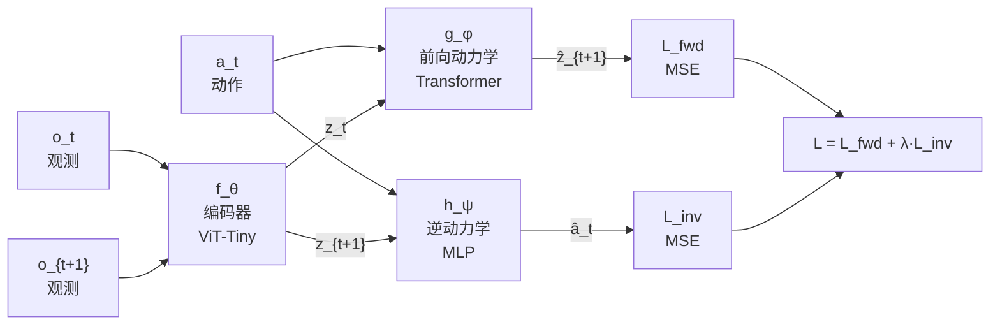

## 论文信息

| 字段 | 内容 |
|------|------|
| **标题** | Sensorimotor World Models: Perception for Action via Inverse Dynamics |
| **作者** | Petr Ivashkov¹, Randall Balestriero², Bernhard Schölkopf¹,³,⁴ |
| **机构** | ¹Max Planck Institute for Intelligent Systems, ²Brown University, ³ELLIS Institute, ⁴ETH Zürich |
| **arXiv** | [2606.20104](https://arxiv.org/abs/2606.20104) |
| **PDF** | [https://arxiv.org/pdf/2606.20104](https://arxiv.org/pdf/2606.20104) |
| **代码** | [Webpage](https://petr-ivashkov.github.io/smwm/) |

**一句话总结：** 用单步逆动力学头作为唯一反坍塌机制，实现端到端 JEPA 式世界模型训练，学习到的表示自动对齐可控自由度。

---

## 研究背景

### 问题

JEPA（Joint Embedding Predictive Architecture）式世界模型直接在嵌入空间预测未来状态，避免了像素级重建的冗余。但端到端训练面临**表示坍塌（representation collapse）**：当编码器和动力学模型联合训练时，编码器可能将所有观测映射到同一个嵌入，使预测任务变得平凡但模型完全失效。

现有解决方案各有局限：

| 方法 | 反坍塌机制 | 缺点 |
|------|-----------|------|
| DINO-WM | 冻结预训练编码器 | 无法端到端训练 |
| PLDM | 多维权方差-协方差正则化 | 复杂，多个超参 |
| LeWorldModel | SIGReg（匹配各向同性高斯） | 强分布先验 |
| V-JEPA 2 | EMA 目标编码器 | 需要动量网络 |

### 核心洞察

论文从"感知为行动"（perception for action）的视角出发：**有用的表示不应仅保留视觉保真度，而应保留对动作相关的信息。** 如果两个连续嵌入足以恢复产生状态转移的动作，它们必然保留了可控自由度信息。

这引出了一个简洁的机制：**逆动力学正则化（Inverse Dynamics Regularization）**。

---

## 核心方法

### 架构

论文提出 **SMWM（Sensorimotor World Model）**，由三个组件组成：

**三个组件：**

1. **编码器** $f_\theta$：ViT-Tiny，将 $224\times224$ RGB 图像映射到 $z \in \mathbb{R}^{192}$
2. **前向动力学** $g_\phi$：Transformer，预测 $\hat{z}_{t+1} = g_\phi(z_t, a_t)$
3. **逆动力学** $h_\psi$：2 层 MLP（256 宽），预测 $\hat{a}_t = h_\psi(z_t, z_{t+1})$

### 训练目标

$$\mathcal{L} = \underbrace{\mathbb{E}[\|\hat{z}_{t+1} - z_{t+1}\|^2]}_{\mathcal{L}_{\text{fwd}}} + \lambda \underbrace{\mathbb{E}[\|\hat{a}_t - a_t\|^2]}_{\mathcal{L}_{\text{inv}}}$$

**关键设计：** 编码器同时接收两个损失的梯度。前向损失训练 $f_\theta$ 和 $g_\phi$；逆损失训练 $f_\theta$ 和 $h_\psi$。

### 为什么逆动力学能防止坍塌？

用反证法：如果编码器坍塌到常数嵌入 $z^\star$，逆模型输入永远是 $(z^\star, z^\star)$，最优预测是常数动作 $\mathbb{E}[a_t]$，其风险为 $\mathbb{E}[\|a_t - \mathbb{E}[a_t]\|^2]$。任何低于此常数预测器风险的表现都要求 $(z_t, z_{t+1})$ 保留动作信息 → 排除了完全坍塌。

与 SIGReg 等分布先验不同，逆动力学**不规定嵌入空间的几何**，只要求编码器保留 $(o_t, o_{t+1})$ 中关于 $a_t$ 的信息。

### 论文原图：方法总览

> **Figure 1: Method overview.** 编码器 $f_\\theta$、前向动力学 $g_\\phi$、逆动力学 $h_\\psi$ 联合训练。逆损失作为反坍塌机制：为使动作可恢复，$f_\\theta$ 必须保留 $(o_t, o_{t+1})$ 中的动作相关信息。

---

## 实验结果

### 1. 表示结构分析（Dot World）

论文在可控的 dot world 环境中验证学到的表示结构：

**内在维度恢复：** 编码器从像素和动作中自动识别出环境真正的 2D 结构。PCA 谱在 $d_{\text{true}}=2$ 处急剧下降，剩余 62 维有效坍塌。

**可控自由度追踪：** 论文设计四种配置测试编码器是否能区分可控与不可控自由度：

> **Figure 4: Effective latent dimension tracks controllable degrees of freedom.** 四种配置的 PCA 谱显示，编码器将显著方差精确分配到可控自由度，过滤不可控干扰项。

| 配置 | 可控维度 | 动作维度 | PCA 有效维度 |
|------|---------|---------|-------------|
| Independent | 4 | 4 | 4 |
| Coupled | 2 | 2 | 2 |
| Distractor | 2 | 2 | 2（忽略随机点） |
| Combined | 6 | 6 | 6 |

**控制依赖感知：** 论文用三角形精灵实验可视化"感知随可控性变化"：

> **Figure 12: Control-dependent reconstruction.** 无控制时表示坍塌；仅 x/y 控制时保留位置但平均化方向；全控制时保留完整位姿。

### 2. 前向模型交换性

论文证明编码器与前向模型近似交换：$f(a(o)) \\approx g_a(f(o))$。这意味着物理动作在潜空间中近似为平移：$g_a(z) \\approx z + \\rho(a)$。

**定理 1：** 若 $f$ 满足交换性，则 $a \\mapsto g_a$ 是 $f(\\mathcal{O})$ 上的同态映射。

### 3. 潜空间规划性能

在四个环境上评估目标条件规划成功率（50 步预算，目标在 25 步后）：

| 环境 | SMWM | SIGReg | Forward-only | Random |
|------|------|--------|-------------|--------|
| TwoRoom | **99%** | 94% | 37% | 30% |
| Reacher | 66% | **67%** | 11% | 14% |
| Push-T | 83% | **87%** | 2% | 3% |
| OGBench-Cube | **84%** | 59% | 44% | 43% |

> **Figure 5: Planning success across environments.** SMWM 在三个 2D 任务上匹配 SIGReg，在 3D OGBench-Cube 上显著超越（84% vs 59%）。

### 4. 物理状态探测

在冻结嵌入上训练线性/MLP 探针回归真实物理状态：

| 环境 | 物理量 | SMWM 线性 | SIGReg 线性 | SMWM MLP | SIGReg MLP |
|------|--------|----------|------------|----------|-----------|
| TwoRoom | agent position | **1.000** | 0.996 | **1.000** | 1.000 |
| Reacher | joint angles | 0.946 | **0.999** | 0.995 | **1.000** |
| Push-T | agent position | **0.993** | 0.954 | **1.000** | 1.000 |
| OGBench-Cube | gripper position | **0.999** | 0.985 | **1.000** | 0.999 |

### 5. 潜空间几何

> **Figure 6: Latent geometry of SMWM embeddings.** 各环境 PCA 谱在低维处急剧下降。TwoRoom/Push-T 呈现近似线性方向，Reacher 的周期性关节角编码为 2-环面（3D PC 投影中可见圆柱结构）。

**对比 SIGReg 的潜空间：** SIGReg 谱无清晰拐点，方差分散到多主成分中（因正则化强制匹配各向同性高斯），表示不够紧凑、可解释性较差。

### 6. 消融实验：λ 敏感性

逆动力学权重 λ 需要环境级调参：

| λ | TwoRoom | Reacher | Push-T | OGBench-Cube |
|---|---------|---------|--------|-------------|
| 0 | 33% | 12% | 0% | 40% |
| **0.1** | **100%** | 12% | 60% | **85%** |
| 5 | 90% | **75%** | 85% | 85% |
| 30 | 90% | 70% | **90%** | 85% |

---

## 个人评价

### 创新点

1. **极简反坍塌：** 仅用一个超参 λ 和一个小 MLP 头，替代了冻结编码器、EMA、多维权方差正则化等复杂方案。
2. **理论-实验闭环：** 从"感知为行动"哲学出发，用逆动力学实现，在可控环境验证表示结构，在真实环境验证规划性能。
3. **表示自动对齐可控自由度：** 无需显式设计，编码器自动过滤不可控干扰项，保留可控结构。
4. **潜空间几何丰富：** Cartesian 自由度→线性方向，周期性变量→圆环结构，符合物理直觉。

### 局限性

1. **λ 需要环境级调参：** 不同环境最优 λ 差异大（0.1~30），缺乏自适应机制。
2. **假设动作可恢复：** 当不同动作产生相同可见变化时失效。
3. **单帧编码器：** 无法捕获速度等不可从单帧识别的量。
4. **离线数据限制：** 规划性能受限于数据集覆盖范围，长时 rollout 仍有累积误差。
5. **实验规模有限：** 仅在中等规模模拟控制任务上验证，未扩展到真实机器人或更大规模环境。

### 对后续研究的影响

- 为 JEPA 式世界模型提供了一条简洁的反坍塌路径，可能替代当前主流的 SIGReg/EMA 方案。
- "逆动力学作为唯一正则化"的假设值得在更大规模环境（如真实机器人、视频数据集）上验证。
- 潜空间平移结构 $g_a(z) \approx z + \rho(a)$ 暗示了动作在潜空间中的线性可组合性，可能为分层规划提供基础。

---

## 相关论文

1. **LeWorldModel (Maes et al., 2026)** — 本文主要对比基线，用 SIGReg 正则化实现端到端 JEPA 训练。SMWM 用逆动力学替代 SIGReg，在 3D 任务上表现更优。

2. **V-JEPA 2 (Assran et al., 2025)** — 大规模自监督视频模型，用 EMA 目标编码器防止坍塌。SMWM 避免了 EMA 的动量网络开销。

3. **DINO-WM (Zhou et al., 2025)** — 冻结预训练 DINOv2 编码器学习潜空间动力学。SMWM 实现真正的端到端训练。

4. **ICM (Pathak et al., 2017)** — 逆动力学作为内在奖励的经典工作。SMWM 将逆动力学从辅助信号提升为核心反坍塌机制。

5. **EB-JEPA (Terver et al., 2026)** — 多维权方差+逆动力学联合正则化。SMWM 证明仅逆动力学一项即足够。

---

> 整理者：Nancy | 数据源：arXiv + PaddleOCR-VL-1.6 | 更新时间：2026-06-22