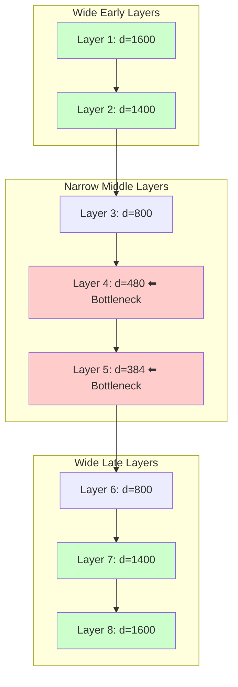
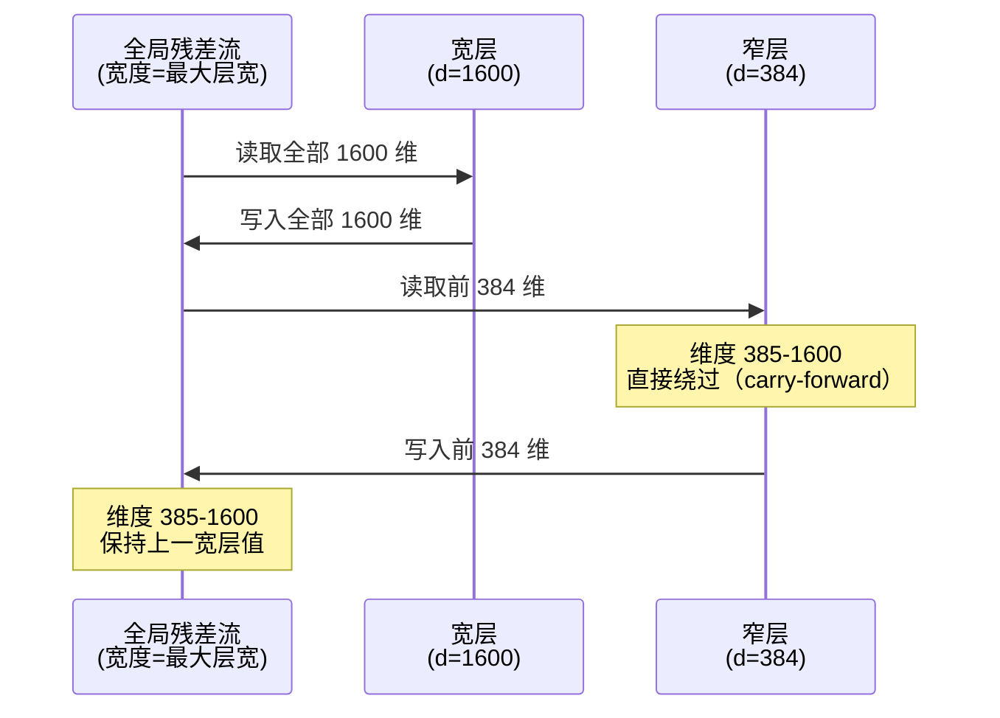

## 论文信息

| 字段 | 内容 |
|------|------|
| **标题** | Variable-Width Transformers |
| **作者** | Zhaofeng Wu, Oliver Sieberling, Shawn Tan, Rameswar Panda, Yury Polyanskiy, **Yoon Kim** |
| **机构** | MIT / MIT-IBM Watson AI Lab |
| **arXiv** | [2606.18246](https://arxiv.org/abs/2606.18246) |
| **PDF** | [https://arxiv.org/pdf/2606.18246](https://arxiv.org/pdf/2606.18246) |
| **类别** | cs.CL |
| **发表日期** | 2026-06-16 |

**一句话总结：** 打破 Transformer 各层宽度必须一致的假设，提出 × 形（两头宽、中间窄）的 `><former` 架构，在参数匹配下 Loss 降低约 3%、FLOPs 降低 22%、KV Cache 降低 15%。

---

## 研究背景

### 2.1 问题：均匀宽度假设真的最优吗？

Transformer 的模型规模由 **宽度**（hidden dimension $d$）和 **深度**（层数 $L$）决定。Scaling Law 研究（Kaplan et al., 2020）探讨了最优的 width/depth 比例，但几乎所有工作共享一个隐含假设：

> **每一层的宽度 $d$ 是相同的。**

这意味着无论哪一层，都获得相同的参数/计算预算。但直觉上，不同层承担不同的计算角色（Tenney et al., 2019; Meng et al., 2022），固定均匀分配未必最优。

### 2.2 现有方法的不足

| 方法 | 调整维度 | 局限 |
|------|----------|------|
| DeLighT (2020) | 块级缩放，前浅后深 | 仅调整块深度 |
| OpenELM (2024) | 逐层缩放 attention/FFN | 仅调整子组件 |
| Ikeda et al. (2025) | FFN 中间维度 | 仅调整 MLP 容量 |

**以上方法均未触及完整的 block hidden dimension。** 本文直接改变每层的完整隐藏维度 $d_\ell$，并解决了一个关键工程问题：**变宽层之间如何衔接 residual stream？**

---

## 核心方法

### 3.1 × 形架构设计

`><former` 采用 **两头宽、中间窄** 的 × 形宽度分布：

> **× 形宽度分布：早期层宽（编码原始信息）→ 中间瓶颈（强制压缩正则化）→ 晚期层宽（精确预测）**

用数学表述，层宽按几何级数变化：

$$d_\ell = \begin{cases} \alpha^- d_{\ell-1}, & 1 < \ell \leq \ell^* \\ \alpha^+ d_{\ell-1}, & \ell^* < \ell \leq L \end{cases}$$

其中 $\alpha^- \leq 1$（收缩率），$\alpha^+ \geq 1$（扩张率），$\ell^*$ 为瓶颈层索引。

### 3.2 关键创新：参数-free 的残差流复用

变宽层之间的维度对齐是核心挑战。论文提出 **固定全局残差流宽度** + **逐层切片读写** 的方案：

**核心操作：**

- **收缩时**：截断多余维度 $f^\ell(\mathbf{x}) = \mathbf{x}[:d_\ell]$
- **扩张时**：从最近处理过该维度的层恢复 $[f^\ell(\mathbf{x}^{\ell-1})]_i = [\mathbf{x}^{\ell'}]_i$，其中 $\ell' = \max\{\tilde{\ell} < \ell \mid d_{\tilde{\ell}} \geq i\}$
- **未使用维度**：通过 **复制（carry-forward）** 传递到上游，零参数开销

### 3.3 为什么 × 形最优？

论文在 500M 参数规模上对比了 4 种形状（◇、×、∨、∧），每种 9 组超参数，共 36 次实验。**× 形在所有指标上最优。**

**直觉解释：**

| 阶段 | 宽度 | 原因 |
|------|------|------|
| 早期层 | 宽 | 需要高维空间编码丰富的 token 嵌入 |
| 中间层 | 窄 | 信息瓶颈强制压缩，起到结构正则化 |
| 晚期层 | 宽 | 需要高维空间做精细的词汇表预测 |

### 3.4 数学保证：参数匹配下的效率优势

当变宽模型与均匀宽度模型 **参数数匹配** 时，有严格的数学保证：

每层参数 $P_\ell \approx K d_\ell^2$（二次缩放），匹配条件：

$$\frac{1}{L}\sum_{\ell=1}^{L} d_\ell^2 = d^2$$

由 **方均值 ≥ 均值的平方**（Jensen 不等式）：

$$\left(\frac{1}{L}\sum_{\ell=1}^{L} d_\ell\right)^2 < \frac{1}{L}\sum_{\ell=1}^{L} d_\ell^2 = d^2 \implies \frac{1}{L}\sum_{\ell=1}^{L} d_\ell < d$$

**结论：平均层宽严格小于均匀宽度 $d$。**

| 指标 | 缩放关系 | 结论 |
|------|----------|------|
| 参数数 | $\sum d_\ell^2$ | 匹配（构造保证） |
| Attention FLOPs | $\propto \sum d_\ell$ | **严格更低** |
| KV Cache 大小 | $\propto \sum d_\ell$ | **严格更小** |
| 激活 I/O 成本 | $\propto \sum d_\ell$ | **严格更低** |

### 3.5 超参数选择

通过网格搜索发现，**相对比例** 参数化在不同模型规模下表现一致：

- 瓶颈层位置：$\ell^* = 0.75L$（倒数 1/4 处）
- 瓶颈宽度：$d_{\ell^*} = 0.3d$（最大宽度的 30%）

---

## 实验结果

### 4.1 语言建模 Loss 对比

| 规模 | 模型 | Loss ↓ | FLOPs ↓ | 平均层宽 ↓ |
|------|------|--------|---------|-----------|
| **200M** | Transformer | 3.452 | 0.18 | 640 |
| | **><former** | **3.430** | **0.17 (-3.2%)** | **576 (-10.0%)** |
| **500M** | Transformer | 3.138 | 1.11 | 960 |
| | **><former** | **3.099** | **1.07 (-3.7%)** | **855 (-11.0%)** |
| **1B** | Transformer | 2.926 | 4.52 | 1280 |
| | **><former** | **2.890** | **4.38 (-3.1%)** | **1143 (-10.7%)** |
| **2B** | Transformer | 2.751 | 18.0 | 1600 |
| | **><former** | **2.720** | **17.4 (-3.3%)** | **1435 (-10.3%)** |

><former 在所有规模上一致优于均匀宽度基线，Loss 降低约 1-1.2%，FLOPs 降低约 3%，KV Cache 降低约 10%。

### 4.2 Scaling Law 分析

论文拟合了 Kaplan 风格的 Scaling Law 曲线：

$$\text{Loss} = A \cdot C^{-\alpha}$$

**关键发现：**

- **><former 截距更小**：同等计算量下 Loss 更低
- **><former 指数更陡**（$\alpha$ 更大）：差距随规模扩大而增大
- **达到 2B 均匀模型 Loss (2.751) 仅需 77.8% FLOPs 和 85.1% 平均层宽**

### 4.3 下游任务评估（2B 模型，zero-shot）

| 任务 | 2B 均匀 | 2B ><former | MoE 均匀 | MoE ><former |
|------|---------|-------------|----------|--------------|
| ARC-C | 33.0 | **33.9** | 34.5 | 34.2 |
| ARC-E | 59.5 | **61.0** | 62.1 | 61.5 |
| BoolQ | 59.4 | **60.2** | 61.0 | 60.5 |
| HellaSwag | 55.9 | **57.1** | 58.3 | 57.8 |
| LAMBADA PPL | 7.12 | **6.85** | 6.52 | **6.41** |
| WikiText PPL | 23.1 | **22.4** | 21.0 | **20.5** |

2B ><former 在大多数 NLU 任务上领先，MoE 版本在困惑度指标上提升最明显。

### 4.4 消融实验：维度扩张方法对比

| 方法 | Loss (500M) |
|------|-------------|
| 均匀宽度（基线） | 3.138 |
| **Carry-forward（本文）** | **3.099** |
| Zero Padding | 3.124 |
| Projection Layer | 3.150 |

**Carry-forward（复制上游特征）最优。** 训练投影层反而更差——说明 learnable 变换引入了额外的优化难度。

---

## 5. 机制分析

### 5.1 MLP 激活利用率提升

><former 的瓶颈结构强制网络更均匀地利用 MLP 激活维度。

**论文原图：MLP 激活维度利用率热力图（Figure 5）**

> *上图：2B 模型 MLP 激活维度利用率热力图。左侧为 ><former，右侧为均匀宽度基线。颜色越深表示该维度被激活的频率越高。><former 在中间瓶颈区域（灰色阴影）显示出更均匀的激活分布。*

> **><former 更均匀地利用了 MLP 激活维度。** 均匀宽度模型存在大量"闲置"维度（dead dimensions），而 ><former 的瓶颈结构迫使信息更有效地编码。

### 5.2 缓解中层表示坍缩（Compression Valley）

论文测量了残差流的 **归一化矩阵熵**：

$$\frac{1}{\log r}\left(-\sum_{j=1}^{r} p_j \log p_j\right), \quad p_j = \sigma_j^2 / \|\mathbf{X}\|_F^2$$

**关键发现：**

- 均匀宽度模型：中层熵降至近零（严重坍缩，"compression valley"）
- ><former：中层保持高熵，表示空间被充分利用

**物理约束宽度 → 结构正则化 → 更均匀的表示空间利用**

### 5.3 Logit Lens 预测动态

通过 Logit Lens 分析中间层的预测分布：

- ><former 在早中期赋予目标 token 更高概率
- 层间 KL 散度更低（预测分布变化更平缓）
- 晚期层概率质量集中更快

---

## 6. 个人评价

### 6.1 创新点

1. **问题意识清晰**：挑战了 Transformer 领域一个"显而易见"的假设（均匀宽度），并给出了系统性实证答案
2. **工程创新巧妙**：参数-free 的残差流复用方案，避免了投影层带来的额外开销
3. **数学论证严谨**：用 Jensen 不等式严格证明了参数匹配下的效率优势
4. **分析深入**：从 MLP 激活、残差流熵、Logit Lens 三个角度揭示了机制
5. **Scaling Law 分析**：不仅报告绝对性能，还给出了计算效率曲线

### 6.2 局限性

1. **训练基础设施适配成本高**：需要为不同宽度 profile 开发专用 kernel，当前训练效率低于理论值
2. **张量/流水线并行不友好**：异构层宽与标准 parallelism 策略冲突
3. **适用范围待验证**：仅在 200M-3B 规模验证，更大规模（70B+）是否保持优势未知
4. **仅预训练阶段评估**：未涉及指令微调、RLHF 等下游训练阶段

### 6.3 对后续研究的影响

- **架构搜索新维度**：宽度 profile 成为又一个可优化的架构自由度
- **与 MoE 的自然结合**：论文已验证 MoE 版本有效，可能是未来混合架构的基础
- **与 Hyper-Connections 的互补**：HC 用可学习的残差混合，><former 用确定性切片
- **推理部署潜力**：KV Cache 降低 10-15% 对长上下文场景意义重大

---

## 相关论文

| 论文 | 年份 | 核心贡献 | 与本文关系 |
|------|------|----------|-----------|
| **DeLighT** (Mehta et al.) | 2020 | 块级缩放 Transformer | 早期灵感，仅调整块深度 |
| **OpenELM** (Mehta et al.) | 2024 | 逐层缩放 attention/FFN 维度 | 粒度更细，未触及完整 block 宽度 |
| **Ikeda et al.** | 2025 | FFN 逐层重要性分析 | 结论相反（中间层需更多 FFN），说明调整完整宽度 vs 仅 FFN 得到不同最优 profile |
| **Hyper-Connections** (Zhu et al.) | 2025 | 可学习残差混合扩展残差流 | 概念相关，机制不同（learnable vs deterministic） |
| **Scaling Laws** (Kaplan et al.) | 2020 | Transformer Scaling Law 奠基 | Scaling Law 分析方法论来源 |

---

## 个人评价

- [ ] 更大规模（7B+）验证 × 形优势是否保持
- [ ] 与指令微调/RLHF 的兼容性
- [ ] 专用 kernel 实现后的实际训练/推理速度
- [ ] 与其他宽度 profile（◇、∨、∧）在不同任务上的表现差异
- [ ] 与 Hyper-Connections 的结合潜力

---

> 整理者：Nancy | 数据源：arXiv + PaddleOCR-VL-1.6 解析 | 更新时间：2026-06-22
