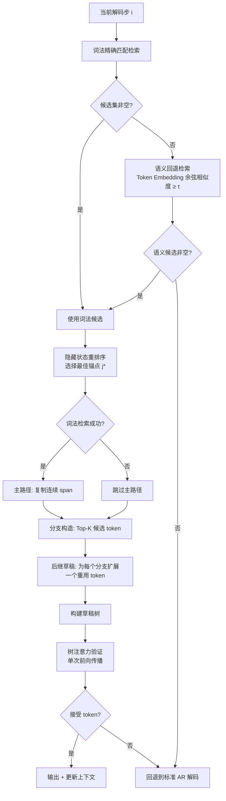

## 1. 论文信息

| 项目 | 内容 |
|------|------|
| **标题** | AdaPLD: Adaptive Retrieval and Reuse for Efficient Model-Free Speculative Decoding |
| **作者** | Runheng Liu\*, Jincheng Xie\*, Wen Hu, Xingchen Xiao, Heyan Huang |
| **机构** | 北京理工大学, 清华大学, 京东 AI 基础设施 |
| **arXiv** | [2606.05742](https://arxiv.org/abs/2606.05742) |
| **PDF** | [arxiv.org/pdf/2606.05742](https://arxiv.org/pdf/2606.05742) |
| **发表日期** | 2026-06-04 |
| **类别** | cs.CL |

**一句话总结：** AdaPLD 是一种无需训练的投机解码方法，通过"词法优先 + 语义回退"的自适应检索策略和分支草稿构造，在保持输出分布不变的前提下实现最高 3.10x 的解码加速。

---

## 2. 研究背景与动机

### 2.1 问题定义

LLM 自回归解码的核心瓶颈在于**严格串行性**：每个 token 都需要一次完整的前向传播。

$$p(y_i \mid x, y_{<i})$$

投机解码（Speculative Decoding, SD）通过"草稿-验证"范式缓解这一瓶颈：先提出多个候选 token，再用目标模型一次性并行验证。经典 SD 需要训练一个辅助草稿模型，而**无模型 SD（Model-Free SD）**则从已有上下文中构造草稿，无需额外模型。

### 2.2 现有方法的两大瓶颈

AdaPLD 精准定位了现有基于重用的无模型 SD 方法的两个关键缺陷：

**瓶颈一：检索召回率不足（Lexical No-Hit）**

现有方法依赖 n-gram 精确匹配定位可重用位置。当表面形式发生变化时（如同义替换、格式变化），精确匹配失败，候选集为空——即使语义上存在相关上下文也无法利用。

> PLD+ 尝试用表示相似度对词法候选进行重排序，但重排序发生在词法检索之后，无法解决"词法检索返回空集"的情况。

**瓶颈二：草稿构造过于确定（Single Span Copying）**

现有方法找到锚点后，仅复制其后的一段连续 span 作为草稿。但局部匹配的锚点可能对应多种合理的后续 token，单一 span 复制忽略了这种不确定性。

---

## 3. 核心方法

### 3.1 整体架构

AdaPLD 在两个阶段改进上下文重用：**自适应检索** + **分支草稿构造**。

### 3.2 自适应检索（Adaptive Retrieval）

**词法锚定（Lexical Anchoring）**

查询锚点为最近生成的 token $a_i = y_{i-1}$，精确匹配历史记忆中的相同 token：

$$\mathcal{C}_{\mathrm{lex}} = \{j \mid 1 \leq j < |M_i|, M_{i,j} = a_i\}$$

**语义回退检索（Semantic Fallback Retrieval）**

当词法检索为空时，激活语义回退，使用目标模型的 token embedding 进行余弦相似度比较：

$$\mathcal{C}_{\mathrm{sem}} = \{j \mid 1 \leq j < |M_i|, \cos(\mathbf{e}_{M_{i,j}}, \mathbf{e}_{a_i}) \geq \tau\}$$

**词法-语义回退规则：**

$$\mathcal{C}_i = \begin{cases} \mathcal{C}_{\mathrm{lex}}, & \text{if } \mathcal{C}_{\mathrm{lex}} \neq \emptyset \\ \mathcal{C}_{\mathrm{sem}}, & \text{otherwise} \end{cases}$$

> 关键设计：词法匹配作为默认路径（高精度），语义检索仅在词法失败时激活（扩召回），两者互斥而非叠加。

### 3.3 候选选择：隐藏状态重排序

从候选集中选择与当前解码上下文最兼容的锚点：

$$s(j) = \cos\left(\mathbf{h}_{i,j-1}^{(\ell)}, \mathbf{h}_{i,|M_i|-1}^{(\ell)}\right)$$

$$j^* = \arg\max_{j \in \mathcal{C}_i} s(j)$$

其中 $\mathbf{h}_{i,t}^{(\ell)}$ 是第 $\ell$ 层在处理前缀 $M_{i,\leq t}$ 后的隐藏表示。

### 3.4 分支草稿构造（Adaptive Reuse Construction）

给定锚点 $j^*$，AdaPLD 构造三类草稿路径：

**① 主路径（Main Copy Path）**

仅当词法检索成功时激活，直接复制锚点后的连续 span：

$$\hat{y}_{i:i+\ell_i-1}^{\mathrm{main}} = M_{i, j^*+1:j^*+\ell_i}$$

其中 $\ell_i = \min(\ell_m, |M_i| - j^*)$，$\ell_m$ 为最大复制长度。

**② 分支路径（Branch Paths）**

从锚点条件分布中提取 Top-K 候选 token，覆盖局部不确定性：

$$\mathcal{B}_i = \begin{cases} \widetilde{\mathcal{B}}_i \setminus \{M_{i,j^*+1}\}, & \text{if } \mathcal{C}_{\mathrm{lex}} \neq \emptyset \\ \widetilde{\mathcal{B}}_i, & \text{otherwise} \end{cases}$$

其中 $\widetilde{\mathcal{B}}_i = \mathrm{TopK}(p(\cdot \mid M_{i,\leq j^*}), K)$。

**③ 后继草稿（Successor Drafting）**

为每个分支 token $b \in \mathcal{B}_i$ 再扩展一个重用 token，增加重用深度：

$$\hat{y}_{i+1}^{(b)} = M_{i, j_b^*+1}$$

其中 $j_b^*$ 通过以 $b$ 为查询的隐藏状态重排序得到。

### 3.5 验证

所有草稿路径组织为草稿树，通过**树注意力（Tree Attention）**在单次前向传播中并行验证。接受规则遵循标准投机解码的拒绝采样校正，保证输出分布与目标模型一致（无损性）。

---

## 4. 实验结果

### 4.1 主要结果对比

**Spec-Bench 输入引导生成任务（Vicuna-13B）：**

| 方法 | MT | Sum | RAG | Avg. 加速 |
|------|-----|-----|-----|-----------|
| AR | 1.00 | 1.00 | 1.00 | 1.00 |
| TR | 2.05 | 1.81 | 1.61 | 1.83 |
| SAMD | 1.70 | 2.64 | 1.70 | 2.02 |
| PLD | 1.39 | 2.18 | 1.53 | 1.70 |
| PLD+ | 1.70 | 2.45 | 1.79 | 2.00 |
| **AdaPLD** | **1.70** | **2.45** | **1.79** | **2.27** |

> 图片来源论文原文：

**CodeEditorBench 代码编辑任务（Vicuna-33B）：**

| 方法 | Debug | Polish | Translate | Switch | Avg. 加速 |
|------|-------|--------|-----------|--------|-----------|
| AR | 1.00 | 1.00 | 1.00 | 1.00 | 1.00 |
| TR | 2.03 | 2.01 | 2.06 | 2.05 | 2.04 |
| SAMD | 1.94 | 1.92 | 1.53 | 2.05 | 1.87 |
| PLD+ | 2.56 | 2.63 | 1.65 | 3.30 | 2.54 |
| **AdaPLD** | **2.56** | **2.63** | **1.65** | **3.30** | **3.10** |

> AdaPLD 在代码编辑任务上达到 **3.10x** 最高加速，尤其在 Switch（需求切换）子任务上表现突出。

**推理任务（Vicuna-13B）：**

| 方法 | AIME 2024 | MATH-500 | MMLU-Pro |
|------|-----------|----------|----------|
| PLD+ | 2.61 | 2.42 | 2.12 |
| Logitspec | 3.15 | 2.68 | 1.94 |
| **AdaPLD** | **3.15** | **2.68** | **1.94** |

> 推理任务中 AdaPLD 在 13B/33B 模型上全面领先，说明结构化推理过程中也存在可重用模式。

### 4.2 消融实验

| 变体 | MT | SUM | RAG | Debug | Polish | Translate | Switch | Avg. |
|------|-----|-----|-----|-------|--------|-----------|--------|------|
| **完整 AdaPLD** | 1.70 | 2.45 | 1.79 | 2.28 | 2.34 | 1.70 | 4.51 | **2.40** |
| w/o 分支+后继 | 1.53 | 2.25 | 1.64 | 2.03 | 2.07 | 1.51 | 4.22 | 2.18 |
| w/o 后继 | 1.68 | 2.43 | 1.76 | 2.24 | 2.32 | 1.68 | 4.47 | 2.37 |
| w/o 语义回退 | 1.70 | 2.38 | 1.73 | 2.18 | 2.27 | 1.62 | 3.91 | 2.24 |

**关键发现：**
- 移除分支+后继草稿导致最大下降（2.40→2.18），证明锚点包含的有用信号远超单一 span
- 移除语义回退在 Switch 任务上下降最显著（4.51→3.91），说明语义检索在词法稀疏场景中价值巨大
- 仅移除后继草稿影响最小（2.40→2.37），但仍是正贡献

### 4.3 超参数敏感性

**分支宽度 K 的影响：**

| 分支宽度 K | 平均接受 Token | 加速比 |
|-----------|---------------|--------|
| 2 | 2.54 | 2.58 |
| 4 | 2.64 | 2.62 |
| **8** | **2.72** | **2.70** |
| 16 | 2.81 | 2.69 |
| 32 | 2.90 | 2.58 |
| 64 | 3.00 | 1.95 |

> K=8~16 时加速最优，K=64 时加速骤降至 1.95x——验证开销超过重用收益。

**最大复制长度：**

| 最大复制长度 | 平均接受 Token | 加速比 |
|------------|---------------|--------|
| 10 | 2.575 | 2.33 |
| 20 | 2.688 | 2.51 |
| **30** | **2.735** | **2.70** |
| 50 | 2.698 | 2.58 |
| 100 | 2.680 | 2.09 |

> 长度 30 为最优，过长复制增加验证成本而不显著提升重用。

**语义检索阈值 τ：**

| 阈值 τ | 平均接受 Token | 加速比 |
|--------|---------------|--------|
| 0.00 | 2.735 | 2.66 |
| 0.05 | 2.735 | 2.68 |
| **0.10** | **2.735** | **2.70** |
| 0.20 | 2.705 | 2.71 |
| 0.50 | 2.57 | 2.52 |
| 0.80 | 2.52 | 2.50 |

> τ=0.1 为默认值，低阈值区域加速稳定，高阈值显著降低性能。

### 4.4 重用行为分析

**重用来源分布（CodeEditorBench, Vicuna-13B）：**

| 来源 | 步数 |
|------|------|
| mismatch（无重用） | 5507 |
| main（主路径） | 3298 |
| branch（分支） | 1945 |
| branch+succ（分支+后继） | 272 |
| prefill | 80 |

> 成功重用并非由单一机制主导：主路径仍是核心来源，但分支路径占成功重用的 ~36%，证明锚点包含的信息远超其直接后续 span。

**检索命中率分析（Vicuna-33B）：**

| 基准 | 词法命中 | 语义命中 | 无命中 | 语义恢复率 |
|------|---------|---------|--------|-----------|
| Spec-Bench | 61.17% | 26.16% | 12.67% | 67.37% |
| CodeEditorBench | 73.43% | 21.28% | 5.30% | 80.07% |
| AIME24 | 72.89% | 20.61% | 6.50% | 76.01% |
| MATH-500 | 73.26% | 20.55% | 6.19% | 76.84% |
| MMLU-Pro | 64.33% | 24.41% | 11.26% | 68.35% |

> 语义回退在词法失败的情况下恢复了 67%~80% 的候选，验证了"词法优先 + 语义回退"设计的有效性。

### 4.5 计算开销分析

| 组件 | 触发延迟 (ms) | 每步平均延迟 (ms) | 占验证前向传播比例 |
|------|-------------|-----------------|-------------------|
| 验证前向传播 | 39.195 | 39.195 | 100.00% |
| 语义回退检索 | 0.107 | 0.028 | 0.07% |
| 隐藏状态重排序 | 0.052 | 0.049 | 0.12% |
| 分支构造 | 0.069 | 0.066 | 0.17% |
| 后继草稿 | 0.322 | 0.069 | 0.17% |

> AdaPLD 额外组件总计仅增加 **0.212ms/步**（占验证前向传播的 **0.53%**），开销极低。

---

## 5. 个人评价

### 5.1 创新点

1. **精准的问题诊断**：AdaPLD 不是盲目改进，而是明确指出了现有无模型 SD 的两个具体瓶颈——词法检索的 no-hit 失败模式和单一 span 复制的确定性假设。这种"先诊断再治疗"的研究思路值得学习。

2. **词法-语义回退设计**：用词法匹配保证精度，用语义检索扩展召回，两者互斥而非叠加。这种设计既保持了精确匹配的高质量，又避免了语义检索的噪声污染。

3. **分支草稿构造**：将锚点视为"一组草稿假设的起点"而非"单一 span 的源头"，通过 Top-K 分支 + 后继扩展，在不增加辅助模型的前提下显著丰富了草稿空间。

### 5.2 局限性

1. **Token 级语义信号较粗糙**：当前使用 token embedding 余弦相似度作为语义信号，粒度较粗。未来可探索短语级或结构级相似度。

2. **超参数依赖**：分支宽度 K、最大复制长度 $\ell_m$、语义阈值 $\tau$ 等参数需要针对具体场景调优。论文使用固定参数，实际部署可能需要自适应策略。

3. **上下文弱关联场景效果有限**：对于自由生成（如创意写作）等上下文重用机会少的任务，加速效果自然受限。

4. **实验模型较旧**：主要实验在 Vicuna-1.3 上，仅附录中简要测试了 Qwen3-8B。在最新模型上的效果待验证。

### 5.3 对后续研究的影响

- 为无模型 SD 提供了一条清晰的改进路径：**检索质量 × 草稿构造丰富度**
- 分支草稿 + 后继扩展的思路可迁移到其他投机解码变体
- 词法-语义回退的双路检索模式对检索增强生成（RAG）也有借鉴意义

---

## 6. 相关论文

| 论文 | 年份 | 简介 |
|------|------|------|
| **Speculative Decoding** (Leviathan et al.) | 2023 | 投机解码奠基工作，提出草稿-验证范式 |
| **Prompt Lookup Decoding (PLD)** (Saxena) | 2023 | 首个基于上下文重用的无模型 SD 方法 |
| **PLD+** (Somasundaram et al.) | 2025 | 在 PLD 基础上引入隐藏状态重排序 |
| **SAM Decoding** (Hu et al.) | 2025 | 通过后缀自动机构造草稿，NAACL 2025 |
| **Token Recycling** (Luo et al.) | 2025 | 将已生成 token 回收为草稿，ACL 2025 |
| **Logitspec** (Liu et al.) | 2026 | 通过 next-next token 推测加速检索型 SD |
| **Medusa** (Cai et al.) | 2024 | 多解码头投机解码，ICML 2024 |
| **Suffix Decoding** (Oliaro et al.) | 2025 | 极端投机解码，利用后缀共享加速 |

---

> 整理者：Nancy | 数据源：arXiv + PaddleOCR 解析 | 更新时间：2026-06-22
