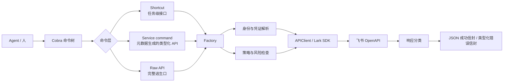
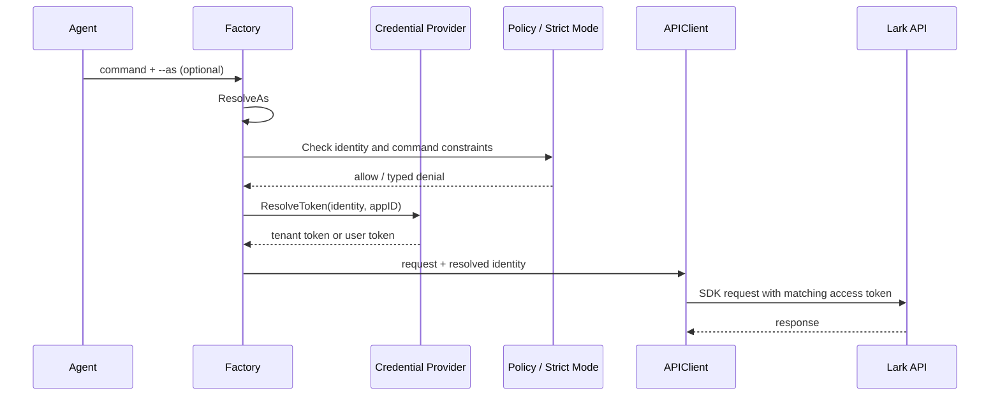
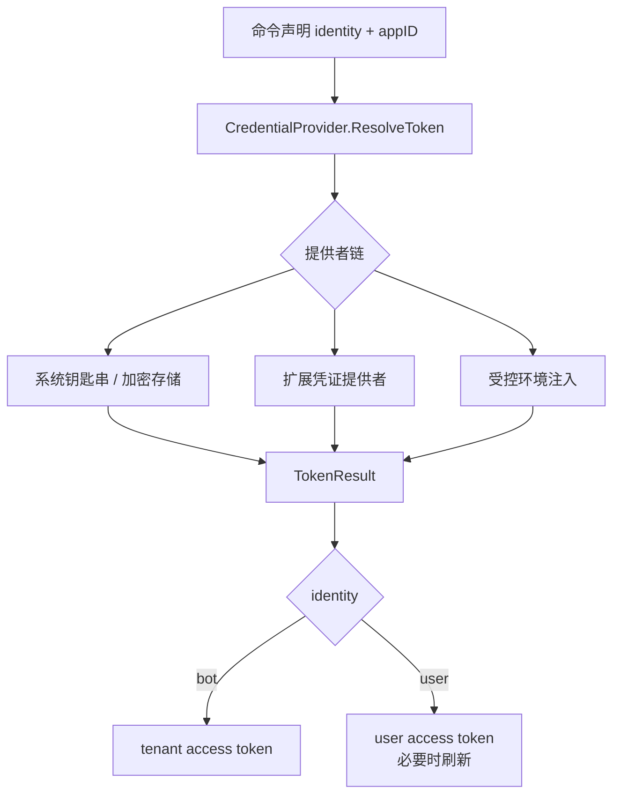
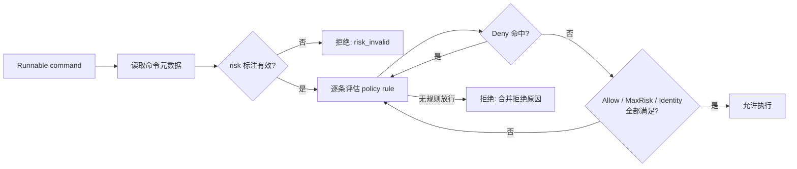
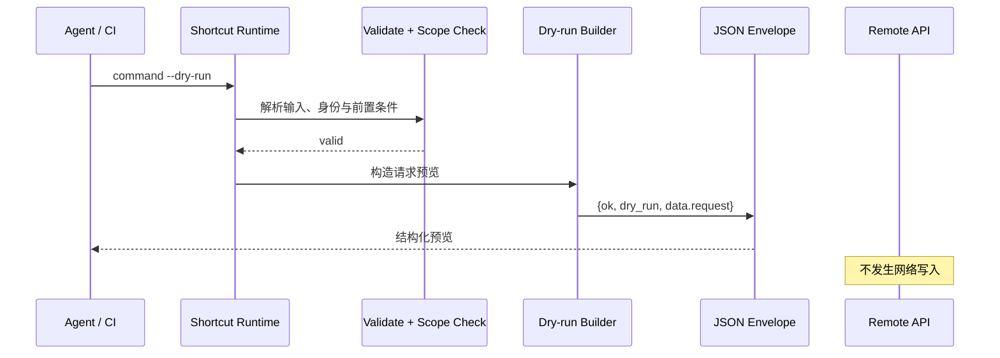

很多 Agent 集成在第一个 Demo 阶段看起来都很顺：模型会调用 API，能建文档、发消息、改表格。真正进入生产后，问题不在“会不会调接口”，而在一次失败后系统能否回答清楚五件事：做了什么、以谁的身份做、是否已经产生副作用、为什么失败、下一步该怎么做。

这就是 Agent 基础设施和 SDK 封装的分界线。前者要给模型提供一条可执行、可观察、可限制的路径；后者通常只负责把 HTTP 请求发出去。

我把这条路径称为 **execution harness**。它不是某一个框架，也不是一组 prompt，而是运行 Agent 工具调用时的一组共同约束。`lark-cli` 是一个很具体的样本：它把飞书 OpenAPI 包成 CLI，同时明确面向人和 Agent。下面的结论来自其命令、凭证、策略、输出和 E2E 测试代码，而不是从产品介绍倒推。

## 先定义问题：Agent 不该直接面对原始 API

原始 API 给人的自由度很高，也给 Agent 留下了太多未定义行为：参数该如何组织、用户 token 和机器人 token 能否混用、写操作是否允许、失败是重试还是重新授权、返回文本到底是成功还是部分成功。

一个可用的 harness 应该把这些分叉收敛到基础设施层：

图里最重要的不是三种命令，而是它们最终都落到相同的身份、策略、请求和输出边界。否则每新增一个工具，就等于新增一套难以审计的执行语义。

## 1. 接口分层：同时保留高层工作流和低层逃生口

`lark-cli` 在 README 与 `cmd/root.go` 中把命令分为三层：

| 层级              | 解决的问题                          | 适合谁                            |
| ----------------- | ----------------------------------- | --------------------------------- |
| `+shortcut`       | 将多个 API 参数与业务步骤压缩成任务 | 人和大多数 Agent 调用             |
| service command   | 依据嵌入的 API 元数据生成命令       | 需要可发现、类型化 OpenAPI 的场景 |
| `api METHOD PATH` | 不等 CLI 封装即可访问底层能力       | 新接口、排障、长尾需求            |

这不是重复建设。只有高层 shortcut，功能覆盖会被维护速度限制；只有原始 API，模型要自己理解每个字段和调用顺序。三层共存的关键是让它们共享同一套运行时规则，而不是让每层各自处理鉴权、错误和输出。

这对内部 Agent 平台也是一个直接的设计建议：把任务接口作为默认入口，同时留下受治理的原始能力。不要为了“防止模型乱用”而彻底拿掉逃生口，应该通过风险等级、身份约束、审计和 dry-run 来管理它。

## 2. 身份不是请求参数，而是执行上下文

最容易被低估的是身份。对一个 Agent 来说，“调用这个工具”不够完整；完整语句应该是“以用户身份或机器人身份调用这个工具”。两种身份拥有不同 token、不同 scope，也对应不同的资源所有权。

`internal/cmdutil/factory.go` 把身份解析放在共享 `Factory` 中。`--as` 显式指定时优先；否则再考虑严格模式、配置的默认身份、凭证可用性和自动探测。shortcut 的运行时 `RuntimeContext` 不自行猜测身份，只读取已经解析好的结果。`internal/client/client.go` 再依据身份选择 tenant access token 或 user access token，并设置 SDK 支持的 token 类型。

这里的工程边界很清楚：命令实现不应该接触 secret，更不应当决定 token 的优先级。它只声明自己支持哪些身份、需要哪些 scope；基础设施负责把声明变成可执行的身份上下文。

这样做还有一个常被忽略的收益：测试可以替换 `Factory` 的懒加载依赖，而不必伪造整套登录环境。对 Agent harness 而言，可替换性比“单例配置中心”更实际。

## 3. 凭证需要做成提供者链，而不是散落的环境变量

配置文件可以描述“去哪里取密钥”，不应成为密钥本身。`lark-cli` 的 `Factory` 持有 `CredentialProvider`；仓库把默认凭证处理放在 `internal/credential/`，同时在 `extension/credential/` 暴露扩展接口。正常命令只通过 `ResolveToken` 请求某个身份的 token。

这种边界允许同一个 CLI 支持系统钥匙串、扩展提供者和环境注入，而不把这些差异复制到每一个命令中。它也让凭证轮换、token 刷新、用户重新授权这些状态有一个集中的故障出口。

构建自己的 harness 时，至少应满足三条：应用代码不能读取明文 secret；token 解析的输入必须包含身份和目标 app；凭证失败必须能区分“缺配置”“缺授权”“token 已失效”。否则 Agent 只能拿到一句“401”，接着盲目重试。

## 4. 策略应作用于命令树，并在执行前失败

权限校验不能只依赖远端 API 的 403。远端拒绝得太晚：模型已经选定了错误路径，而且对“为什么禁止”没有本地解释。

`internal/cmdpolicy/engine.go` 的规则有四个维度：`Allow`、`Deny`、`MaxRisk`、`Identities`。一条规则内四个维度同时成立才放行，多条规则之间采用 OR。更值得注意的是它的失败策略：风险标注写错直接拒绝；命令没有风险标注时默认拒绝，只有规则显式设置 `AllowUnannotated` 才放行。这避免了新增命令因为漏标风险而悄悄绕过治理。

严格模式是另一层约束。它会将不兼容的命令替换为拒绝 stub，帮助输出和直接执行都保持一致。这一点很实用：治理不能只藏在执行函数里，发现能力时也应让模型看到边界，否则模型会反复尝试一个必然失败的工具。

风险标签不需要一开始设计得很细。`read`、`write`、`high-risk-write` 这样少量、稳定的层级已经足够支撑默认拒绝、按身份限制和人工确认。重点是让每条可执行路径都有标签。

## 5. 输出契约必须让 Agent 能做下一步决策

面向 Agent 的 CLI，stdout 不是日志窗口，而是数据通道。仓库的 `AGENTS.md` 明确要求 stdout 只写 JSON envelope，进度、警告与提示走 stderr。成功信封由 `internal/output/envelope.go` 定义：`ok`、`identity`、`dry_run`、`data`、`meta` 和 `_notice` 是稳定字段。

失败也不是随手 `fmt.Errorf`。命令边界统一把错误写成类型化信封，错误契约带有 category、subtype、参数名、hint、远端 code 与 log id。shortcut 运行时的 `CallAPITyped` 会把 API 非零 code 分类，并从响应头提升 `x-tt-logid`；对非 JSON 的网关错误，则按 HTTP 状态区分可重试的服务端错误、404 和其他 API 错误。

这使 Agent 可以用有限状态机处理失败，而不是从自然语言猜原因：

| 错误类别         | Agent 的合理动作                   |
| ---------------- | ---------------------------------- |
| validation       | 修正某个 flag 或输入文件           |
| authentication   | 重新授权或切换身份                 |
| policy           | 停止重试，向用户申请更高权限或确认 |
| network / server | 按退避策略重试，并保留 log id      |
| API 业务错误     | 根据 code、hint 和资源状态处理     |

`_notice` 也值得借鉴。版本更新或 skills 漂移不污染正常数据字段，而是作为成功信封中的附加运行时信息。Agent 可以选择处理，不会把一段提示文本误当成 API 返回值。

## 6. Dry-run 不是“打印一下”，而是副作用前的协议测试

当 Agent 具备写权限时，dry-run 应被看作 harness 的一等能力。它让模型、开发者和测试都能在不发请求的情况下检查方法、路径、查询参数、请求体和身份上下文。

在 `shortcuts/common/runner.go` 中，shortcut 的 `DryRun` 是显式声明的回调；未支持的命令会返回带 `--dry-run` 参数信息的类型化校验错误。service command 和 raw API 也走相同的 dry-run 输出路径，而不是各自打印一段文本。这样 CI 可以针对 JSON 中的 request preview 做断言。

一个常见误区是把 dry-run 放在鉴权之前，导致预览绕过了身份和策略。更合理的顺序是：允许输入解析、身份解析和本地策略检查；跳过远端写入。否则 CI 证明的只是“能拼字符串”，不是“在当前治理下能形成一个合法请求”。

## 7. Harness 需要两类测试：请求契约与真实生命周期

`lark-cli` 的测试策略很直接：shortcut 变更必须有 dry-run E2E；新增流程还要有 live E2E。前者不需要真实凭证，断言请求的方法、URL 和参数。后者必须是自包含的 `create -> use -> cleanup`，测试完成后删除自己创建的资源。

这两类测试各自抓不同的问题：

| 测试        | 能抓住什么                               | 不能代替什么                 |
| ----------- | ---------------------------------------- | ---------------------------- |
| dry-run E2E | 参数映射、命令默认值、身份传递、请求形状 | 远端权限、异步行为、资源状态 |
| live E2E    | 真实鉴权、OpenAPI 行为、资源生命周期     | 对所有输入组合的覆盖         |

只做 mock 单测，容易把错误的请求形状一起 mock 掉；只做 live E2E，成本高且容易污染环境。两者结合后，前者锁住命令契约，后者确认契约接到了真实系统。

## 8. 一个可落地的最小 Harness

如果要给内部 Agent 接入业务系统，我会按下面的顺序建设，而不是先堆很多 tools：

1. 定义稳定的输入、成功和错误 envelope；每个错误至少携带类别、可行动 hint 和关联 id。
2. 把身份、secret、token 刷新做成独立 provider；每次调用显式解析身份。
3. 为每个命令标注读写风险、允许身份和所需 scope；默认拒绝未知风险。
4. 给所有写路径提供结构化 dry-run，并把请求预览作为测试对象。
5. 将高频工作流封装成 shortcut，同时保留受治理的底层 API 通道。
6. 为新工作流补一条会清理资源的 live E2E，避免“测试通过，环境留下垃圾”。

这套东西的价值不在于限制模型，而在于让模型的每一次行动都变得可解释。模型仍会选错工具、填错参数、遇到远端故障；但 harness 能把这些不确定性变成结构化状态，并把恢复动作交还给 Agent 或人。

从这个角度看，Agent 时代的基础设施不是一个更聪明的 API 网关。它是一层执行操作系统：管理身份，限制风险，保持输出协议，提供预演，并用测试证明工具没有悄悄改变含义。

## 源码定位

- `cmd/root.go`：根命令、标准输出错误处理、notice 注入。
- `cmd/service/service.go`：由 API 元数据驱动的 service command 与 dry-run。
- `shortcuts/common/runner.go`：shortcut 生命周期、输入解析、身份、scope 检查和 API 响应分类。
- `internal/cmdutil/factory.go`：懒加载依赖、身份解析与可替换 Factory。
- `internal/credential/`、`extension/credential/`：凭证提供者链与扩展边界。
- `internal/cmdpolicy/engine.go`：Allow、Deny、MaxRisk、Identities 规则评估。
- `internal/client/client.go`、`internal/output/envelope.go`：请求执行与 JSON envelope。
- `tests/cli_e2e/`：dry-run 与 create/use/cleanup 的真实环境流程测试。
