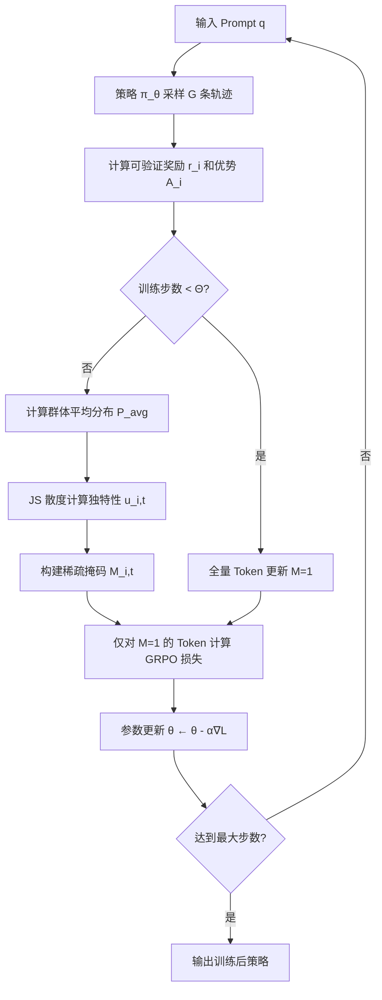

## 1. 论文信息

| 字段 | 内容 |
|------|------|
| **标题** | Beyond Entropy: Learning from Token-Level Distributional Deviations for LLM Reasoning |
| **作者** | Xuanzhi Feng, Zhengyang Li, Zeyu Liu, Haoxi Li, Yuming Jiang, Bing Guo, Jingcai Guo, Jie Zhang, Song Guo |
| **机构** | 香港科技大学, 四川大学, 香港理工大学 |
| **arXiv** | [2606.19771](https://arxiv.org/abs/2606.19771) |
| **PDF** | [https://arxiv.org/pdf/2606.19771](https://arxiv.org/pdf/2606.19771) |
| **发表日期** | 2026-06-18 |

**一句话总结**：RLVR 训练中，均匀更新所有 Token 导致熵坍缩，仅更新高熵 Token 导致熵爆炸——ICT 框架用 JS 散度识别"分布独特 Token"，仅更新 Top 10% 即超越全量训练，同时稳定控制两种熵。

---

## 2. 研究背景与动机

### 2.1 RLVR 的优化不稳定性

Reinforcement Learning with Verifiable Rewards (RLVR) 已成为提升 LLM 推理能力的核心范式（GRPO、DeepSeek-R1 等）。但现有实现普遍存在一个根本问题：**对所有 Token 均匀施加训练信号**。

这导致两种极端：

- **熵坍缩（Entropy Collapse）**：均匀更新使模型过早收敛到次优策略，探索能力丧失（GRPO 的固有问题）
- **熵爆炸（Entropy Explosion）**：仅更新高 Shannon 熵 Token 导致盲目探索，生成无意义的推理链

### 2.2 现有方法的不足

| 方法 | 策略 | 问题 |
|------|------|------|
| GRPO (Shao et al.) | 全量 Token 更新 | 熵坍缩，探索不足 |
| 20-Entropy (Wang et al.) | 仅更新高熵 Token | 熵爆炸，盲目探索 |
| STAPO (Liu et al.) | 启发式约束 | 治标不治本 |

核心缺陷：**Shannon 熵作为标量指标，无法区分不同概率分布的结构差异**。两个分布可以有相同的 Shannon 熵值，却产生完全不同的推理轨迹。

### 2.3 核心洞察

> 信息论基本原理：事件的自信息量与其概率成反比。Token 的**独特性**（分布偏离程度）与其编码的信息重要性正相关。

ICT 将优化焦点从**标量不确定性**转向**Token logits 的分布特性**，通过 Jensen-Shannon (JS) 散度量化每个 Token 相对于群体平均分布的偏离程度。

---

## 3. 核心方法

### 3.1 理论框架：熵动力学分析

论文引入**二阶 Rényi 熵** $\mathcal{H}_2$ 作为更稳健的探索能力指标：

$$\mathcal{H}_2(\pi_\theta|s) = -\log\left(\sum_a \pi_\theta(a|s)^2\right)$$

相比 Shannon 熵，$\mathcal{H}_2$ 对长尾低概率噪声不敏感（二次依赖 $\sum \pi^2$），更能反映决策空间的有效支撑集大小。

**策略纯度（Strategy Purity）**定义为碰撞概率：

$$\beta(\pi) = \sum_a \pi(a)^2$$

**熵分叉定理**（核心发现）：

对 Token $a^*$ 施加小更新 $\Delta\theta_{s,a^*} > 0$，二阶熵变化的符号由下式决定：

$$\Delta\mathcal{H}_2 \approx -2\Delta\theta_{s,a^*}\pi(a^*)\left(\frac{\pi(a^*)}{\beta(\pi)} - 1\right)$$

- **Regime H（高概率 Token，$\pi(a^*) > \beta(\pi)$）**：$\Delta\mathcal{H}_2 < 0$，更新**降低**熵 → 熵坍缩
- **Regime L（低概率 Token，$\pi(a^*) < \beta(\pi)$）**：$\Delta\mathcal{H}_2 > 0$，更新**增加**熵 → 熵爆炸

这解释了为什么全量训练不稳定：高/低置信度 Token 产生**相反的熵梯度**。

### 3.2 ICT 分布选择器

ICT 用 JS 散度识别独特 Token：

$$u_{i,t} = D_{JS}\left(\text{softmax}(L_{i,t}) \parallel P_{\text{avg}}(\cdot|t)\right)$$

其中 $P_{\text{avg}}$ 是 G 条采样轨迹在位置 t 的平均分布。

构建稀疏掩码 $M_{i,t} \in \{0,1\}$，仅保留 Top k% 独特性 Token：

$$M_{i,t} = \mathbb{I}[u_{i,t} \geq \text{Percentile}(\{u_{i,\tau}\}_{\tau=1}^T, k)]$$

### 3.3 Sparse-GRPO 目标函数

$$\mathcal{J}_{\text{S-GRPO}}(\theta) = \mathbb{E}_{q,\{o_i\}}\left[\frac{1}{G}\sum_{i=1}^G \frac{1}{\sum_t M_{i,t}} \sum_{t=1}^{T_i} M_{i,t} \cdot \Psi_{i,t}(\theta)\right]$$

与标准 GRPO 相比，仅对独特 Token 加权求和，其余 Token 梯度被掩码过滤。

### 3.4 算法流程

<!-- Image 1: Figure 1 - 盲探索 vs 引导探索 -->

**Figure 1** 直观展示了三种训练策略的奖励轨迹：
- **蓝色曲线**（均匀更新）：熵坍缩，奖励快速下降
- **橙色曲线**（Shannon 熵选择）：盲目探索，持续不确定性
- **红色曲线**（ICT 引导）：稳定收敛，避免两种极端

<!-- Image 2: Figure 2 - ICT 稀疏 RLVR 框架 -->

**Figure 2** 展示了 ICT 框架的完整流程：通过 JS 散度选择独特 Token，构建稀疏掩码过滤梯度，实现精准探索引导。

---

## 4. 实验结果

### 4.1 实验设置

- **基座模型**：Qwen2.5 (0.5B / 1.5B / 7B)
- **训练框架**：VeRL + GRPO 训练配方
- **基线**：GRPO, 20-Entropy, STAPO
- **评估基准**（7 个）：Math500, GSM8K, MMLU-Stem, GPQA, AIME23, AIME24, AIME25
- **评估方式**：5 独立随机种子取均值

### 4.2 主实验结果

| 模型 | 方法 | Math500 P@1 | GSM8K P@1 | GPQA P@1 | AIME24 P@1 | Avg P@1 | Avg P@4 |
|------|------|-------------|-----------|----------|------------|---------|---------|
| **Qwen2.5-0.5B** | Base | 11.05 | 13.88 | 4.56 | — | — | — |
| | GRPO | 12.87 | 18.45 | 5.21 | — | — | — |
| | **ICT** | **14.72** | **21.38** | **6.15** | — | **+2.37%** | **+3.37%** |
| **Qwen2.5-1.5B** | Base | — | 43.10 | — | — | — | — |
| | GRPO | — | 57.45 | — | — | — | — |
| | **ICT** | — | **66.23** | — | — | **+3.64%** | **+4.98%** |
| **Qwen2.5-7B** | GRPO | — | — | — | — | — | — |
| | **ICT** | — | — | — | — | **+3.50%** | **+4.38%** |

**关键发现**：

1. **ICT 在所有模型规模和基准上均超越基线**，0.5B/1.5B/7B 分别提升 3.38%、4.31%、3.94%
2. **Pass@4 增益 > Pass@1 增益**：ICT 产生更多样化的正确推理路径，而非冗余路径
3. **跨领域泛化**：在数学数据集上训练的 ICT 在 GPQA（科学问答）上同样有效，而 20-Entropy 在非数学数据集上性能下降

### 4.3 消融实验

#### 更新比例对比（Qwen2.5-1.5B, GSM8K）

| 方法 | GSM8K P@1 | GSM8K P@4 |
|------|-----------|-----------|
| Base | 43.10 | 77.29 |
| GRPO | 57.45 | 78.45 |
| **10%-unique（ICT）** | **66.23** | **85.31** |
| 20%-unique | 63.37 | 83.31 |
| 30%-unique | 64.45 | 83.76 |
| 90%-frequent | 60.62 | 85.08 |

**10% 是最优阈值**，与 JS 散度分布的拐点一致。更新更多 Token 反而引入噪声梯度。

<!-- Image 3: Figure 3 - 不同更新比例的奖励轨迹 -->

**Figure 3** 显示 10% unique token 策略（红色曲线）达到最高且最稳定的奖励。

#### 独特 Token 的熵属性分析

<!-- Image 4: Figure 4 - 独特 Token 中高/低熵比例 -->

**Figure 4** 揭示独特 Token 中**高熵与低熵 Token 比例约为 1:1**（GSM8K: 1.03, MATH: 0.99），验证了理论预测的独特 Token 位于两个熵制衡区域之间的关键分支点。

---

## 5. 个人评价

### 5.1 创新点

1. **从标量到分布的范式转变**：不再用 Shannon 熵这一标量值判断 Token 重要性，而是用 JS 散度衡量分布偏离度。这是对信息论在 RLVR 中应用的深度拓展。

2. **理论严谨性**：基于 Shannon 熵和二阶 Rényi 熵的双重分析，严格证明了独特 Token 更新对熵动力学的调控作用。熵分叉定理（Entropy Bifurcation Theorem）为稀疏更新提供了坚实的理论基础。

3. **"少即是多"的实证**：仅 10% Token 的梯度更新即超越全量训练，这不仅是计算效率的提升，更揭示了推理优化中**关键决策节点**的帕累托分布特性。

### 5.2 局限性

1. **仅验证于 Qwen2.5 系列**：未在其他架构（Llama、Mixtral 等）或更大规模模型（>7B）上验证泛化性。

2. **JS 散度计算开销**：需要计算每个 Token 相对于群体平均分布的 JS 散度，在大批次训练时可能带来额外计算负担。论文未报告训练时间的对比。

3. **Top-k 阈值固定**：10% 的阈值在消融实验中表现最优，但是否需要自适应调整（如随训练阶段变化）未探索。

4. **仅数学推理领域**：未在代码生成、常识推理等更广泛的推理任务上验证。

### 5.3 对后续研究的影响

- **RLVR 算法设计**：ICT 为稀疏策略梯度更新提供了新范式，可能启发更多基于分布特性的 Token 选择方法。
- **推理效率**：10% 梯度更新即达最优，意味着推理对齐的训练成本可大幅降低。
- **理论方向**：二阶 Rényi 熵在 RLVR 中的应用可能扩展到更广泛的优化稳定性分析。

---

## 6. 相关论文

| 论文 | 方向 | 与 ICT 的关系 |
|------|------|--------------|
| **GRPO** (Shao et al., 2024) | RLVR 基线 | ICT 的直接基线，ICT 在 GRPO 上加入稀疏 Token 选择 |
| **20-Entropy** (Wang et al., 2025) | 高熵 Token 选择 | 对比基线，证明仅用 Shannon 熵的局限性 |
| **STAPO** (Liu et al., 2026) | 启发式约束 | 对比基线，ICT 从分布层面从根本上解决问题 |
| **DeepSeek-R1** (Guo et al., 2025) | RLVR 推理对齐 | 同属 RLVR 范式，ICT 可视为其训练效率优化方向 |
| **Manifold Bandits** (McKenzie et al., 2026) | 课程学习 | 同为 RL 训练效率优化，但关注问题采样而非 Token 选择 |

---

> 整理者：Nancy | 数据源：arXiv (2606.19771) + PaddleOCR 解析 | 更新时间：2026-06-22
