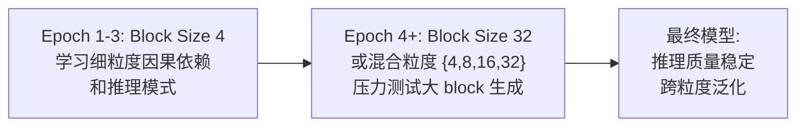

## 1. 论文信息

- **标题**: DreamReasoner-8B: Block-Size Curriculum Learning for Diffusion Reasoning Models
- **作者**: Zirui Wu, Lin Zheng, Jiacheng Ye, Shansan Gong, Xueliang Zhao, Yansong Feng, Wei Bi, Lingpeng Kong
- **机构**: The University of Hong Kong, Peking University
- **arXiv**: [2606.19257](https://arxiv.org/abs/2606.19257)
- **PDF**: [https://arxiv.org/pdf/2606.19257](https://arxiv.org/pdf/2606.19257)
- **代码/模型**: [https://github.com/DreamLM/DreamReasoner](https://github.com/DreamLM/DreamReasoner)

**一句话总结**: 块级扩散语言模型在长链思维推理中存在"粒度困境"——大 block 训练导致推理崩塌，小 block 训练无法发挥并行优势。本文提出块级课程学习，从细粒度渐进到粗粒度，训练出首个与 AR 模型推理性能相当（追平 Qwen3-8B-Thinking）的开源扩散推理模型。

## 2. 研究背景与动机

### 2.1 自回归解码的并行瓶颈

当前推理模型（OpenAI o1, DeepSeek-R1, Qwen3-Thinking 等）全部基于自回归（AR）架构。AR 解码严格遵循从左到右的因子分解：

$$p(x_1, \ldots, x_T) = \prod_{t=1}^{T} p(x_t \mid x_{<t})$$

这意味着**每个 token 必须等前一个 token 生成完毕后才能开始计算**，推理完全串行化。对于长链思维（CoT）场景，推理步数可达数千 token，效率瓶颈显著。

### 2.2 扩散语言模型的潜力与困境

扩散语言模型通过迭代去噪生成文本，天然支持**并行 token 生成**。Block Diffusion（Arriola et al., 2025）进一步将序列划分为连续块：

$$p_{\theta}(\mathbf{x}_{0})=\prod_{k=1}^{K}p_{\theta}(b_{0}^{k}\mid b_{0}^{<k})$$

- **块间**：自回归依赖（保证序列连贯性）
- **块内**：双向扩散并行去噪（加速生成）

理论上，block size 越大，并行度越高，推理越快。但已有工作（SDAR, TraDo 等）显示：**扩散模型在复杂推理 benchmark 上远落后于 AR 模型**，且 block size 增大时性能急剧下降。

### 2.3 核心问题

> Block Diffusion 能否在保持推理质量的同时，利用大 block 实现高效并行解码？

## 3. 核心方法

### 3.1 Block Diffusion 训练目标

Block Diffusion 使用前向腐蚀过程将目标 block 中的 token 逐步替换为 [MASK]，训练目标为加权交叉熵：

$$\mathcal{L}(\theta)=-\mathbb{E}_{t,b_{0},b_{t}}\bigg[\sum_{k=1}^{K}w_{t}\log p_{\theta}\big(b_{0}^{k}\mid b_{0}^{<k},b_{t}^{k}\big)\bigg]$$

其中 $w_t = \frac{\alpha'_t}{1-\alpha_t}$ 为时间步权重，只有被 mask 的 token 贡献 loss。

### 3.2 粒度困境：Pilot Study 发现

作者在 PromptCoT 2.0 子集上对比了两种固定粒度训练策略（Block Size 4 vs 32）：

| Training Block Size | Inference Block Size | AIME 2024 (LowConf) | AIME 2024 (AR) |
|---------------------|---------------------|---------------------|----------------|
| 4 | 4 | **47.1%** | **52.1%** |
| 4 | 32 | 42.5% | 52.1% |
| 32 | 4 | **20.0%** | 29.2% |
| 32 | 32 | 29.5% | 33.3% |

**关键发现**:
1. **大 block 训练导致推理崩塌**: Block Size 32 训练的模型在 AIME 2024 上仅 20.0%（LowConf），相比 Block Size 4 训练的 47.1% 暴跌 57.5%
2. **小 block 训练具有跨粒度泛化能力**: Block Size 4 训练的模型在 Block Size 32 推理下仅下降 4.6 个百分点
3. **AR 解码部分恢复大 block 模型性能**: 说明大 block 训练导致模型过度依赖块内并行聚合，丧失了 token 级顺序推理能力

### 3.3 块级课程学习（Block-Size Curriculum Learning）

为解决粒度困境，作者提出渐进式课程学习：

**训练流程**:
1. **阶段一**（Block Size 4）：让模型学习 robust 的局部因果依赖和细粒度推理模式
2. **阶段二**（Block Size 32 或混合 {4,8,16,32}）：渐进暴露于大 block，使模型适应粗粒度生成

**课程训练效果**:

| Model | AIME 2024 (BS=4) | AIME 2024 (BS=32) | AIME 2025 (BS=4) | AIME 2025 (BS=32) |
|-------|-------------------|--------------------|-------------------|--------------------|
| Fixed BS=4 | 47.1% | 42.5% | 37.5% | 39.6% |
| Fixed BS=32 | 20.0% | 29.5% | 24.2% | 21.3% |
| **Curriculum (4→32)** | **50.0%** | **48.3%** | **39.8%** | **38.5%** |

课程模型在两种推理粒度下均超越固定粒度基线，证明渐进学习有效**解耦了推理质量与 block 粒度**。

### 3.4 DreamReasoner-8B 训练配置

- **基座**: Qwen3-8B-Base → 持续预训练为 Block Diffusion 模型（160B tokens）
- **微调数据**: PromptCoT 2.0，约 480 万样本，上下文 16384 tokens
- **课程策略**: Block Size 4 训练 3 epoch → 混合粒度 {4,8,16,32} 随机采样
- **推理引擎**: SGLang
- **解码策略**: LowConfidence（阈值 τ=0.95）

### 3.5 RelaxedConfidence 解码加速

标准 LowConfidence 解码过于保守：连续 token 序列通常在个体置信度超过阈值前就已经稳定。作者提出 RelaxedConfidence，通过邻居支持动态调整置信度阈值：

$$S_{i}=\frac{\sum_{j\in\mathcal{N}_{r}(i)\cap\mathcal{R}}w_{i,j}}{\sum_{j\in\mathcal{N}_{r}(i)}w_{i,j}},\quad\tau_{i}=\tau-(\tau-\tau_{\min})S_{i}$$

- $S_i$：空间支持分数（0=孤立 token，1=完全被可靠邻居包围）
- $\tau_i$：动态阈值，孤立 token 保持全阈值 $\tau$，被支持的 token 降至 $\tau_{\min}$

**效果**:

| Phase | LowConfidence TPF | RelaxedConfidence TPF | 提升 |
|-------|-------------------|-----------------------|------|
| Thinking | ~2.1 | ~2.8 | **+33%** |
| Answering | ~2.4 | ~3.6 | **+50%** |

准确率仅下降 2 个百分点（AIME25: 63→61），换取显著吞吐量提升。

## 4. 实验结果

### 4.1 Base 模型对比

DreamReasoner-8B-Base 在多项 benchmark 上追平甚至超越同规模 AR 模型：

| Model | Type | MMLU | MATH | HumanEval |
|-------|------|------|------|-----------|
| DreamReasoner-8B-Base | Block Diffusion | **75.4** | **55.8** | **69.5** |
| Qwen3-8B-Base | AR | 76.9 | 52.7 | 65.8 |
| Dream-v0-7B-Base | Diffusion | 69.5 | 39.6 | 57.9 |
| LLaDA-8B-Base | Diffusion | 65.9 | - | - |

### 4.2 推理模型对比

| Model | Block Size | AIME 2024 | AIME 2025 | LiveCodeBench |
|-------|-----------|-----------|-----------|---------------|
| Qwen3-8B-Thinking | - | **76.0** | **67.0** | **56.1** |
| AceReason-Nemotron-1.1-7B | - | 72.6 | 64.8 | 52.1 |
| **DreamReasoner-8B** | 4 | **65.0** | **64.0** | **51.3** |
| **DreamReasoner-8B** | 32 | 63.0 | 63.0 | **51.5** |
| SDAR-30B-A3B-Sci | 4 | 59.0 | 27.0 | 29.0 |
| SDAR-30B-A3B-Sci | 32 | 18.0 | 47.0 | - |
| TraDo-8B-Thinking | - | 45.0 | - | - |

**关键观察**:
- DreamReasoner-8B 在 Block Size 4 和 32 下性能稳定（AIME 2024: 65→63），而 SDAR-30B（参数量 3.75x）在 Block Size 32 下暴跌至 18%
- LiveCodeBench 上超越 SDAR-30B 22.3 个百分点
- 与 Qwen3-8B-Thinking 的差距控制在 10 个百分点以内

### 4.3 效率分析：TPF（Tokens Per Forward Pass）

| Block Size | TPF (Ours) | TPF (SDAR) |
|-----------|------------|------------|
| 4 | 21.5% | 1.40% |
| 8 | 27.0% | 0.80% |
| 16 | 30.5% | 0.30% |
| 32 | **43.0%** | 0.40% |

Block Size 32 下，DreamReasoner-8B 的 TPF 达到 43.0%，而 SDAR 仅为 0.40%（**107x 差距**）。

### 4.4 RelaxedConfidence 加速效果

| | LowConfidence | RelaxedConfidence |
|--|---------------|-------------------|
| AIME25 Pass@1 | 63% | 61% |
| LiveCodeBench | 51% | 49% |
| Thinking TPF | 2.1 | **2.8** |
| Answering TPF | 2.4 | **3.6** |

## 5. 个人评价

### 5.1 创新点

1. **首次系统性研究 block size 作为扩散推理模型的缩放轴**：不是固定超参数，而是推理时可调的质量-效率旋钮
2. **块级课程学习**：简单但有效，解决了大 block 训练的推理崩塌问题
3. **RelaxedConfidence**：基于空间邻居支持的动态阈值，直觉合理，工程实现简单
4. **开源 8B 扩散推理模型**：填补了开源社区在扩散推理方向的空白

### 5.2 局限性

1. **仅覆盖数学和代码推理**：未评估工具使用、多模态等更广泛的推理场景
2. **固定 block size**：未探索语义感知的动态/变长 block 划分（如按代码块、段落边界划分）
3. **仍落后 AR 模型约 10%**：AIME 2024 上 65% vs Qwen3-8B-Thinking 的 76%
4. **RelaxedConfidence 为分析性探针**：尚未集成到实际推理管线中

### 5.3 对后续研究的影响

- **扩散推理的可行性得到验证**：8B 规模即可追平 AR 模型，说明扩散架构不是推理的瓶颈
- **课程学习思路可推广**：粒度渐进训练可能适用于其他"精度-效率"权衡问题
- **RelaxedConfidence 可结合 Speculative Decoding**：空间支持分数与投机解码的 draft-verify 范式天然兼容
- **动态 block size 是下一步**：语义感知的 block 划分可能进一步突破效率上限

## 6. 相关论文

1. **Block Diffusion** (Arriola et al., 2025) — 首次提出块级扩散架构，在自回归和全序列扩散之间插值
2. **SDAR** (Cheng et al., 2025) — 协同扩散-自回归范式，30B 参数但推理性能不稳定
3. **LLaDA** (Nie et al., 2025) — 8B 全序列扩散语言模型，推理能力有限
4. **Dream-7B** (Ye et al., 2025) — 从 AR checkpoint 初始化的扩散大语言模型
5. **FastDLLM v2** (Wu et al., 2025) — 无需训练的扩散 LLM 加速，通过 KV cache 和并行解码

> 整理者：Nancy | 数据源：arXiv (2606.19257) | 更新时间：2026-06-22