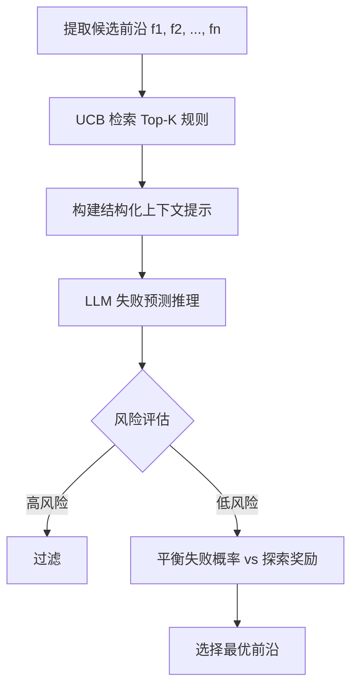

## 论文信息

| 字段 | 内容 |
|------|------|
| **标题** | EvolveNav: Proactive Preflection and Self-Evolving Memory for Zero-Shot Object Goal Navigation |
| **作者** | Qi Chai\*, Wenhao Shen\*, Kaiyong Zhao, Nanjie Yao, Yue Xia, Jie Ma, Guosheng Lin, Hao Wang† |
| **机构** | HKUST(GZ), Nanyang Technological University, XGRIDS, Xi'an Jiaotong University |
| **arXiv** | [2606.18235](https://arxiv.org/abs/2606.18235) |
| **PDF** | [链接](https://arxiv.org/pdf/2606.18235) |
| **发表** | 2026-06-16 |

> **一句话总结**：提出零样本物体目标导航（ZS-OGN）框架，通过自进化规则记忆 + UCB 检索 + 前瞻反思机制，在**不微调任何参数**的前提下实现持续在线改进，HM3D 成功率 67.3%，MP3D 成功率 49.0%，超越所有现有零样本基线。

---

## 研究背景

### 2.1 任务定义

**物体目标导航（Object-Goal Navigation, OGN）**：机器人在未知环境中自主探索，找到指定类别的目标物体（如"找到一盆盆栽"）。

**零样本设定（ZS-OGN）**：不允许任何任务特定或环境特定的微调，完全依赖预训练基础模型（LLM/VLM）的通用先验知识。

### 2.2 现有方法的瓶颈

当前零样本方法（ZSON、ASCENT、MSGNav、ApexNav 等）存在两个根本缺陷：

1. **静态先验，无法适应**：基础模型仅提供固定的语义先验，面对视觉相似物体（如沙发 vs 椅子）或非常规布局时反复犯同样错误
2. **试错成本过高**：在步骤预算有限的环境中，每一步物理行动都很昂贵。现有方法多为**事后修正**（post-hoc correction），错误发生后才检测，浪费大量步骤

### 2.3 核心问题

> 如何在有限测试时间步骤预算下，同时实现**在线适应**和**行动预见**？

---

## 核心方法

### 3.1 整体架构

EvolveNav 将导航转化为**持续自我改进过程**，由两个核心组件构成：

**左：EvolveNav（自进化）**
- 从历史回合中学习 → 动态更新规则 → 前瞻反思避免低价值房间 → 持续进化规则库

**右：Baseline（被动反应）**
- 依赖固定先验 → 重复犯错 → 低效探索

### 3.2 组件一：自进化 Agent 规则记忆（Inter-Episode Rule Self-Evolution）

每轮导航结束后，系统提取可操作的导航规则并存入记忆库 $\mathcal{M}$。

#### 规则生成流程

#### 语义驱动信用分配（Semantic-driven Credit Assignment）

从漫长轨迹中精准识别哪些行动导致了最终结果：

$$S_i = \alpha \cdot S_{room}^{(i)} + (1-\alpha) \cdot S_{obj}^{(i)}$$

其中 $S_{room}^{(i)}$ 和 $S_{obj}^{(i)}$ 分别为当前房间类型和可见物体集与目标类别的余弦相似度。

第 $i$ 步的**边际贡献**：

$$C_i = S_i - S_{i-1}$$

新规则 $r$ 的初始支持分：

$$S_r = \sum_i w_i \cdot C_i$$

#### UCB 动态记忆管理

将规则检索建模为**多臂老虎机问题**：

$$UCB(r) = \mu_r + \beta\sqrt{\frac{\ln T}{N_r}}$$

- $\mu_r$：规则历史表现（动量平滑更新：$\mu_r \leftarrow \eta \cdot \mu_r + (1-\eta) \cdot S_r$）
- $T$：总探索回合数
- $N_r$：规则 $r$ 被检索应用的次数
- $\beta$：探索程度超参数
- 新规则 $N_r=0$ 时，UCB 初始化为 $\infty$，保证初始验证

Top-K 规则注入 LLM 上下文，完成认知闭环。

### 3.3 组件二：记忆引导前瞻反思（Memory-Guided Preflection）

在**行动前**评估候选前沿（frontier）的潜在风险，过滤低价值/高风险选项。

**关键设计**：不直接选择目标，而是强制 LLM 先进行**失败预测推理**——合成注入规则与当前观测，预测每个前沿的失败风险。

### 3.4 空间映射与底层控制

- 增量式 **2D Occupancy Grid Map**（从 RGB-D 深度数据投影）
- 前沿提取：已知自由空间与未探索区域的几何边界
- 底层导航控制器执行到航点，上限 $H$ 步，防止卡死

---

## 实验结果

### 4.1 主实验对比

| 方法 | 类型 | 视觉模型 | 语言模型 | HM3D SR↑ | HM3D SPL↑ | MP3D SR↑ | MP3D SPL↑ |
|------|------|----------|----------|----------|-----------|----------|-----------|
| RIM [IROS'23] | 学习型 | - | - | 57.8 | 27.2 | 50.3 | 17.0 |
| VLFM [ICRA'24] | 零样本 | BLIP-2 | GPT-4 | 48.0 | 22.1 | 35.0 | 12.8 |
| L3MVN [IROS'23] | 零样本 | - | GPT-3.5 | 38.5 | 18.2 | 30.2 | 10.1 |
| SG-Nav [NeurIPS'24] | 零样本 | CLIP | GPT-4 | 55.0 | 26.3 | 38.5 | 13.7 |
| ASCENT [RAL'26] | 零样本 | Qwen2-VL | Qwen2.5 | 65.4 | 33.5 | 44.5 | 15.3 |
| MSGNav [arXiv'25] | 零样本 | Qwen2-VL | Qwen2.5 | 65.4 | 33.5 | 44.5 | 15.3 |
| **EvolveNav (Ours)** | **零样本** | **BLIP-2** | **Qwen3-8B** | **67.3** | **33.9** | **49.0** | **19.1** |

**关键发现**：
- HM3D：SR 67.3%，超越最强基线 1.9%
- MP3D：SR 49.0%，超越最强基线 **4.5%**（绝对提升），SPL 提升 **3.8%**
- MP3D 提升显著更大——复杂多楼层场景中自进化记忆有效弥合泛化鸿沟

### 4.2 消融实验

| 设置 | Preflection | Memory-Evolve | HM3D SR | HM3D SPL | MP3D SR | MP3D SPL |
|------|:-----------:|:-------------:|:-------:|:--------:|:-------:|:--------:|
| 1 (Baseline) | ✗ | ✗ | 64.7 | 32.5 | 43.9 | 15.8 |
| 2 | ✓ | ✗ | 66.5 | 33.5 | 47.4 | 18.4 |
| 3 | ✗ | ✓ | 66.7 | 33.6 | 48.3 | 18.7 |
| **4 (Full)** | **✓** | **✓** | **67.3** | **33.9** | **49.0** | **19.1** |

- **Preflection 单独贡献**：HM3D +1.8% SR，MP3D **+3.5% SR**（复杂场景收益更大）
- **Memory-Evolve 单独贡献**：HM3D +2.0% SR，MP3D **+4.4% SR**（自进化记忆是主要增益来源）
- **两者结合有协同效应**：Full 版本超过单独模块之和

### 4.3 LLM 骨干消融

| 视觉模型 | 语言模型 | HM3D SR | MP3D SR |
|----------|----------|:-------:|:-------:|
| BLIP-2 | Qwen2.5-7B | 67.0 | 48.8 |
| BLIP-2 | Qwen3-8B | 67.3 | 49.0 |
| BLIP-2 | Qwen3.5-9B | 67.2 | 48.9 |

**重要发现**：LLM 骨干从 7B 到 9B 性能几乎不变。原因：EvolveNav 的决策由**动态规则记忆**驱动，而非 LLM 的原始推理能力。

### 4.4 定性可视化

**案例**：寻找"盆栽"的多房间场景
- Step 22：触发前瞻反思，检索规则"避免依赖 spa/jacuzzi 的间接关联"，成功绕过误导性前沿 1
- Step 106：前瞻反思引导优先探索含扶手椅区域，预期与盆栽共现概率更高
- 回合结束后：动态提升成功规则权重，蒸馏新规则"寻找盆栽时优先含扶手椅的区域"

**三条 MP3D 场景对比**：
- ASCENT（红色轨迹）：频繁被相邻小房间和狭窄走廊干扰，大量步骤浪费在局部陷阱中
- EvolveNav（绿色轨迹）：在狭窄通道入口主动观察重定向，规划更直接的全局最优路线

---

## 个人评价

### 5.1 创新点

1. **从"被动修正"到"主动预见"的范式转换**：Preflection 模块在行动前评估风险，而非事后纠错。这对步骤预算有限的具身导航至关重要。

2. **测试时自进化无需参数更新**：规则记忆 + UCB 检索构成完整认知闭环。所有改进发生在推理时，严格遵循零样本设定。

3. **语义驱动信用分配**：用语义相似度的边际增益替代 RL 中的标量奖励，更细粒度地量化每步贡献。

4. **LLM 骨干鲁棒性**：7B~9B 性能几乎一致，说明框架对基础模型规模不敏感——降低了部署成本。

### 5.2 局限性

1. **依赖 2D 视觉模型**：2D 检测错误直接导致导航失败。论文建议未来引入多视角验证或主动感知策略。

2. **非常规布局敏感**：如"厨房里的床"可能陷入低效探索循环。规则验证和更新策略需进一步研究。

3. **单 Agent 设定**：大规模复杂环境可能需要多 Agent 协作。

### 5.3 对后续研究的影响

- **零样本具身智能**：证明了"推理时自进化"路线的可行性，为训练-free 导航提供了新范式
- **Agent 记忆机制**：UCB 检索 + 语义信用分配的框架可迁移到其他需要经验积累的 Agent 场景
- **前瞻推理**：Preflection 概念可推广至任何试错成本高昂的决策场景（如机器人操作、自动驾驶）

---

## 相关论文

| 论文 | 简述 |
|------|------|
| **Reflexion** (Shinn et al., NeurIPS 2023) | 语言 Agent 通过口头强化学习进行反思，无需权重更新即可持续改进 |
| **MemoryBank** (Zhong et al., AAAI 2024) | 增强 LLM 的长期记忆，按时间性和相关性动态更新记忆 |
| **ASCENT** (Gong et al., RAL 2026) | 在线跨楼层零样本导航，分层楼梯感知拓扑 + LLM 驱动粗到细推理 |
| **MSGNav** (Huang et al., arXiv 2025) | 多模态 3D 场景图零样本具身导航，以图像为边特征保留视觉信息 |
| **ApexNav** (Zhang et al., RAL 2025) | 自适应探索策略零样本物体导航，平衡语义与几何探索 |

---

> 整理者：Nancy | 数据源：arXiv (2606.18235) + PaddleOCR-VL-1.6 解析 | 更新时间：2026-06-22
