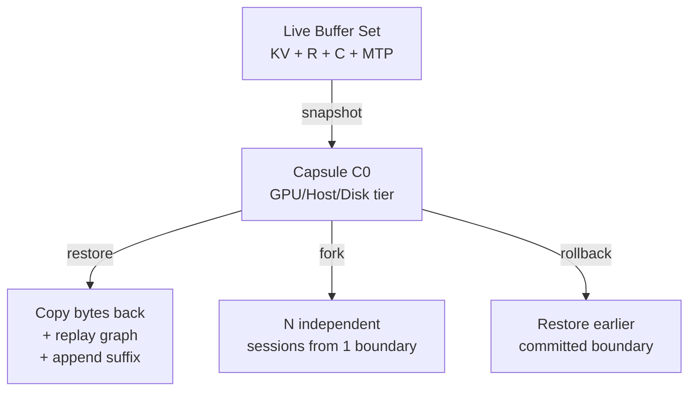

## 1. 论文信息

- **标题**: Execution-State Capsules: Graph-Bound Execution-State Checkpoint and Restore for Low-Latency, Small-Batch, On-Device Physical-AI Serving
- **作者**: Liang Su
- **arXiv**: [2606.20537](https://arxiv.org/abs/2606.20537)
- **PDF**: [https://arxiv.org/pdf/2606.20537](https://arxiv.org/pdf/2606.20537)
- **代码**: [github.com/flashrt-project/FlashRT](https://github.com/flashrt-project/FlashRT)

**一句话总结**: FlashRT 将 LLM 推理的完整执行状态（KV + 循环状态 + 卷积状态 + MTP 缓存）封装为可快照/恢复/分叉的"胶囊"对象，在单流低延迟场景下将首 token 延迟（TTFT）从冷启动的秒级降至毫秒级，速度提升最高达 76×。

## 2. 研究背景与动机

### 现有 LLM Serving 架构的局限

当前主流 LLM 推理服务框架（vLLM、SGLang）围绕**高吞吐、多并发**场景设计，核心管理对象是 **KV Cache**：

- **vLLM (PagedAttention)**: 将 KV Cache 分页管理，通过 block table 将逻辑位置映射到物理块，支持 copy-on-write 共享
- **SGLang (RadixAttention)**: 用前缀树（radix tree）匹配最长公共前缀，自动复用共享前缀

两者都使用 **CUDA Graphs** 降低启动开销，但它们的图**刻意不绑定 KV 为自包含缓冲区集**——attention 通过可变 block-table 索引读取 KV，使得单个捕获的图可以从不固定的物理块中收集数据。

这种间接寻址是块复用的前提，但也意味着：**捕获的图 + 其绑定缓冲区永远不构成完整的、可冻结的前向传播快照**。

### 目标场景：单流低延迟服务

论文定义的"Physical-AI Serving"场景特征：

| 特征 | 说明 |
|------|------|
| 并发度 | 1 或少数几个流 |
| 核心指标 | TTFT（首 token 延迟），非吞吐率 |
| 典型负载 | 长前缀（10k-50k token）+ 短后缀，每轮重复发送 |
| 硬件 | 单 GPU，设备端/边缘端 |
| 关键需求 | 快速恢复会话状态（新回合、分支、中断、重新进入） |

在这种场景下，高吞吐优化的 KV 管理机制无法发挥最大效率——因为它们的效率前提（大量并发请求分摊共享缓存）不成立。

### 核心洞察

> 问题不在于能否匹配并复用共享前缀的 KV，而在于系统能否在交互变化后快速恢复有效的继续状态。

**位置寻址的 KV Cache 只是状态的一部分，不是全部控制面。** 对于混合架构模型（线性注意力 + 全注意力），线性注意力的循环状态是对整个前缀的 fold 操作，无法按位置切片复用。

## 3. 核心方法

### 3.1 FlashRT 运行时底座

FlashRT 是一个**面向内核的白色盒子运行时**，核心设计选择：

```
静态连续缓冲区 + 图回放，无 block-table 间接寻址
```

这一个设计选择同时带来两个后果：

1. **运行时快**: 无 gather 开销、字节级一致回放、无每步启动/Python 开销
2. **状态可冻结**: 前向传播在固定缓冲区集上运行，边界状态 = 固定缓冲区集

### 3.2 执行状态胶囊（Execution-State Capsule）

**定义**: 胶囊将提交边界位置 P 处的完整执行状态冻结为一组命名的设备缓冲区。

对于混合 LLM，胶囊包含：

```
┌─────────────────────────────────────────────┐
│           Execution-State Capsule            │
├─────────────────────────────────────────────┤
│  固定大小部分 (Fixed-size)                   │
│  ├─ 线性注意力循环状态 (Recurrent State)     │
│  ├─ 卷积状态 (Convolution State)             │
│  ├─ MTP 尾部 + 紧凑缓存 (MTP Tail)           │
│  ├─ 最后隐藏层 (Last Hidden, MTP seed)       │
│  └─ 边界元数据 (cur_pos, 前缀 digest)        │
│                                             │
│  KV 区域 (随 P 增长)                         │
│  ├─ 全注意力 KV [0, P)                      │
│  └─ FP8 反量化阶段有效端                     │
└─────────────────────────────────────────────┘
```

### 3.3 四个动词（Serving Verbs）

胶囊提供四个操作，全部基于缓冲区集的字节复制 + 已捕获图的回放：



| 动词 | 操作 | 成本 |
|------|------|------|
| **snapshot** | 冻结边界缓冲区集 | Θ(bytes)，带宽受限复制 |
| **restore** | 复制回缓冲区 + 重建边界 | Θ(bytes)，带宽受限复制 |
| **cold prefill** | 重新计算共享前缀 | 计算受限，∝ 前缀长度 |

关键不等式：

$$T_{\text{prefill}}(L) \gg T_{\text{restore}}(L)$$

前缀越长，差距越大。

### 3.4 与 vLLM/SGLang 的对比


*Figure 1: 各系统管理对象的具体对比。(a) 分页/前缀引擎通过 token 地址复用；(b) FlashRT 将前向传播捕获为连续静态缓冲区上的图计划，边界状态为一个命名、有序的缓冲区集。*


*Figure 2: 胶囊的四个动词操作。snapshot 冻结完整缓冲区集，restore 复制回缓冲区并追加后缀，fork 将一边界分叉为 N 个独立会话，rollback 回退到早期边界。*

| 维度 | vLLM (PagedAttention) | SGLang (RadixAttention) | FlashRT (Capsule) |
|------|----------------------|------------------------|-------------------|
| **管理对象** | KV 内存页 | KV 前缀子树 | 图绑定执行状态 |
| **寻址方式** | 位置（块） | 前缀（radix） | 边界 |
| **启用能力** | 高吞吐批处理 | 跨调用前缀复用 | 恢复/分叉/回滚 |
| **循环状态复用** | 实验性 | 独立缓存 | ✅ 原生支持 |
| **分叉（1→N）** | ❌ | ❌ | ✅ |
| **回滚** | ❌ | ❌ | ✅ |

### 3.5 执行契约（Execution Contract）

胶囊基于极简 C ABI，仅三种句柄类型：

```c
/* Buffer: 唯一的状态原语 */
frt_buffer frt_buffer_alloc(frt_ctx, const char* name, size_t bytes);
frt_buffer frt_buffer_wrap(frt_ctx, const char* name, void* dptr, size_t);
int frt_buffer_copy(frt_ctx, frt_buffer dst, size_t doff,
                    frt_buffer src, size_t soff, size_t n, int stream);

/* Graph: ShapeKey -> 捕获的图执行 */
int frt_graph_capture(frt_graph, frt_shape_key, void(*rec)(void*,void*), void*);
int frt_graph_replay(frt_graph, frt_shape_key, int stream_id);
```

**机制不策略（Mechanism-not-Policy）**：契约只看到流、图、事件和命名缓冲区，不知道会话、KV append/fork/evict 或调度器。

### 3.6 块对齐条件（Chunk Alignment Condition）

论文发现的一个关键正确性条件：长分块线性注意力推理按块折叠循环状态，状态在位置 P 依赖于块边界位置。若胶囊边界 P 不是块大小 C 的倍数，append 会引入冷推理从未有过的块分裂，在 FP8 舍入下产生偏差。

**解决方案**: 在块对齐边界快照：$P' = \lfloor P/C \rfloor \cdot C$

$$\text{restore}(P') + \text{append}(\text{suffix}) + \text{decode} = \text{cold-full-prefill} + \text{decode}$$

子块余量（<C tokens）由 append 廉价地重新推理。

## 4. 实验结果

### 4.1 运行时底座（RTX 5090）


*Figure: 运行时底座性能数据。冷启动 TTFT 尾部紧密（p99 与 p50 差距 < 0.5ms），峰值内存 22.8GB。*

| 指标 | p50 | p90 | p99 |
|------|-----|-----|-----|
| 冷启动 TTFT (ms) | 366.8 | 367.2 | 367.2 |
| 胶囊 TTFT (ms) | 53.0 | 53.0 | 53.1 |
| 峰值 GPU 内存 | 22.8 GB | | |

冷启动 TTFT 比 vLLM **低 2.6-2.8×**，且尾部延迟极紧。

### 4.2 胶囊机制性能


*Figure: 胶囊操作成本随前缀长度缩放。snapshot 和 restore 均为亚毫秒级，append 稳定在 ~25-28ms。*

| 前缀长度 | 胶囊大小 | snapshot | restore | append | 冷 TTFT | 胶囊 TTFT | 加速比 |
|----------|---------|----------|---------|--------|---------|-----------|--------|
| 2048 | 160 MB | 0.3 ms | 0.3 ms | 25 ms | 200 ms | 51 ms | **3.9×** |
| 4096 | 224 MB | 0.4 ms | 0.4 ms | 26 ms | 365 ms | 53 ms | **6.9×** |
| 8192 | ~352 MB | ~0.5 ms | ~0.5 ms | ~27 ms | ~723 ms | ~54 ms | **~13×** |
| 16384 | ~608 MB | ~0.8 ms | ~0.8 ms | ~28 ms | ~1541 ms | ~57 ms | **~27×** |

**关键观察**: 胶囊 TTFT 在前缀 2k→16k 范围内保持平坦（51-57ms），而冷启动 TTFT 线性增长，加速比单调扩大。

### 4.3 KV-only 消融实验


*Figure: 物理 AI 服务场景与胶囊操作。编码 agent 温暖多轮对话、思维树分叉、机器人 RL 回放的 episode 重置。*

| 恢复变体 | 首次偏离 | token 不匹配 | token 精确 |
|----------|---------|-------------|-----------|
| 完整状态 (KV+循环+卷积+MTP) | — | 0/48 | ✅ |
| 仅 KV，循环状态清零 | token 1 | 47/48 (97.9%) | ❌ |
| 仅 KV，循环状态过期 | token 3 | 45/48 (93.8%) | ❌ |

**结论**: 仅恢复位置 KV 不足以正确继续推理——循环状态是承载性组件，不是可选优化。

### 4.4 与 vLLM 对比（RTX 5090）


*Figure: 运行时底座与状态复用底座的对比。FlashRT 冷启动比 vLLM 低 2.6-2.8×，胶囊比 vLLM APC 缓存命中低 1.4-2.8×。*

| 前缀 | vLLM 冷 | FlashRT 冷 | vLLM APC 命中 | FlashRT 胶囊 |
|------|---------|-----------|--------------|-------------|
| 2048 | 519 ms | 200 ms | 143 ms | **51 ms** |
| 4096 | 1026 ms | 365 ms | 76 ms | **53 ms** |
| 8192 | 2057 ms | 723 ms | 120 ms | **54 ms** |

### 4.5 边缘设备性能


*Figure: 跨设备 TTFT 对比。Jetson Thor 上冷启动需秒级，胶囊恢复仅需 ~250ms。*

| 设备 | 前缀 2k | 前缀 4k | 前缀 8k | 前缀 16k |
|------|---------|---------|---------|----------|
| **RTX 5090 胶囊** | 50 ms | 50 ms | 50 ms | 50 ms |
| **Jetson Thor 胶囊** | 250 ms | 250 ms | 250 ms | 250 ms |
| DGX Spark 胶囊 | 200 ms | 200 ms | 200 ms | 200 ms |

Jetson Thor 上冷启动→胶囊加速比：**9-76×**（比 5090 的 27× 更大，因为边缘设备冷推理成本更高）。

### 4.6 工作集实验


*Figure: 实体工作集实验。vLLM-APC 在工作集超过 ~16k tokens 时缓存命中率崩溃至 0，胶囊保持平坦。*

- vLLM-APC 在 ~16k token 工作集后缓存命中率崩溃（TTFT 回到冷启动 519ms）
- 胶囊在所有工作集大小下保持 ~50ms（显式 pinning，不受自动 LRU 驱逐影响）
- 20 个上下文（3.4GB 胶囊）在 27.5GB 峰值内存下全部保持

### 4.7 跨域验证


*Figure: LLM+TTS 打断场景。胶囊恢复 persona 比重新推理快 2×。*

| 方法 | LLM persona 重新进入 | TTS 首音频 | 总时间 |
|------|---------------------|-----------|--------|
| 朴素（重新推理） | 205 ms | 105 ms | **300 ms** |
| 胶囊（恢复 persona） | 60 ms | 100 ms | **147 ms** |

## 5. 个人评价

### 创新点

1. **重新定义复用单元**: 从"token 寻址的 KV 片段"到"图绑定执行状态边界"。这不是更好的 KV Cache，而是第三类管理对象。

2. **一个设计选择，两个后果**: 静态连续缓冲区 + 图回放 = 同时获得低延迟执行 + 可冻结状态。不是两个独立功能的拼凑。

3. **机制不策略的契约设计**: 极简 C ABI（~188 行头文件），不依赖内核层。LLM warm start 和机器人 episode reset 使用同一个 snapshot/restore 动词。

4. **块对齐条件的发现**: 精确复用分块循环扫描需要尊重其块边界——这是一个具有普遍意义的发现。

### 局限性

1. **静态缓冲区牺牲灵活性**: 需要有限形状变体集和固定最大序列长度，不适合高并发多变形状负载。

2. **胶囊绑定部署**: 二进制状态 blob 绑定到精确权重、量化、内核版本和图 bucketing，不可跨版本移植。

3. **单节点**: 无分布式 KV 支持，大集群场景不在范围内。

4. **生产集成仍在进行中**: 论文是受控微基准，完整多轮服务器有未解决的工程问题。

### 对后续研究的影响

- **混合架构模型的推理服务**: 为 Mamba、GLA 等包含循环/卷积状态的模型提供了正确的状态复用范式
- **边缘 AI 部署**: 在设备端 GPU 上，冷启动成本是秒级，胶囊将其降至亚秒级
- **多模态交互**: LLM+TTS 打断场景展示了一个统一契约驱动多模型交互的潜力
- **机器人控制**: episode reset、中断恢复作为零重新捕获操作，为实时控制循环提供了计算状态恢复机制

## 6. 相关论文

1. **PagedAttention/vLLM** (SOSP 2023): LLM 服务中的分页 KV Cache 管理，高吞吐批处理的行业标准
2. **RadixAttention/SGLang** (NeurIPS 2024): 基于前缀树的 KV 复用，自动最长公共前缀匹配
3. **Medusa** (2024): 多解码头推测解码框架，加速 LLM 推理
4. **Pensieve** (EuroSys 2025): 有状态 LLM 服务，跨请求缓存多轮对话状态
5. **vAttention** (ASPLOS 2025): 通过 CUDA 虚拟内存保持 KV 虚拟连续，替代分页管理

> 整理者：Nancy | 数据源：arXiv API | 更新时间：2026-06-22
