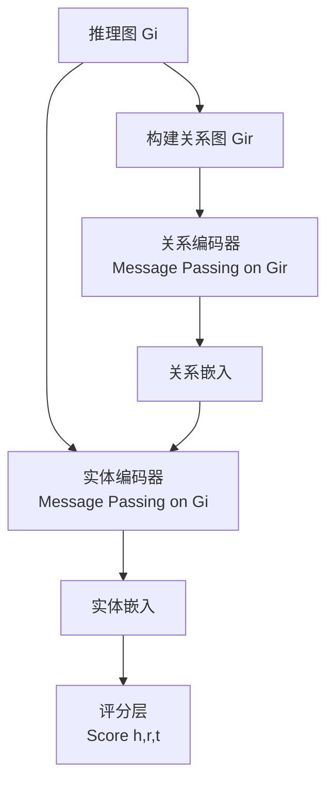

## 论文信息

- **标题**: Half a Link can Be Enough to Predict a Whole Link: Understanding Generalization in Knowledge Graph Foundation Models
- **作者**: Cosimo Gregucci, Obaidah Theeb, Daniel Hernández, Antonio Vergari, Steffen Staab
- **机构**: University of Stuttgart, University of Southampton, University of Edinburgh
- **arXiv**: [2606.18001](https://arxiv.org/abs/2606.18001)
- **PDF**: [链接](https://arxiv.org/pdf/2606.18001)
- **一句话总结**: 将知识图谱链接预测中的每个测试三元组分解为"查询半链接"和"答案半链接"，发现 KGFM 的零样本泛化性能在四种半链接场景下差异高达 0.4 MRR，且答案半链接是正信号而查询半链接是干扰项。

## 研究背景

### 问题定义

知识图谱（KG）基础模型（KGFM）是一类**零样本泛化器**：在源图上预训练后，无需重新训练即可在新图上做链接预测。核心设置是**归纳迁移（inductive transfer）**：

- 推理图 $\mathcal{G}_i$：推理时可用的边集 $\mathcal{E}_i$
- 测试图 $\mathcal{G}_t$：需要预测的边集 $\mathcal{E}_t$，与 $\mathcal{E}_i$ 不相交
- 实体和关系名称在推理时都是全新的

### 现有评估的盲区

现有工作用**聚合 MRR** 衡量 KGFM 泛化能力，但聚合指标掩盖了底层场景的异质性。本文的核心洞察是：即使测试三元组 $(h,r,t) \notin \mathcal{E}_i$，推理图 $\mathcal{E}_i$ 中仍可能包含**部分信息**——即"半链接（half-link）"。

### 关键问题

> 推理图中对测试三元组的结构证据是什么？它如何映射到关系图 $\mathcal{G}_i^r$ 的表示中？

## 核心方法

### 3.1 半链接分类体系

将每个测试三元组 $(h,r,t)$ 分解为两个半链接：

| 半链接 | 定义 | 可见条件 |
|--------|------|----------|
| **查询半链接** $(h,r,?)$ | 头实体-关系对 | $\exists e: (h,r,e) \in \mathcal{E}_i$ |
| **答案半链接** $(?,r,t)$ | 关系-尾实体对 | $\exists e: (e,r,t) \in \mathcal{E}_i$ |

交叉组合产生 **$2 \times 2 = 4$ 种场景**：

| 场景 | 查询半链接 | 答案半链接 | 含义 |
|------|-----------|-----------|------|
| **SQSA** | Seen | Seen | 两半皆可见 |
| **SQUA** | Seen | Unseen | 仅查询可见 |
| **UQSA** | Unseen | Seen | 仅答案可见 |
| **UQUA** | Unseen | Unseen | 两半皆不可见 |

### 3.2 论文原图：半链接场景可视化

> 上图展示了四种场景在同一个推理图上的表现。SQSA 中测试三元组的两半都有橙色半链接支撑；UQUA 中没有任何橙色半链接，模型必须超越直接证据泛化。

### 3.3 KGFM 的架构流程

GNN-based KGFM 采用**双编码器流水线**：

> 上图展示了推理图 $\mathcal{G}_i$（上）及其导出的关系图 $\mathcal{G}_i^r$（下）。关系图以关系名为节点，共现模式为边。

### 3.4 关系图视角

半链接分类如何映射到关系图？关键在于测试三元组诱导的共现模式是否已在 $\mathcal{G}_i^r$ 中存在：

> SQSA 场景下，测试三元组诱导的 $t2t$ 边已在关系图中存在；UQUA 场景下，诱导的模式可能缺失，只能通过偶然覆盖恢复。

### 3.5 三种 KGFM 对比

| 模型 | 关系图设计 | 特点 |
|------|-----------|------|
| **ULTRA** (Galkin et al., 2024) | 二元共现模式 | 基线 |
| **MOTIF** (Huang et al., 2025) | 高阶共现 ($k \geq 3$) | 更长的模式 |
| **TRIX** (Zhang et al., 2024) | 二元 + 实体级别标记 + 迭代更新 | 更细粒度 |

## 实验结果

### 4.1 场景分布：聚合 MRR 的盲区

> **Table 1**: SQSA 占比最大（40.9%），UQUA 平均不足 10%。场景比例是数据划分方式的产物，而非刻意设计。

### 4.2 架构不对称性：答案半链接 vs 查询半链接

核心发现：**两半链接在架构中扮演完全不同的角色**。

- **可见答案半链接**：提供明确的正信号——当 $t$ 在 $\mathcal{G}_i$ 中有 $r$ 类型入边时，$r$ 类型消息通过标准消息传递到达 $t$ 的表示
- **可见查询半链接**：结构上模糊——当 $h$ 有 $r$ 类型出边时，$h$ 的表示编码了现有 $r$-尾实体作为隐式先验，该先验仅在 $t$ 与现有尾实体结构相似时才对齐

> **Table 2**: 即使编码器随机初始化（ULTRA_rand），UQSA 仍远高于 SQUA（0.419 vs 0.129），证明答案半链接优势是架构固有的。预训练主要放大答案半链接信号（$\Delta = +0.128$），对查询半链接几乎无影响（$\Delta = +0.004$）。

### 4.3 UQUA 泛化：关系图设计的影响

> **Table 3**: MOTIF 在所有家族中 UQUA 表现最佳，TRIX_noiter 反而低于 ULTRA。原因：MOTIF 的高阶模式是实体无关的，偶然覆盖有效；TRIX_noiter 的实体标记使测试三元组无法匹配。

### 4.4 全场景模型对比

> **Table 4**: 场景排序一致为 UQSA > SQSA > UQUA > SQUA。最强场景与最弱场景差距达 0.37-0.41 MRR，与聚合 MRR 本身相当。

**微调翻转排名**：

| 场景 | Zero-shot 最佳 | Fine-tuned 最佳 |
|------|---------------|-----------------|
| SQSA | TRIX | TRIX |
| UQSA | TRIX | TRIX |
| SQUA | TRIX | **MOTIF** |
| UQUA | TRIX | **ULTRA** |

> 微调在答案不可见场景（SQUA, UQUA）上翻转了模型排名。ULTRA 和 MOTIF 的实体无关关系图从微调中受益，而 TRIX 的实体级别标记反而退化。

## 个人评价

### 创新点

1. **半链接分类体系**：将"整链接泛化"细化为四个子场景，揭示了聚合指标掩盖的 0.4 MRR 鸿沟。这是一个简单但深刻的洞察。
2. **架构不对称性分析**：通过冻结基线（ULTRA_rand）证明答案半链接优势是架构固有的，而非预训练产物。
3. **关系图表达力诊断**：揭示了"更 expressive 的关系图不一定更好"——实体标记在 UQUA 场景下反而有害。

### 局限性

1. 仅覆盖 GNN-based KGFM（ULTRA, MOTIF, TRIX），未系统评估 FLOCK 等非 GNN 架构。
2. 半链接分类依赖于二元分解，未考虑更复杂的结构证据（如路径模式、子图匹配）。
3. 场景分布受数据划分方式驱动，未来需要设计场景平衡的基准。

### 对后续研究的影响

- 为 KGFM 评估提供了**细粒度诊断协议**，建议与聚合 MRR 一起报告。
- 指明了未来 KGFM 的设计方向：改善答案不可见场景（SQUA, UQUA）的泛化能力。
- 微调实验表明答案不可见的性能差距部分是**提取差距**（信号已在推理图中，但模型未利用），为模型改进提供了具体靶点。

## 相关论文

1. **ULTRA** (Galkin et al., 2024) — 首个 KGFM 框架，基于二元共现模式构建关系图，奠定零样本 KG 链接预测的基础。
2. **MOTIF** (Huang et al., 2025) — 将共现模式扩展到高阶 ($k \geq 3$)，在 UQUA 场景下表现最佳。
3. **TRIX** (Zhang et al., 2024) — 引入实体级别标记和迭代实体-关系耦合，聚合 MRR 最高但 UQUA 依赖迭代机制恢复。
4. **R-GCN** (Schlichtkrull et al., 2018) — 关系图卷积网络，KGFM 实体编码器的基础架构。
5. **RotatE** (Sun et al., 2019) — 知识图谱嵌入方法，揭示了链接预测中的记忆化问题，与本文讨论的泛化问题一脉相承。

---

> 整理者：Nancy | 数据源：arXiv (2606.18001) | 更新时间：2026-06-22
