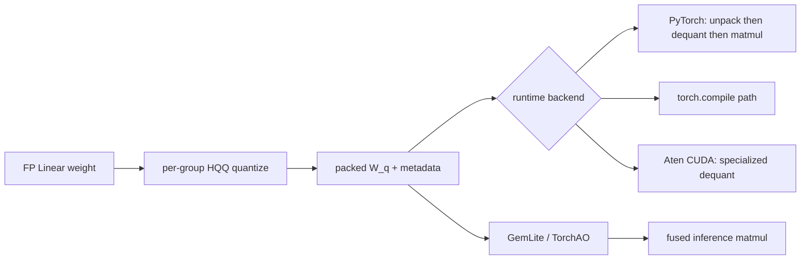

HQQ（Half-Quadratic Quantization）解决的是一个很实际的问题：手里只有已经训练好的模型权重，没有校准集，能不能快速压成 4 bit，还别把效果压坏。

它的答案是：可以先把每一小组权重做普通的非对称整数映射，再用一个很短的 half-quadratic 迭代去修正映射的位置。全程只看权重本身，不跑样本、不反传、不估计 Hessian。因此它和 GPTQ、AWQ 的气质不同：前者通常需要校准激活或二阶信息，HQQ 是典型的 **data-free weight-only PTQ**。

本文以 [dropbox/hqq](https://github.com/dropbox/hqq) 的实现为准，源码版本 `d88a488`（2026-02-26）。先给结论：常用的 `nbits=4, group_size=64, axis=1` 是一个务实的起点；想再榨一点质量可试 `axis=0`，但这会失去现成的快速推理 backend 支持。

## 先把 4 bit 想成一把 16 格的尺子

HQQ 不会训练或修改原始浮点权重 $W$。它做的是：把每 64 个权重分成一组，为这组找到一把能放进 4 bit 的尺子。4 bit 只有 16 个整数格子：

```text
q = 0, 1, 2, ..., 15
```

这把尺子有两个参数：`scale` 决定格子间距，`zero point` 决定整把尺子在浮点轴上的位置。若一组权重范围约为 `[-0.8, 0.7]`，一个合理的初始映射可以是：

```text
float weight:  -0.8  ...   0   ...   0.7
integer code:    0   ...   8   ...   15
```

这里整数码 `8` 代表真实浮点数 `0`，所以 zero point 是 `8`。这也澄清了一个常见混淆：INT8 的 `-128` 通常是有符号整数的**最小可表示码**，不是 zero point。对称 INT8 常让 `q=0` 代表浮点 `0`；无符号 UINT8 常让 `q=128` 代表浮点 `0`；HQQ 的 4-bit 码范围则是 `0..15`，zero point 会随每组权重分布而变。

## 量化公式：把尺子写出来

设线性层权重为 $W$，量化器不会拿整层共用一把尺子，而是将它重排为许多 `group_size` 大小的组。对每一组，它要找整数码 $q$、尺度 $s$ 和零点 $z$，使重建值尽量贴近原权重：

$$
q=\operatorname{clip}(\operatorname{round}(W\cdot s+z),0,2^b-1),\qquad
\hat W=\frac{q-z}{s}
$$

这里的 $b$ 是位宽。4 bit 时每个数只能取 `0` 到 `15`；`z` 让这 16 个格子可以偏向负值较多或正值较多的一侧，所以这是**非对称量化**。HQQ 运行时把倒数尺度 $\Delta=1/s$ 存进 metadata，于是实际反量化写成：

$$
\hat W=(q-z)\cdot\Delta
$$


这张图也解释了 HQQ 为什么方便接入推理 kernel：反量化最终只有减零点、乘尺度两步，是线性的。无论 kernel 选择先展开再 GEMM，还是把它融入矩阵乘，数学形式都很普通。当前默认 HQQ 路径主要固定初始 `scale`，迭代寻找更合适的 `zero`；每次 `zero` 改变后，整数码 $q$ 会重新取整，因此 $q$ 也可能改变，但原始权重 $W$ 始终不动。

### 为什么一定要分组

假设一组权重绝大多数在 `[-0.2, 0.2]`，只有一个值是 `-1.0`。整层共用量化范围时，那个极值会让所有普通值挤在零点附近；分成 64 个一组后，极值只会影响自己的那一组。

组越小，尺度越贴合局部分布，误差通常越低；代价是每组都要保存一个 `scale` 和 `zero`。所以显存并不是恰好 4 bit/weight：若两项都按 FP16 保存，4-bit、组大小 64 的理论开销约为 $4+2\times16/64=4.5$ bpw，未计对齐与 bias。

```text
64 weights: [ q0 q1 q2 ... q63 ]  ->  64 x 4 bits = 32 bytes
metadata:   [ scale fp16 | zero fp16 ]              =  4 bytes
total: 36 bytes / 64 weights = 4.5 bits per weight
```

仓库会真的 bit-pack 主权重：4 bit 时两个无符号码塞进一个 `uint8`；2 bit 时四个码塞进一个字节；3 bit 则将十个 3-bit 值装入一个 32-bit 整数。`6` 和 `5` bit 虽被当前 `SUPPORTED_BITS` 接受，但仍用一个 `uint8` 保存，没有进一步 bit packing，不能把它们当作真正的 6/5 bpw 格式看待。

## 第一拍：min-max 给一个可用的初值

`hqq/core/quantize.py` 先在每组统计最小值和最大值：

$$
s_0=\frac{2^b-1}{\max(W)-\min(W)},\qquad z_0=-\min(W)\cdot s_0
$$

这就是标准 affine min-max quantization。$z_0=-\min(W)\cdot s_0$ 的原因很直接：希望最小权重映射到整数 `0`，代入 $q=W\cdot s+z$ 得 $0=\min(W)\cdot s+z$。再代入 $s_0$，最大权重恰好映射到 $2^b-1$。例如 4 bit、范围 `[-0.8, 0.7]` 时，$s_0=15/(0.7-(-0.8))=10$、$z_0=8$；于是 `-0.8 -> 0`、`0 -> 8`、`0.7 -> 15`。

分母太小时代码会把 $s$ 设为 `1.0`，随后将它限制在 `2e4` 以下，避免半精度下出现数值问题。至此其实已经可以量化；但纯 min-max 的问题也很熟悉：它只保证范围覆盖，不保证 16 个离散格子的位置对这组真实权重最合适。

HQQ 的工作从这里才开始。

## 第二拍：half-quadratic 迭代修正零点

论文名字里的 “half-quadratic” 不意味着它要做漫长的连续优化。当前仓库默认连接的是 `optimize_weights_proximal_legacy`：最多 20 次、遇到重建 MAE 不再下降就提前停止。它每一轮做四件事：


1. 用当前 $s,z$ 把权重取整为 $q$，再重建 $\hat W$。
2. 计算残差 $W-\hat W$，通过 shrink 算子得到 $e$。默认 $p=0.7$，`beta=10`，并在每轮把 `beta` 乘以 `1.01`。
3. 固定离散码 $q$ 和尺度 $s$，直接用组内均值更新零点：

$$
z\leftarrow\operatorname{mean}\bigl(q-(W-e)\cdot s\bigr)
$$

4. 如果本轮重建 MAE 没有优于历史最好值，撤回到上一组参数并退出；最后再用原始权重和得到的参数量化一次。

### 为什么 zero 是这个均值

先忽略 shrink，且暂时固定当前整数码 $q$ 和尺度 $s$。若某个权重能被完美还原，应满足 $q=W\cdot s+z$，于是它对 zero 的建议是 $z_i=q_i-W_i\cdot s$。一组只能共享一个 zero，取所有建议的均值，正是固定 $q,s$ 时最小化平方重建误差的解：

$$
z=\operatorname{mean}(q-W\cdot s)
$$

这只是一次**条件反推**，不是一步得到全局答案。第一轮先由 $z_0$ 得到 $q_0$，再反推 $z_1$；第二轮会用新 zero 重新取整：

```text
q0 = round(W * s + z0)     -> z1 = mean(q0 - W * s)
q1 = round(W * s + z1)     -> z2 = mean(q1 - W * s)
```

若 $z_1$ 没让权重跨过任何整数格边界，则 $q_1=q_0$，算法很快稳定；若部分整数码改变，则需要按新的 $q_1$ 再算一次。这就是 HQQ 每轮都在做的“先分格，再移动尺子”。

### shrink 不是删除极值

直觉上，$e=\operatorname{shrink}(W-\hat W)$ 是残差收缩：小残差会被压成 `0`，大残差会保留一部分但缩小。更新时目标由 $W$ 变成 $W-e$：普通权重通常 $e=0$，仍会被认真拟合；少数难以用 4 bit 表示的离群权重则不再强行拖动整组 zero。

这不是重新做一次去极值 min-max：原始 $W$ 仍在，默认的 $s$ 也不变。它只是在更新 zero 时，软性降低大残差的影响。这样做不会像逐元素贪心那样反复修改原权重，而是用一个组共享的 $z$ 来移动整套码本。计算量小，因而可以很快扫完整个模型。

有个值得说清的实现事实：**默认路径只更新 zero，不更新初始 scale。** 源码中 `scale` 从循环传入又原样返回。仓库还提供了较慢的 `optimize_weights_proximal_v2`，可选 grid search scale，但它不是默认入口。把 HQQ 笼统说成“同时精调 scale 和 zero”并不符合当前默认代码。

## `axis` 不是一个无关紧要的开关

量化前的权重通常是二维的 `[out_features, in_features]`。HQQ 先 `reshape`，再沿 `axis` 做 min/max 和均值归约：

```python
# axis=1
W = W.reshape([-1, group_size])
stats = W.min(axis=1, keepdim=True)

# axis=0
W = W.reshape([group_size, -1])
stats = W.min(axis=0, keepdim=True)
```

因此 `axis` 实际决定的是**重排后哪一维共享 scale/zero**，不是一个抽象的“精度模式”。它会改变同一组里放了哪些权重，也会改变 metadata 的排布。项目 README 的经验结论是：低比特下 `axis=0` 往往精度更好；但当前 Aten/CUDA 反量化只支持 `axis=0`，GemLite、TorchAO 等融合推理 backend 则要求 `axis=1`。选择时应把质量和部署路径一起看：

| 目标                    | 建议                        | 原因                                               |
| ----------------------- | --------------------------- | -------------------------------------------------- |
| 先得到可靠的 4 bit 模型 | `4 bit / group 64 / axis=1` | README 给出的平衡配置，生态 backend 覆盖最好       |
| 优先权重重建质量        | 尝试 `axis=0`               | 项目的实测经验是低位宽通常更好                     |
| 追求低 batch 推理吞吐   | `axis=1` + GemLite/TorchAO  | 可用融合 matmul；需要满足各 backend 的额外限制     |
| 研究极低位宽            | 3/2/1 bit，缩小 group       | 量化格子很少，局部统计更重要，也要重新评估模型质量 |

这里不要把 “`axis=0` 更准确” 理解为定理。它只是该实现和其测试模型上的经验；层类型、位宽、组大小与后端都会改变结果。

## 从压缩文件到一次前向

HQQ 把 `torch.nn.Linear` 换成 `HQQLinear`。原权重删除后，模块保留压缩码 `W_q`、`scale`、`zero`、形状与 bit-packing 信息；前向时再选择 backend：



默认 PyTorch 路径的核心就是：unpack -> `(q - zero) * scale` -> `x @ W_hat.T`。训练用的 backprop 版本不会给冻结的量化权重求梯度，但会用反量化权重计算输入梯度，因此能和 LoRA/PEFT 适配器一起使用。

速度上有一个常见误会：**权重存成 4 bit，不等于朴素 PyTorch 前向就是 4-bit GEMM。** 如果每层都先完整反量化成 FP16 再做普通 matmul，主要省的是显存与带宽，不一定获得理想的吞吐。要得到明显速度收益，需要可用的融合 kernel；这也是 `axis=1` 在工程里仍然有吸引力的原因。

## 一个最小可复现实验

以下代码直接量化一个线性层，并以误差检查是否跑通。需要 CUDA 和与 PyTorch 匹配的 HQQ 安装；项目使用 `torch.cuda.empty_cache()`，所以这条主路径以 GPU 为目标。

```python
import torch
from hqq.core.quantize import BaseQuantizeConfig, HQQLinear

torch.manual_seed(0)
linear = torch.nn.Linear(4096, 4096, bias=False, dtype=torch.float16, device="cuda")
reference = linear.weight.detach().float()

config = BaseQuantizeConfig(nbits=4, group_size=64, axis=1)
hqq_linear = HQQLinear(
    linear,
    quant_config=config,
    compute_dtype=torch.float16,
    device="cuda",
    del_orig=True,
)

reconstructed = hqq_linear.dequantize().float()
mae = (reference - reconstructed).abs().mean().item()
print(f"mean absolute weight error: {mae:.6f}")
```

实际落地时，不要只看这个 MAE。它只说明单层权重重建。应再测任务指标或至少测 perplexity，并分别检查 attention 的 Q/K/V/O 和 MLP 投影层。有些层比其他层敏感得多，HQQ 支持按模块名给不同层分配不同的 bit 与 group size，正是为这种混合配置准备的。

## HQQ、GPTQ、AWQ 放在一张图里看

| 方法 | 主要依据               | 需要校准数据 | 典型代价 | 核心取舍                               |
| ---- | ---------------------- | ------------ | -------- | -------------------------------------- |
| HQQ  | 权重分布与组内重建误差 | 否           | 很低     | 速度快、部署直接，但不显式建模真实激活 |
| GPTQ | 校准激活近似的二阶信息 | 是           | 较高     | 更关注误差在网络中的传播               |
| AWQ  | 校准激活中显著通道     | 是           | 中等     | 保护 activation salient 的权重通道     |

这不是谁在所有任务上都更好的排名。HQQ 的优势很明确：无法拿到原训练数据、需要临时压缩大模型，或者需要一个干净的 weight-only baseline 时，它的准备成本非常低。若目标是把某个固定模型压到极限，而且能取得有代表性的校准集，使用 activation-aware 方法通常仍值得比较。

## 最后记住三件事

第一，HQQ 的基本形态是**分组非对称均匀量化**，不是神秘的新码本。第二，它的关键增量是用很短的 half-quadratic/proximal 循环移动零点，以较小成本减轻 min-max 的浪费。第三，`group_size` 与 `axis` 同时决定精度、metadata 开销和能否使用高性能 kernel，部署前不能只按默认值照抄。

如果只想得到一个稳妥的开始，使用 4 bit、group size 64、`axis=1`，在目标模型上测 perplexity/任务集；若质量不够，再按层缩小 group 或单独尝试 `axis=0`。这比一开始就把所有层压到 2 bit 更接近真实工程路线。

## 参考

- [HQQ 官方仓库](https://github.com/dropbox/hqq)，本文对应 commit `d88a488ec8aa2d58362ef2038a52bca862db2e74`
- [HQQ project blog](https://dropbox.github.io/hqq_blog/)
- Badri, H. et al. [Half-Quadratic Quantization of Large Machine Learning Models](https://arxiv.org/abs/2309.14953), 2023
- [HQQ 源码：量化路径](https://github.com/dropbox/hqq/blob/d88a488ec8aa2d58362ef2038a52bca862db2e74/hqq/core/quantize.py)
- [HQQ 源码：proximal 优化器](https://github.com/dropbox/hqq/blob/d88a488ec8aa2d58362ef2038a52bca862db2e74/hqq/core/optimize.py)
