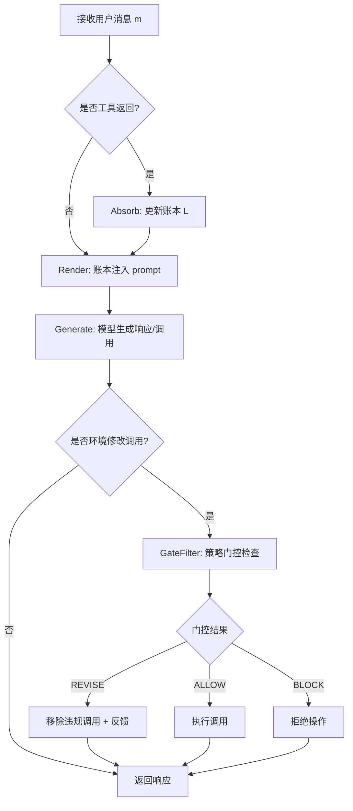

## 1. 论文信息

- **标题**: LedgerAgent: Structured State for Policy-Adherent Tool-Calling Agents
- **作者**: Md Nayem Uddin, Amir Saeidi, Eduardo Blanco, Chitta Baral
- **机构**: Arizona State University, University of Arizona
- **arXiv**: [2606.20529](https://arxiv.org/abs/2606.20529)
- **PDF**: [https://arxiv.org/pdf/2606.20529](https://arxiv.org/pdf/2606.20529)
- **一句话总结**: 用 schema-anchored 类型化账本替代隐式 prompt 状态管理，配合策略门控在写入前拦截违规操作，无需改模型权重即可提升 Agent 的一致性和策略遵守率。

## 2. 研究背景与动机

### 2.1 问题定义

工具调用 Agent 在客服场景中需要**跨轮次维持任务状态**并**遵守领域策略**。任务状态包括用户身份、订单信息、约束条件等，来自工具返回和用户交互。

标准 Agent 的做法：把所有信息（观察、工具返回、策略指令）塞进 prompt，让模型每次从上下文重建状态。

### 2.2 两种典型失败模式

**状态丢失（State Grounding Failure）**：Agent 检索到了正确信息，但后续决策基于过期、缺失或错误重建的状态。

**策略违规（Policy Violation）**：工具调用语法正确，但违反了依赖当前任务状态的领域策略。例如对不可退货订单执行退货。

> 核心洞察：问题不在模型推理能力，而在**状态表示方式**。状态埋在 transcript 中 = 每次都要重新搜索。

## 3. 核心方法

LedgerAgent 添加两个**确定性组件**，不改动模型权重：

### 3.1 Schema-Anchored Ledger（类型化账本）

```
L: P → V
```

账本是类型化字典，键为 canonical schema paths（如 `orders.1234`, `reservations.SI5UKW`），值为工具返回的原始数据。

**更新规则**：
- 仅从成功的 read-tool 返回更新
- 失败的调用和 write-tool 返回不更新
- write 后必须通过 read 重新观察新状态（observe-not-assume 原则）
- 路径映射表是领域级配置，非 LLM 生成

**Prompt 注入**：每轮生成前，将完整账本以结构化格式注入 prompt，模型通过 stable path 查找而非搜索原始 JSON。

### 3.2 Policy Gate（策略门控）

在环境修改操作执行前，对拟议调用进行评估：

```
ALLOW  → 执行不变
REVISE → 移除违规调用，返回违反规则 + 冲突状态，模型可修正
BLOCK  → 拒绝操作，终止该写入
```

门控特点：
- 仅检查，不选择工具、不修复参数、不做规划
- 谓词基于账本字段，非自然语言策略
- 读操作不受门控（重复读取是观察新状态的合法方式）

### 3.3 Agent Loop



**成本不变量**：默认配置下每轮仅一次 LLM 调用。账本更新、渲染、门控均为确定性操作。

### 3.4 架构图


> Figure 1: 标准 Agent 检索到预订信息但后续发出策略违规的取消请求（状态隐式存在于 prompt 中）。LedgerAgent 将工具返回存入类型化账本，在执行前通过策略门控拦截违规操作。

## 4. 实验结果

### 4.1 实验设置

| 领域 | 基准 | 任务数 | 控制类型 |
|------|------|--------|----------|
| Airline | τ²-bench | 50 | single |
| Retail | τ²-bench | 114 | single |
| Telecom | τ²-bench | 114 | dual |
| Telehealth | τ-Trait | 20 | single |

**模型面板**：GPT-5.2, GPT-4.1, Kimi K2.5, GLM-5, MiniMax-M2.5, Qwen3-30B

**评估协议**：每任务 4 次独立运行，报告 pass^1（成功率）和 pass^4（一致性）。

### 4.2 主要结果

**非 GPT 模型对比（Table 2）**：

| 模型 | 领域 | FC pass^1 | Ledger pass^1 | FC pass^4 | Ledger pass^4 |
|------|------|-----------|---------------|-----------|---------------|
| Kimi K2.5 | Airline | 69.0% | ↑ | 44.0% | ↑ |
| Kimi K2.5 | Retail | 57.5% | ↑ | 24.6% | ↑ |
| Kimi K2.5 | Telecom | 90.8% | ↑ | 71.9% | ↑ |
| Kimi K2.5 | Telehealth | 15.0% | ↑ | 10.0% | ↑ |
| GLM-5 | 平均 | — | +4.7 pts | — | +7.6 pts |
| MiniMax M2.5 | 平均 | — | +7.3 pts | — | +8.3 pts |

**GPT 模型对比（Figure 2）**：

| 模型 | pass^1 baseline | pass^1 ledger | pass^4 baseline | pass^4 ledger |
|------|-----------------|---------------|-----------------|---------------|
| GPT-4.1 | 42.2 | **54.4** (+12.2) | 19.9 | **29.3** |
| GPT-5.2 | 42.6 | **58.1** (+15.5) | 18.2 | **34.9** |

### 4.3 与环境修改任务的关联

环境修改任务占比极高：Airline 26/50, Retail 104/114, Telecom 94/114, Telehealth 19/20。

Ledger 在这些任务上提升最显著，特别是 Telecom 双控制场景（agent 和用户模拟器均可修改共享数据库）。

### 4.4 与 Agentic Context-Engineering 方法对比

| 方法 | pass^1 | pass^4 | Token Overhead |
|------|--------|--------|----------------|
| IRMA | 23.4% | 9.6% | 53.1% |
| **Ledger (本文)** | **27.2%** | **17.1%** | **0.0%** |

Ledger 在 pass^1 上超越 IRMA 3.7 点，pass^4 上超越 7.4 点，且**零 token 开销**（IRMA 因使用 3 个辅助 Agent 产生 >50% token 开销）。

### 4.5 错误分析

失败分布（Figure 5）：
- **遗漏必要操作** (missed required actions): 70.3%
- **参数错误** (wrong action arguments): 20.4%
- 其他（额外操作、策略违规、通信失败等）: 9.3%

领域差异：
- Retail/Telecom：主要是遗漏操作（过早转人工）
- Airline：参数错误最多（33.9%），不可逆写入风险高
- Telehealth：参数错误率最高（25.9%），工具 schema 复杂

## 5. 个人评价

### 5.1 创新点

1. **问题定位精准**：不是"Agent 推理不够好"，而是"状态表示方式有缺陷"。将状态从隐式 transcript 转为显式类型化结构。

2. **确定性组件 + 零额外 LLM 调用**：账本更新、渲染、门控全部是确定性操作，不增加推理成本。这在推理时间优化领域是一个重要约束。

3. **策略门控的三态设计**（ALLOW/REVISE/BLOCK）比简单的 pass/fail 更实用。REVISE 允许模型修正参数后重试，而非直接终止。

4. **observe-not-assume 原则**：write 后不假设新状态，必须通过 read 重新观察。这保持了账本与外部系统的一致性。

### 5.2 局限性

1. **领域配置依赖**：需要开发者手动定义路径映射表和策略谓词。非自动策略归纳。

2. **仅覆盖已观察状态**：账本不包含未检索的事实，门控只能检查已有证据。

3. **结构化数据假设**：对视觉、非结构化、隐式状态的任务不直接适用。

4. **基准覆盖有限**：4 个客服领域，固定用户模拟器，未覆盖对抗行为或生产流量。

### 5.3 对后续研究的影响

- 为 Agent 系统设计提供了一个**状态管理范式**：显式类型化状态 + 写入前验证
- 与 Speculative Decoding、KV Cache 压缩等技术正交，可组合使用
- 策略门控思想可扩展到更广泛的 Agent 安全场景（如代码执行、金融操作）

## 6. 相关论文

1. **τ²-bench** (Barres et al., 2025) — 双控制环境下的对话 Agent 评估基准，本文实验基础之一。

2. **τ-bench** (Yao et al., 2024) — 真实领域工具-Agent-用户交互基准，定义了客服场景的多轮工具调用评估框架。

3. **IRMA** (Mishra et al., 2025) — 通过输入重构改进工具使用准确性的 agentic context-engineering 方法，本文主要对比基线。

4. **FAMA** (Saeidi et al., 2026) — 基于失败模式的元 Agent 框架，动态选择辅助 Agent。与 LedgerAgent 同出一组作者。

5. **ReAct** (Yao et al., 2023) — 推理与行动协同的 Agent 范式，本文方法可视为 ReAct 的状态管理增强。

---

> 整理者：Nancy | 数据源：arXiv | 更新时间：2026-06-22
