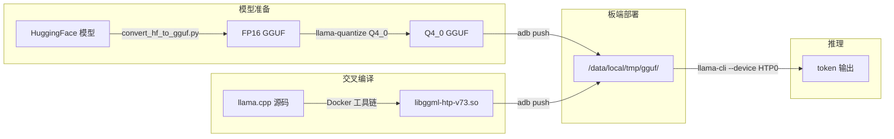

## 全流程



四个阶段：模型量化 → 交叉编译 → 推送部署 → NPU 推理。下面逐个拆开。

## 1. 模型：为什么必须是 GGUF + Q4_0

llama.cpp 只认 GGUF 格式。这不是一个偏好，而是一个硬约束——HTP kernel 操作的是 GGUF 的 tensor layout，走不了 Safetensors 或 PyTorch 的 `.bin`。

更关键的是量化类型的选择：

| 量化类型 | HTP 加速 | 说明 |
|---|---|---|
| **Q4_0** | 是 | 对称 4-bit，HTP 原生 kernel |
| Q4_1 | 是 | 非对称 4-bit |
| Q8_0 | 是 | 8-bit |
| **MXFP4** | 是 | Microscaling FP4，HTP 原生 |
| Q4_K_M / Q5_K_M / IQ* | **否** | fallback 到 CPU，不走 NPU |

**Q4_K_M 和 IQ 系列是纯 CPU 量化**，HTP 上没有对应 kernel。如果你从 HuggingFace 下载了一个 `Q4_K_M` 的 GGUF，推到手机上会发现 NPU 压根不工作——所有 op fallback 到 CPU，速度还不如直接用 CPU 后端。

所以选模型的时候要看清楚：文件名里带 `Q4_0`、`Q4_1` 或 `Q8_0` 的才适合 HTP。

### 获取模型

```bash
# 方式一：直接下载预量化 GGUF
/home/luke/miniforge3/envs/queopt/bin/pip install modelscope
/home/luke/miniforge3/envs/queopt/bin/python -c "
from modelscope import snapshot_download
snapshot_download('Manojb/Qwen3.5-4B-Q4_0.gguf', cache_dir='./models')
"

# 方式二：从 HuggingFace 自己量
cd /path/to/llama.cpp
python3 convert_hf_to_gguf.py ./models/mymodel/
./build/bin/llama-quantize ./models/ggml-model-f16.gguf ./models/model-Q4_0.gguf Q4_0
```

如果要追求极致精度，可以先跑 `llama-imatrix` 生成 importance matrix 再量化：

```bash
./llama-imatrix -m ./models/ggml-model-f16.gguf -f calibration.txt -o imatrix.gguf
./llama-quantize --imatrix imatrix.gguf ./models/ggml-model-f16.gguf ./models/model-Q4_0.gguf Q4_0
```

`imatrix` 记录的是每个权重的"重要性"——哪些对输出影响大，量化时多给 bit 预算。校准文本选和推理场景接近的数据即可，没必要特别大。

## 2. 编译：Docker 工具链一把过

高通提供了一套完整的 ARM64 Android 工具链 Docker 镜像，内含 NDK、Hexagon SDK、OpenCL SDK、CMake。省去了手动装 SDK 的各种坑。

```bash
cd /path/to/llama.cpp

# 拉取工具链镜像（只需一次）
docker pull ghcr.io/snapdragon-toolchain/arm64-android:v0.7

# 启动容器
docker run -it -u $(id -u):$(id -g) \
  --volume $(pwd):/workspace \
  --platform linux/amd64 \
  ghcr.io/snapdragon-toolchain/arm64-android:v0.7

# ===== 容器内 =====
cd /workspace
cp docs/backend/snapdragon/CMakeUserPresets.json .

# CMake 配置——这一步会预生成 v68-v81 全部 HTP kernel 的 DSP 汇编
cmake --preset arm64-android-snapdragon-release -B build-snapdragon

# 编译
cmake --build build-snapdragon -j $(nproc)

# 打包
cmake --install build-snapdragon --prefix pkg-snapdragon/llama.cpp
```

产物结构：

```
pkg-snapdragon/llama.cpp/
├── bin/
│   ├── llama-cli          ← 交互对话
│   ├── llama-bench        ← 性能压测
│   ├── llama-perplexity   ← 困惑度评估
│   └── llama-quantize     ← 量化工具
└── lib/
    ├── libggml-htp-v73.so ← 你需要的（v73 架构）
    ├── libggml-htp-v75.so
    ├── libggml-htp-v79.so
    ├── libggml-htp-v81.so
    ├── libggml-hexagon.so ← CPU 侧的 Hexagon 胶水层
    ├── libggml-opencl.so  ← Adreno GPU 后端（可选）
    └── libggml-cpu.so
```

关键 CMake 选项（如果你想调参）：

| 选项 | 默认值 | 说明 |
|---|---|---|
| `GGML_HEXAGON` | ON | 启用 HTP 后端 |
| `GGML_OPENCL` | ON | 启用 GPU 后端（需要 OpenCL SDK） |
| `GGML_HEXAGON_FP32_QUANTIZE_GROUP_SIZE` | 128 | FP32 权重分组的 group size |
| `ANDROID_ABI` | arm64-v8a | 目标架构 |
| `ANDROID_PLATFORM` | android-31 | 最低 API level |

如果不需要 GPU 后端可以关掉 `GGML_OPENCL`，编译会快不少。

## 3. 板端部署

```bash
# 推送可执行文件和 so 库
adb push pkg-snapdragon/llama.cpp /data/local/tmp/

# 推送模型
adb push models/Qwen3.5-4B-Q4_0.gguf /data/local/tmp/gguf/

# 确认权限
adb shell chmod -R 755 /data/local/tmp/llama.cpp/bin
adb shell chmod -R 755 /data/local/tmp/llama.cpp/lib
```

验证文件在板子上存在：

```bash
adb shell ls -lh /data/local/tmp/llama.cpp/lib/libggml-htp-v73.so
adb shell ls -lh /data/local/tmp/gguf/Qwen3.5-4B-Q4_0.gguf
```

## 4. 跑起来

```bash
adb shell
cd /data/local/tmp/llama.cpp
export LD_LIBRARY_PATH=/data/local/tmp/llama.cpp/lib
export ADSP_LIBRARY_PATH=/data/local/tmp/llama.cpp/lib

./bin/llama-cli \
  -m /data/local/tmp/gguf/Qwen3.5-4B-Q4_0.gguf \
  --device HTP0 -ngl 99 -t 4 \
  -n 64 -cnv
```

这几个参数的含义：

| 参数 | 说明 |
|---|---|
| `-m` | 模型路径 |
| `--device HTP0` | 指定设备为 HTP（NPU）。如果模型很大可以用 `HTP0,HTP1` 两个 session |
| `-ngl 99` | 把所有 layer offload 到设备上。99 是一个"大于任何模型层数"的值，等价于"全部" |
| `-t 4` | CPU 线程数。CPU 只做 tokenize/decode 调度，不需要太多 |
| `-n 64` | 最多生成 64 个 token |
| `-cnv` | 交互对话模式 |

### 进阶参数

```bash
./bin/llama-cli \
  -m /data/local/tmp/gguf/Qwen3.5-4B-Q4_0.gguf \
  --device HTP0 -ngl 99 -t 4 \
  -fa on \
  -ctk q8_0 -ctv q8_0 \
  --batch-size 128 \
  --ctx-size 2048 \
  -n 128 -cnv
```

几个调优经验：

- **`-fa on`**：Flash Attention。7B 及以上模型建议打开，小模型可能出现负优化，实测为准
- **`-ctk q8_0 -ctv q8_0`**：KV cache 量化，显著省内存，精度损失极小
- **`--ctx-size`**：context 长度。默认很大，建议显式设一个合理值避免浪费内存
- **`--batch-size`**：prompt 阶段的 batch 大小，128 是常用值

### 多模型规模适配

| 模型大小 | HTP session 数 | 参数 |
|---|---|---|
| ≤ 7B | 1 | `--device HTP0 -ngl 99` |
| 8B-13B | 2 | `NDEV=2 --device HTP0,HTP1 -ngl 99` |
| 20B+ | 4 | `NDEV=4 --device HTP0,HTP1,HTP2,HTP3 -ngl 99` |

## 5. 怎么确认 NPU 真的在工作

最容易踩的坑：命令跑起来了，token 也在吐，但其实全在 CPU 上跑。因为你下载的 GGUF 是 Q4_K_M 不是 Q4_0。

看模型加载日志。正常的 HTP 加载长这样：

```
ggml-hex: Hexagon Arch version v73
ggml-hex: allocating new session: HTP0
ggml-hex: new session: HTP0 : session-id 0 domain-id 3
load_tensors: offloaded 17/17 layers to GPU       ← 注意这里
load_tensors:         HTP0 model buffer size =   ... MiB
load_tensors:  HTP0-REPACK model buffer size =  ... MiB
```

关键信号：`offloaded X/X layers to GPU` —— 如果是 X/X（全部），NPU 在工作。如果是 0/X，检查量化类型。

更细粒度的调试：

```bash
# Op 级别打日志
GGML_HEXAGON_VERBOSE=1 ./bin/llama-cli ... 2>&1 | head -50

# 禁用特定 op 走 NPU（排查用）
GGML_HEXAGON_OPFILTER="FLASH_ATTN_EXT" ./bin/llama-cli ...

# 性能 profiling
GGML_HEXAGON_PROFILE=1 ./bin/llama-cli ...
```

环境变量速查：

| 变量 | 说明 |
|---|---|
| `GGML_HEXAGON_VERBOSE=1` | 打印每个 op 的执行路径 |
| `GGML_HEXAGON_PROFILE=1` | op 级别耗时统计 |
| `GGML_HEXAGON_OPFILTER` | 强制指定 op fallback 到 CPU |
| `GGML_HEXAGON_NDEV` | HTP session 数量 |

## 6. 性能参考

实测（kalama / Snapdragon 8 Gen 2 / v73）：

| 模型 | 量化 | Prompt | Generation |
|---|---|---|---|
| Qwen3.5-4B | Q4_0 | 13.2 t/s | 7.4 t/s |

Generation 速度 7.4 t/s 是什么概念？同一个模型在骁龙 8 Gen 2 的 CPU 上跑，大概 2-3 t/s。HTP 带来了 2-3x 的加速。而且功耗更低——NPU 的能效比远高于 CPU 和 GPU。

官方在 v79 架构上的参考数据：

| 模型 | 量化 | Prompt | Generation |
|---|---|---|---|
| Llama-3.2-1B | Q4_0 | 136 t/s | 51.5 t/s |
| OLMoE-1B-7B | Q4_0 | 122.5 t/s | 45.7 t/s |

小模型的吞吐已经很可观了。1B 规模 50+ t/s 的 generation 速度，实时对话完全够用。

## 7. 常见问题

### generation 速度低于预期

先排查三个最常见的原因：

1. **量化类型不对**——这是排名第一的坑。确认 GGUF 是 Q4_0 不是 Q4_K_M
2. **不是全部 layer 走了 HTP**——看加载日志确认 `offloaded X/X`
3. **ctx-size 太大**——默认值可能很大，显式设 `--ctx-size 2048`

然后可以尝试：

- 关掉 flash attention：去掉 `-fa`（小模型可能负优化）
- 关掉 kv cache 量化：去掉 `-ctk -ctv`

### 加载时 OOM

顺序尝试：

```bash
# 1. 缩小 context 窗口（效果最明显）
--ctx-size 1024

# 2. KV cache 量化
-ctk q8_0 -ctv q8_0

# 3. 换更小的模型
```

### 某些 op 走不了 NPU

不是所有 op 都有 HTP kernel。当前支持的算子主要是 `MUL_MAT`（矩阵乘）、`FLASH_ATTN_EXT`、`RCP`（RMS Norm 等）。如果遇到不支持的 op，会静默 fallback 到 CPU。

可以开 `GGML_HEXAGON_VERBOSE=1` 看具体哪些 op 走了 CPU。

## 总结

llama.cpp + Hexagon NPU 的关键点：

1. **量化选 Q4_0，不要选 Q4_K_M**。这是最高频的错误。
2. **交叉编译用 Docker 工具链**，别自己手动配 Hexagon SDK。
3. **跑起来后先看日志**确认 `offloaded X/X layers`。
4. **用 `-ctk q8_0 -ctv q8_0` 省内存**，副作用极小。
5. **ctx-size 不要用默认值**，按需设 2048 或更小。

整个流程走通后，一部手机就能本地跑 4B-7B 的对话模型。
