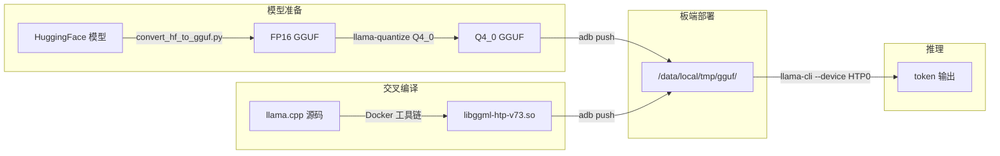

## 全流程



四个阶段：模型量化 → 交叉编译 → 推送部署 → NPU 推理。下面逐个拆开。

## 1. 模型：为什么必须是 GGUF + Q4_0

llama.cpp 只认 GGUF 格式。这不是一个偏好，而是一个硬约束——HTP kernel 操作的是 GGUF 的 tensor layout，走不了 Safetensors 或 PyTorch 的 `.bin`。

更关键的是量化类型的选择：

| 量化类型 | HTP 加速 | 说明 |
|---|---|---|
| **Q4_0** | 是 | 对称 4-bit，HTP 原生 kernel |
| Q4_1 | 是 | 非对称 4-bit |
| Q8_0 | 是 | 8-bit |
| **MXFP4** | 是 | Microscaling FP4，HTP 原生 |
| Q4_K_M / Q5_K_M / IQ* | **否** | fallback 到 CPU，不走 NPU |

**Q4_K_M 和 IQ 系列是纯 CPU 量化**，HTP 上没有对应 kernel。如果你从 HuggingFace 下载了一个 `Q4_K_M` 的 GGUF，推到手机上会发现 NPU 压根不工作——所有 op fallback 到 CPU，速度还不如直接用 CPU 后端。

所以选模型的时候要看清楚：文件名里带 `Q4_0`、`Q4_1` 或 `Q8_0` 的才适合 HTP。

### 获取模型

```bash
# 方式一：直接下载预量化 GGUF
/home/luke/miniforge3/envs/queopt/bin/pip install modelscope
/home/luke/miniforge3/envs/queopt/bin/python -c "
from modelscope import snapshot_download
snapshot_download('Manojb/Qwen3.5-4B-Q4_0.gguf', cache_dir='./models')
"

# 方式二：从 HuggingFace 自己量
cd /path/to/llama.cpp
python3 convert_hf_to_gguf.py ./models/mymodel/
./build/bin/llama-quantize ./models/ggml-model-f16.gguf ./models/model-Q4_0.gguf Q4_0
```

如果要追求极致精度，可以先跑 `llama-imatrix` 生成 importance matrix 再量化：

```bash
./llama-imatrix -m ./models/ggml-model-f16.gguf -f calibration.txt -o imatrix.gguf
./llama-quantize --imatrix imatrix.gguf ./models/ggml-model-f16.gguf ./models/model-Q4_0.gguf Q4_0
```

`imatrix` 记录的是每个权重的"重要性"——哪些对输出影响大，量化时多给 bit 预算。校准文本选和推理场景接近的数据即可，没必要特别大。

## 2. 编译：Docker 工具链一把过

高通提供了一套完整的 ARM64 Android 工具链 Docker 镜像，内含 NDK、Hexagon SDK、OpenCL SDK、CMake。省去了手动装 SDK 的各种坑。

```bash
cd /path/to/llama.cpp

# 拉取工具链镜像（只需一次）
docker pull ghcr.io/snapdragon-toolchain/arm64-android:v0.7

# 启动容器
docker run -it -u $(id -u):$(id -g) \
  --volume $(pwd):/workspace \
  --platform linux/amd64 \
  ghcr.io/snapdragon-toolchain/arm64-android:v0.7

# ===== 容器内 =====
cd /workspace
cp docs/backend/snapdragon/CMakeUserPresets.json .

# CMake 配置——这一步会预生成 v68-v81 全部 HTP kernel 的 DSP 汇编
cmake --preset arm64-android-snapdragon-release -B build-snapdragon

# 编译
cmake --build build-snapdragon -j $(nproc)

# 打包
cmake --install build-snapdragon --prefix pkg-snapdragon/llama.cpp
```

产物结构：

```
pkg-snapdragon/llama.cpp/
├── bin/
│   ├── llama-cli          ← 交互对话
│   ├── llama-bench        ← 性能压测
│   ├── llama-perplexity   ← 困惑度评估
│   └── llama-quantize     ← 量化工具
└── lib/
    ├── libggml-htp-v73.so ← 你需要的（v73 架构）
    ├── libggml-htp-v75.so
    ├── libggml-htp-v79.so
    ├── libggml-htp-v81.so
    ├── libggml-hexagon.so ← CPU 侧的 Hexagon 胶水层
    ├── libggml-opencl.so  ← Adreno GPU 后端（可选）
    └── libggml-cpu.so
```

关键 CMake 选项（如果你想调参）：

| 选项 | 默认值 | 说明 |
|---|---|---|
| `GGML_HEXAGON` | ON | 启用 HTP 后端 |
| `GGML_OPENCL` | ON | 启用 GPU 后端（需要 OpenCL SDK） |
| `GGML_HEXAGON_FP32_QUANTIZE_GROUP_SIZE` | 128 | FP32 权重分组的 group size |
| `ANDROID_ABI` | arm64-v8a | 目标架构 |
| `ANDROID_PLATFORM` | android-31 | 最低 API level |

如果不需要 GPU 后端可以关掉 `GGML_OPENCL`，编译会快不少。

## 3. 板端部署

```bash
# 推送可执行文件和 so 库
adb push pkg-snapdragon/llama.cpp /data/local/tmp/

# 推送模型
adb push models/Qwen3.5-4B-Q4_0.gguf /data/local/tmp/gguf/

# 确认权限
adb shell chmod -R 755 /data/local/tmp/llama.cpp/bin
adb shell chmod -R 755 /data/local/tmp/llama.cpp/lib
```

验证文件在板子上存在：

```bash
adb shell ls -lh /data/local/tmp/llama.cpp/lib/libggml-htp-v73.so
adb shell ls -lh /data/local/tmp/gguf/Qwen3.5-4B-Q4_0.gguf
```

## 4. 跑起来

```bash
adb shell
cd /data/local/tmp/llama.cpp
export LD_LIBRARY_PATH=/data/local/tmp/llama.cpp/lib
export ADSP_LIBRARY_PATH=/data/local/tmp/llama.cpp/lib

./bin/llama-cli \
  -m /data/local/tmp/gguf/Qwen3.5-4B-Q4_0.gguf \
  --device HTP0 -ngl 99 -t 4 \
  -fa on \
  -ctk q8_0 -ctv q8_0 \
  --batch-size 128 --ctx-size 2048 \
  -n 128 -cnv
```

| 参数 | 说明 |
|---|---|
| `-m` | 模型路径 |
| `--device HTP0` | HTP 设备。大模型可 `HTP0,HTP1` 多 session |
| `-ngl 99` | 所有 layer offload 到 HTP |
| `-t 4` | CPU 线程数 |
| `-fa on` | Flash Attention |
| `-ctk q8_0 -ctv q8_0` | KV cache 量化，省内存 |
| `--ctx-size` | context 长度，按需设，默认很大浪费内存 |
| `-n` | 最大生成 token 数 |
| `-cnv` | 交互对话模式 |

模型加载时看日志确认 NPU 生效：

```
ggml-hex: Hexagon Arch version v73
load_tensors: offloaded 17/17 layers to GPU       ← 全部走 NPU
```

如果是 `0/X`，检查量化类型是不是 Q4_K_M。

## 性能

实测（Snapdragon 8 Gen 2 / v73）：Qwen3.5-4B Q4_0，prompt 13.2 t/s，generation 7.4 t/s。约 CPU 的 2-3x。

| 模型 | 量化 | Prompt | Generation |
|---|---|---|---|
| Qwen3.5-4B | Q4_0 | 13.2 t/s | 7.4 t/s |
| Llama-3.2-1B | Q4_0 | 136 t/s | 51.5 t/s |

## 几个要点

1. **量化选 Q4_0 不选 Q4_K_M**——Q4_K_M 没有 HTP kernel，全走 CPU
2. **ctx-size 不要用默认值**——显式设 `--ctx-size 2048`，大了浪费内存
3. **开 KV cache 量化**：`-ctk q8_0 -ctv q8_0`，精度损失极小
4. **OOM 优先缩 ctx-size**：`--ctx-size 1024` 效果最明显
5. **`GGML_HEXAGON_VERBOSE=1`** 看哪些 op 走了 CPU

