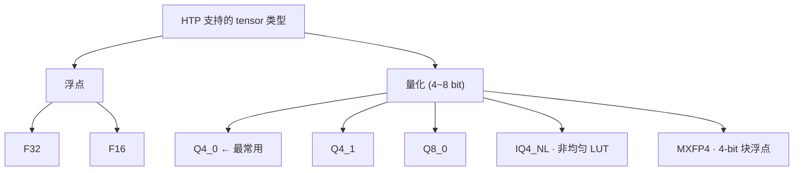

## 总览

llama.cpp 的 Hexagon HTP (NPU) 后端支持 **5 种量化格式**，全部有原生 kernel（matmul + dequant）。其他格式（Q4_K、IQ2_XXS 等）fallback CPU。



---

## Q4_0 — 对称均匀整数量化

权重矩阵按每 32 个元素为一组（block），每组共享一个 fp16 scale：

```
dequant(x) = scale × int4_value
int4 范围: [-8, 7]  (对称)
```

HTP 上用 HVX 指令 `Q6_Vb_vlut32_VbVbI` 直接查表完成 int4→fp16，然后 dot product 累加：

```c
// LUT: -8, -7, ..., 0, ..., 7
static const __fp16 q4_0_to_fp16_lut[64] = {
    -8,0, -7,0, -6,0, -5,0, -4,0, -3,0, -2,0, -1,0,
     0,0,  1,0,  2,0,  3,0,  4,0,  5,0,  6,0,  7,0,
};
```

**block 布局（36 bytes / 32 元素）：**

```
[byte 0..15]  16 bytes = 32 个 int4 值
[byte 16..17]  2 bytes = fp16 scale (d)
```

反量化开销：每 32 元素 1 次 LUT 查表 + 1 次 scale 乘法，**4.5 bpw**。

---

## Q4_1 — 非对称均匀整数量化

与 Q4_0 的区别：每组多一个 min offset，支持非对称分布：

```
dequant(x) = d × int4_value + m
int4 范围: [0, 15] (非对称)
```

```c
static const __fp16 q4_1_to_fp16_lut[64] = {
    0,0, 1,0, 2,0, 3,0, 4,0, 5,0, 6,0, 7,0,
    8,0, 9,0, 10,0, 11,0, 12,0, 13,0, 14,0, 15,0,
};
```

**block 布局（40 bytes / 32 元素）：**

```
[int4 data: 16 bytes] [fp16 d: 2 bytes] [fp16 m: 2 bytes]
```

速度和 Q4_0 同档（多一次加法，HVX 内融合），精度略优——非对称分布更适合 ReLU 激活后的权重。**5.0 bpw**。

---

## IQ4_NL — 非均匀整数量化

核心思路：LLM 权重服从近似正态分布 N(0, σ²)，均匀量化把码本浪费在几乎不出现的大值上。IQ4_NL 用**非均匀 lookup table**，量化点密集分布在 0 附近：

```
反量化值（kvalues）：
[-127, -104, -83, -65, -49, -35, -22, -10,   1, 13, 25, 38, 53, 69, 89, 113]
   ↑ 疏 ← ← ← ← ← ← ← ← ← 密度高（近0） → → → → → → → → → → 疏 ↑
```

HTP 上的反量化 LUT：

```c
static const __fp16 iq4_nl_to_fp16_lut[64] = {
    -127,0, -104,0, -83,0, -65,0, -49,0, -35,0, -22,0, -10,0,
      1,0,   13,0,  25,0,  38,0,  53,0,  69,0,  89,0,  113,0,
};
```

反量化速度和 Q4_0 完全一样（LUT 查表 + scale 乘），block 大小相同（**4.5 bpw**），精度显著优于 Q4_0。

---

## MXFP4 — 4-bit 块浮点 (Microscaling)

Microsoft 联合 AMD/Intel/Qualcomm 提出的 4-bit 浮点标准。与 Q4_0 的"整数+scale"不同，MXFP4 用真正的块浮点：

```
每个元素：1-bit 符号 + 2-bit 指数 + 1-bit 尾数 = S.E2.M1（即 fp4）
每 32 个元素共享 1 个 E8M0（8-bit 指数）

dequant(x) = fp4_value × 2^E8M0_shared_exponent
```

**fp4 → fp16 映射：**

| fp4 bits | fp16 值 | | fp4 bits | fp16 值 |
|---|---|---|---|---|
| 0b0000 | 0 | | 0b1000 | 0 (正零) |
| 0b0001 | 0.5 | | 0b1001 | -0.5 |
| 0b0010 | 1 | | 0b1010 | -1 |
| 0b0011 | 1.5 | | 0b1011 | -1.5 |
| 0b0100 | 2 | | 0b1100 | -2 |
| 0b0101 | 3 | | 0b1101 | -3 |
| 0b0110 | 4 | | 0b1110 | -4 |
| 0b0111 | 6 | | 0b1111 | -6 |

**与 Q4_0 的本质区别：**

```
Q4_0:  quant → int4 × scale              (线性映射，scale 是任意 fp16)
MXFP4: quant → fp4 × 2^shared_exponent    (对数映射，exponent 只控制 2 的幂次)
```

MXFP4 的 scale 只能以 2 的倍数缩放（2^0, 2^1, 2^2...），牺牲 scale 精度换更紧凑编码。

**block 布局（18 bytes / 32 元素）：**

```
[int4 data: 16 bytes] [E8M0 exponent: 1 byte] [padding: 1 byte]
```

仅 **4.5 bpw**，block 比 Q4_0 小一半（18B vs 36B）。

---

## Q8_0 — 8-bit 对称整数量化

和 Q4_0 原理相同，量化位宽翻倍：

```
dequant(x) = scale × int8_value
```

**block 布局：** 32 个 int8 + 1 个 fp16 scale = 34 bytes，**8.5 bpw**。

反量化只需一次 MUL，没有 LUT 开销，但因为 8-bit 权重带宽翻倍，速度约 Q4_0 的 **1.5x 慢**。精度是所有量化格式里最好的。

---

## 对比总结

| | Q4_0 | Q4_1 | IQ4_NL | MXFP4 | Q8_0 |
|---|---|---|---|---|---|
| **编码** | int4 + fp16 scale | int4 + fp16 d+m | int4 + 非均匀 LUT | fp4 + E8M0 | int8 + fp16 scale |
| **对称性** | 对称 | 非对称 | 非均匀对称 | 对数对称 | 对称 |
| **bpw** | 4.5 | 5.0 | 4.5 | 4.5 | 8.5 |
| **block 大小** | 36B | 40B | 36B | 18B | 34B |
| **HTP 速度** | 基准 | 基准 | 基准 | 基准 | ~1.5x 慢 |
| **精度** | 基准 | +微小 | ++更好 | 取决于分布 | ++最好 |

---

## llama-quantize 量化

全部 5 种格式 `llama-quantize` 都支持：

```bash
llama-quantize model-f16.gguf model-q4_0.gguf   Q4_0
llama-quantize model-f16.gguf model-q4_1.gguf   Q4_1
llama-quantize model-f16.gguf model-q8_0.gguf   Q8_0
llama-quantize model-f16.gguf model-iq4_nl.gguf IQ4_NL
llama-quantize model-f16.gguf model-mxfp4.gguf  MXFP4
```

日常使用选 Q4_0——速度最快，精度够用。追求精度优先 Q8_0 或 IQ4_NL，前者精度最好，后者精度接近 Q8_0 但文件只有一半大。
