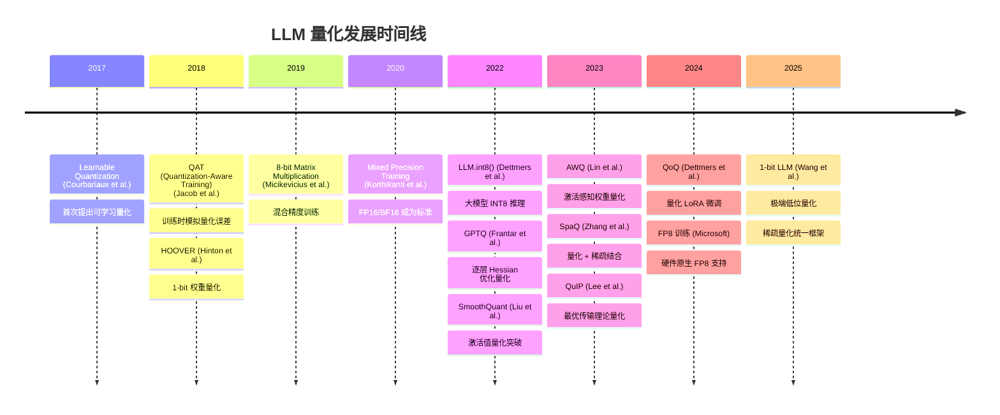
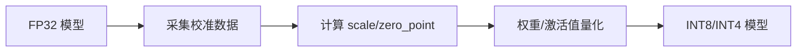
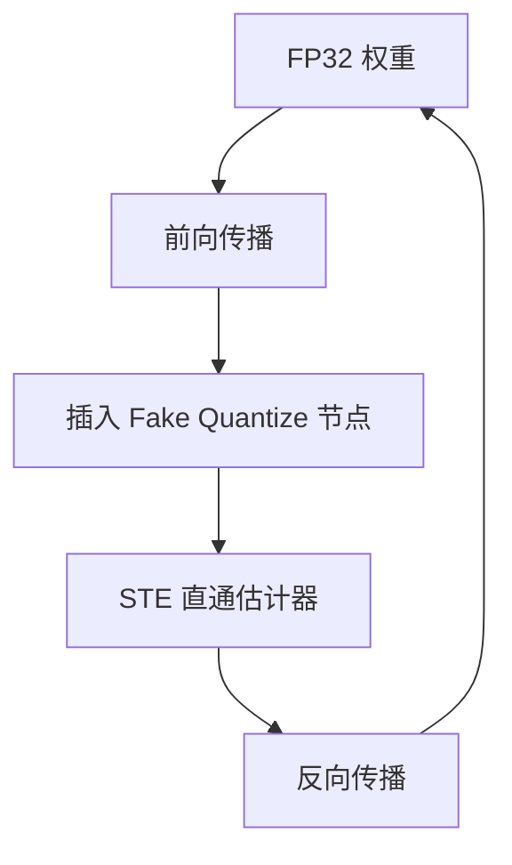
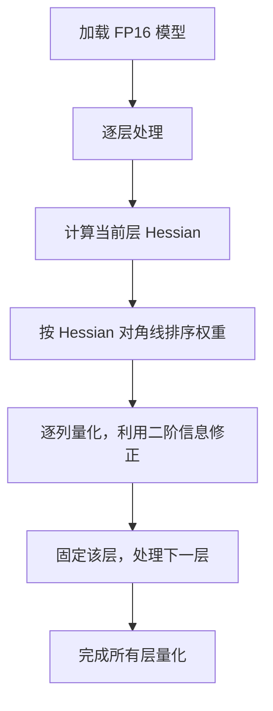
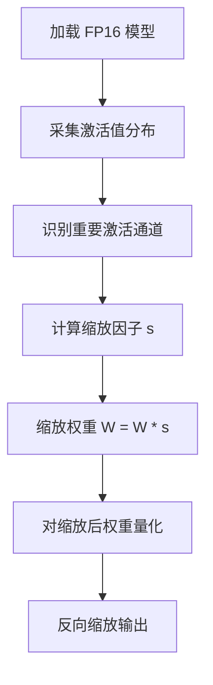
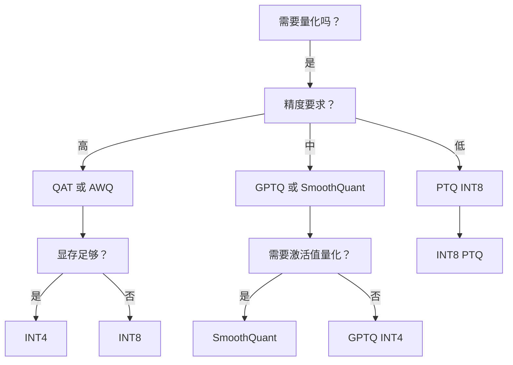

## 量化是什么

用低精度数值（INT8/INT4/FP8）替代高精度数值（FP32/FP16），减少模型体积和计算量。

**核心公式**：

$$W_{quantized} = \text{round}\left(\frac{W_{fp32}}{s} + z\right)$$

其中 $s$ 是缩放因子（scale），$z$ 是零点（zero point）。

**收益直接看数字**：

| 精度 | 体积压缩 | 计算加速 | 典型精度损失 |
|------|---------|---------|-------------|
| FP32 → FP16 | 2x | 1.5-2x | <1% |
| FP16 → INT8 | 2x | 2-4x | 1-3% |
| FP16 → INT4 | 4x | 4-8x | 3-8% |
| FP16 → INT2 | 8x | 8-16x | 8-15% |
| FP16 → INT1 | 16x | 16-32x | 15-30% |

## 发展时间线



## 核心算法

### 1. PTQ（Post-Training Quantization）

训练完成后直接量化，不需要重新训练。

**流程**：



**关键参数**：

- **校准数据量**：通常 32-512 条样本足够
- **量化粒度**：per-tensor（整个张量一个 scale）vs per-channel（每通道独立 scale）
- **量化方法**：Round-to-Nearest (RTN)、MinMax、Percentile

**per-channel vs per-tensor**：

```
per-tensor: 整个权重矩阵共用一个 scale
[1.2, 0.8, 1.5, 0.3]  →  scale = 1.5

per-channel: 每行/每列独立 scale
[1.2, 0.8, 1.5, 0.3]  →  [s1, s2, s3, s4]
```

Per-channel 精度更高，但增加存储和计算复杂度。

### 2. QAT（Quantization-Aware Training）

训练过程中模拟量化误差，让模型学会适应低精度。

**流程**：



**STE（Straight-Through Estimator）**：

```python
# 前向：量化
def fake_quantize(x, scale, zero_point):
    return round(x / scale + zero_point) - zero_point

# 反向：直接传梯度（忽略量化操作）
def fake_quantize_backward(grad):
    return grad  # 直通
```

**QAT vs PTQ 对比**：

| 维度 | PTQ | QAT |
|------|-----|-----|
| 训练时间 | 0 | 需要重新训练 |
| 精度损失 | 较大 | 较小 |
| 校准数据 | 需要 | 不需要 |
| 适用场景 | 快速部署 | 精度敏感 |

### 3. LLM.int8()

2022 年提出，首个针对大模型的 INT8 量化方案。

**核心洞察**：

- 大模型中存在 **outlier**（异常值），少量权重/激活值远大于均值
- 直接量化会导致这些 outlier 被截断，精度大幅下降

**解决方案**：

```python
# Hessian-based outlier detection
hessian = compute_hessian(model, calibration_data)
outlier_mask = hessian > threshold

# 对 outlier 保持 FP16，其余量化为 INT8
W_quantized = torch.where(outlier_mask, W_fp16, quantize(W_fp16))
```

**效果**：

- LLaMA-7B INT8 推理，精度损失 <1%
- 显存占用从 14GB 降至 7GB

### 4. GPTQ（GPT Quantization）

2022 年提出，逐层优化的量化算法。

**核心思想**：

利用 Hessian 矩阵的二阶信息，指导权重量化时的误差最小化。

**算法流程**：



**数学原理**：

$$\min_{W_q} \|W - W_q\|_H^2 = (W - W_q)^T H (W - W_q)$$

其中 $H$ 是 Hessian 矩阵，近似为对角矩阵。

**关键参数**：

- **per-group size**：通常 128，将权重分组量化
- **校准数据**：128 条文本样本
- **量化精度**：支持 INT4、INT3、INT2

**GPTQ vs PTQ 对比**：

| 维度 | PTQ | GPTQ |
|------|-----|------|
| 量化精度 | INT8 | INT4/INT3/INT2 |
| 校准数据 | 需要 | 需要 |
| 计算复杂度 | 低 | 高（需计算 Hessian） |
| 精度损失 | 3-5% | 1-2% |
| 适用场景 | 快速部署 | 极致压缩 |

### 5. AWQ（Activation-aware Weight Quantization）

2023 年提出，MLSys 2024 Best Paper。

**核心洞察**：

- 权重不是同等重要的
- 某些激活通道对模型输出影响更大
- 保护这些"重要权重"可以显著减少量化误差

**算法流程**：



**数学原理**：

$$s_i = \sqrt{\frac{\text{mean}(|A_i|)}{\text{max}(|A_i|)}}$$

其中 $A_i$ 是第 $i$ 个激活通道的值。

**关键特点**：

- **无需重新训练**：纯 PTQ 方法
- **激活感知**：根据激活值分布调整量化策略
- **硬件友好**：支持 INT4、INT3

**AWQ vs GPTQ 对比**：

| 维度 | GPTQ | AWQ |
|------|------|-----|
| 量化方法 | Hessian 优化 | 激活感知缩放 |
| 计算复杂度 | 高 | 低 |
| 校准数据 | 需要 | 需要 |
| 精度损失 | 1-2% | 0.5-1.5% |
| 适用场景 | 极致压缩 | 平衡精度与速度 |

### 6. SmoothQuant

2022 年提出，解决激活值量化难题。

**核心问题**：

激活值中存在 outlier，直接量化会导致精度大幅下降。

**解决方案**：

```python
# 将激活值的 outlier 转移到权重中
def smooth_quant(W, A, alpha=0.5):
    # 计算激活值的 scale
    A_scale = torch.max(torch.abs(A), dim=-1, keepdim=True)[0]
    
    # 平滑因子
    smooth_factor = A_scale ** (-alpha)
    
    # 转移到权重
    W_smooth = W * smooth_factor
    
    # 激活值除以平滑因子
    A_smooth = A / smooth_factor
    
    return W_smooth, A_smooth
```

**效果**：

- 激活值量化误差降低 50%
- 支持 INT8 激活值 + INT8 权重
- 推理速度提升 2-4x

### 7. 其他算法

**SpaQ（Sparse Quantization）**：

- 量化 + 稀疏结合
- 先稀疏化，再量化
- 压缩比可达 16x

**QuIP（Quantization with Optimal Transportation）**：

- 最优传输理论指导量化
- 理论上保证量化误差最小
- 支持 INT2、INT1

**QoQ（Quantized LoRA）**：

- 量化模型 + LoRA 微调
- 无需解冻全量权重
- 微调显存占用降低 10x

## 量化格式对比

| 格式 | 精度 | 压缩比 | 推理速度 | 适用硬件 |
|------|------|--------|---------|---------|
| FP16 | 16-bit | 1x | 基准 | GPU |
| BF16 | 16-bit | 1x | 基准 | GPU/TPU |
| FP8 | 8-bit | 2x | 2-4x | GPU (H100+) |
| INT8 | 8-bit | 2x | 2-4x | CPU/GPU/NPU |
| INT4 | 4-bit | 4x | 4-8x | CPU/GPU/NPU |
| INT2 | 2-bit | 8x | 8-16x | CPU/GPU |
| INT1 | 1-bit | 16x | 16-32x | CPU/GPU |

## 实践建议

**选型决策树**：



**具体场景**：

| 场景 | 推荐方案 | 理由 |
|------|---------|------|
| 服务器部署 | FP8/INT8 | 硬件支持好，精度损失小 |
| 边缘设备 | INT4 GPTQ/AWQ | 压缩比高，推理速度快 |
| 移动端 | INT4 AWQ | 激活感知，精度高 |
| 极致压缩 | INT2/INT1 | 压缩比 8-16x |
| 快速部署 | PTQ INT8 | 无需重新训练 |

## 总结

量化已经从"精度损失可接受的压缩技巧"发展为"大模型部署的标配"。

**关键趋势**：

1. **低位量化成为常态**：INT4 已成为边缘设备标准
2. **激活值量化突破**：SmoothQuant 解决了激活值 outlier 问题
3. **量化 + 稀疏结合**：SpaQ 等算法同时利用两种压缩方式
4. **硬件原生支持**：FP8、INT4 成为 GPU/NPU 标准格式
5. **量化微调兴起**：QoQ 让量化模型也能高效微调

**实践原则**：

- 精度优先 → QAT/AWQ
- 速度优先 → PTQ INT8
- 压缩优先 → GPTQ INT4
- 平衡 → AWQ INT4

量化不是银弹，但选对算法能让模型部署成本降低一个数量级。
