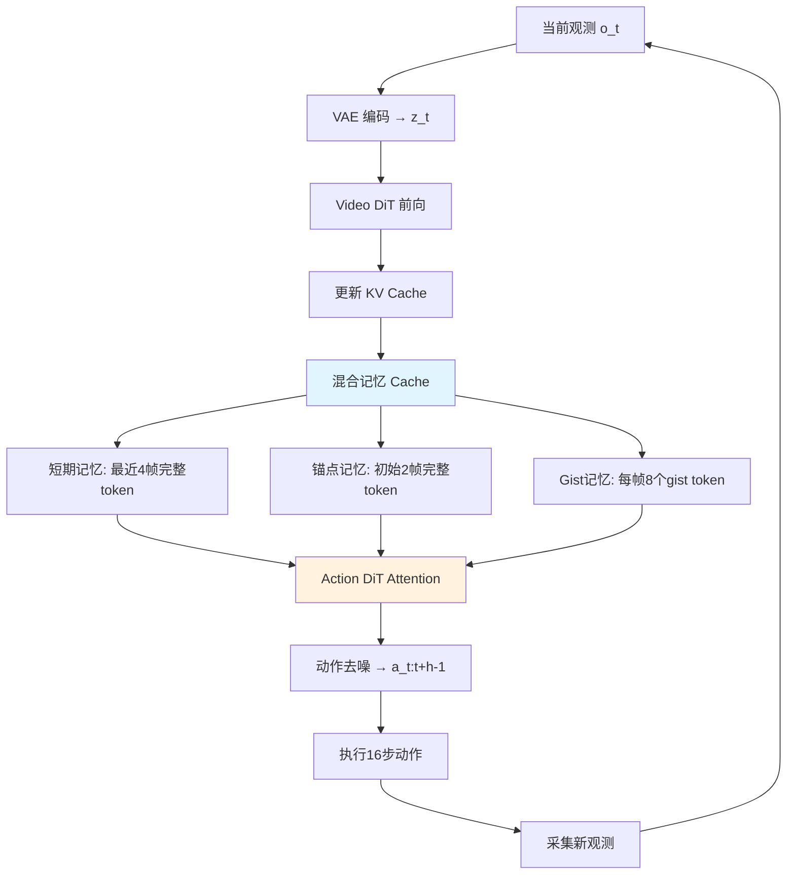

## 论文信息

| 字段 | 内容 |
|------|------|
| **标题** | MemoryWAM: Efficient World Action Modeling with Persistent Memory |
| **作者** | Sizhe Yang\*, Juncheng Mu\*, Tianming Wei, Chenhao Lu, Xiaofan Li, Linning Xu, Zhengrong Xue, Zhecheng Yuan, Dahua Lin, Jiangmiao Pang, Huazhe Xu |
| **机构** | 香港中文大学、清华大学、浙江大学 |
| **arXiv** | [2606.20562](https://arxiv.org/abs/2606.20562) |
| **PDF** | [https://arxiv.org/pdf/2606.20562](https://arxiv.org/pdf/2606.20562) |
| **项目页** | [https://yangsizhe.github.io/MemoryWAM/](https://yangsizhe.github.io/MemoryWAM/) |

**一句话总结：** 受人类认知启发，MemoryWAM 用「近期帧 + 锚点帧 + Gist Token」的混合记忆替代全历史 KV Cache，将 WAM 长序列推理的时空复杂度从 O(N) 降至 O(N/d)，在 RMBench 记忆依赖任务中 SOTA 且推理延迟仅 260ms。

---

## 研究背景

### 2.1 VLA 的局限

当前机器人基础模型以 **Vision-Language-Action (VLA)** 为主流范式（如 π₀、OpenVLA、GR00T 等），直接从当前观测映射到动作。对短周期、语义明确的技能有效，但存在根本缺陷：

- **无历史记忆**：无法利用过去的观测
- **无动力学建模**：不理解物理世界如何随交互演化
- **非马尔可夫任务失败**：当关键信息不在当前帧中（被遮挡、延迟效应），性能急剧下降

### 2.2 WAM 的潜力与瓶颈

**World Action Models (WAMs)** 联合建模视觉前瞻（visual foresight）和动作预测，条件于当前和历史观测，天然具备记忆和动力学建模能力。但现有 WAM 面临**记忆-效率权衡**：

| 方法类别 | 代表 | 记忆方式 | 问题 |
|----------|------|----------|------|
| 高效 WAM | FastWAM, Cosmos Policy, X-WAM | 滑动窗口（有限帧） | 非马尔可夫任务表现差 |
| 全历史 WAM | LingBot-VA, DreamZero, MotuBrain | 保留所有历史 KV Cache | 延迟和显存随序列长度线性增长 |

### 2.3 人类认知的启发

论文从认知心理学获得关键灵感：

> 人类记忆不是单一存储，而是互补系统的混合 [18]：
> - **短期记忆**：支持即时动作规划，容量有限 [19]
> - **长期记忆**：保留抽象 gist 而非逐字细节 [20]
> - **事件边界记忆**：连续体验中的事件边界对记忆组织特别显著 [21]

---

## 核心方法

### 3.1 总体架构

MemoryWAM 采用 **Mixture-of-Transformers (MoT)** 架构，包含两个分支：

```
┌─────────────────────────────────────────────┐
│  MoT Architecture                            │
│                                             │
│  Video DiT Φᵥ  ─→  动力学感知特征 + 记忆维护  │
│  Action DiT Φₐ ─→  动作预测（去噪）           │
│                                             │
│  训练时：视频预测提供密集动力学监督             │
│  推理时：仅前向 Video DiT 一次，无需视频生成   │
└─────────────────────────────────────────────┘
```


> **Figure 2**: MemoryWAM 采用 MoT 架构，Video DiT 提供动力学感知表征，Action DiT 预测动作。持久记忆通过锚点帧、近期帧和 Gist Token 实现。

**推理流程：**

1. 当前观测 $o_t$ → VAE 编码为视频 latent $z_t$
2. Video DiT 前向一次：$\mathcal{C}_t^v = \Phi_v(z_t, l; \mathcal{C}_{<t})$，更新 KV Cache
3. Action DiT 去噪动作 token：$a_{t:t+h-1} = \Phi_a(x_\tau^a, l; \mathcal{C}_{\leq t}^v)$

### 3.2 混合记忆机制（核心创新）

MemoryWAM 的 KV Cache 由三部分构成：

$$\mathcal{C}_{\leq t}^v = \mathcal{C}_{\mathrm{short}}^v \cup \mathcal{C}_{\mathrm{anchor}}^v \cup \mathcal{C}_{\mathrm{gist}}^v$$

#### ① 短期记忆 $\mathcal{C}_{\mathrm{short}}^v$

- **实现**：滑动窗口缓存最近 $N_{recent}=4$ 帧的完整视频 token
- **作用**：即时闭环控制，捕获快速变化的交互线索（物体运动、接触状态、手-物配置）
- **复杂度**：常数窗口大小，与序列长度无关

#### ② 事件边界记忆 $\mathcal{C}_{\mathrm{anchor}}^v$

- **实现**：保留任务起始帧（$N_{init}=2$ 帧）的完整视觉 token
- **作用**：初始场景状态通常承载指令中的关键信息，后续可能被遮挡或移出视野
- **灵感**：事件边界在连续体验中对记忆组织特别显著 [21]

#### ③ Gist 记忆 $\mathcal{C}_{\mathrm{gist}}^v$

- **实现**：每帧附加 $M=8$ 个可学习 gist token（对比每帧 $L=120$ 个视觉 token）
- **压缩比**：$d = L/M = 15\times$
- **机制**：gist token $g_t$ 对当前帧 $f_t$ 和历史上下文进行 attention，后续 token 不直接 attend 到 $f_i$，而是 attend 到 $g_i$
- **复杂度**：从 $O(NL)$ 降至 $O(NM) = O(NL/d)$


> **Figure 3**: MemoryWAM 的 Attention Mask。f 为完整视频帧，g 为 gist token，a 为待去噪动作。非近期/非锚点帧的完整 token 被驱逐，仅保留 gist token。

### 3.3 复杂度分析

| 记忆方式 | KV Cache 大小 | 推理延迟 | 随 N 增长 |
|----------|--------------|----------|----------|
| 全历史 Attention | $O(NL)$ | 线性增长 | 急剧上升 |
| TTT | $O(1)$ 状态 | 常数但偏高 | 平坦 |
| RNN | $O(1)$ 状态 | 常数但偏高 | 平坦 |
| **MemoryWAM** | **$O(NL/d)$** | **接近常数** | **缓慢增长** |

在 1600 帧轨迹长度下，MemoryWAM 的延迟仍低于 TTT 和 RNN 方案。

### 3.4 Mermaid 流程图



---

## 实验结果

### 4.1 记忆机制对比

#### 推理延迟（单层，ms）

| 序列长度 N | Full Attention | TTT | RNN | **MemoryWAM** |
|-----------|---------------|-----|-----|--------------|
| 100 | 0.40 | 0.90 | 0.60 | **0.35** |
| 500 | 0.75 | 0.90 | 0.60 | **0.35** |
| 1000 | 1.15 | 0.88 | 0.58 | **0.35** |
| 1600 | 1.70 | 0.84 | 0.54 | **0.35** |

#### GPU 显存（MB）

| 序列长度 N | Full Attention | TTT | RNN | **MemoryWAM** |
|-----------|---------------|-----|-----|--------------|
| 100 | 120 | 225 | 230 | **100** |
| 500 | 320 | 225 | 230 | **120** |
| 1000 | 500 | 225 | 230 | **135** |
| 1600 | 800 | 225 | 230 | **165** |

#### 成功率（Press Button 任务）

| 方法 | 成功率 |
|------|--------|
| Full Attention | 87.0% |
| TTT | 67.0% |
| RNN | 78.0% |
| **MemoryWAM** | **87.0%** |

> **关键发现**：MemoryWAM 在全历史 Attention 的 87% 成功率下，显存仅为全历史的 1/5（135MB vs 500MB @ N=1000），延迟降低 70%（0.35ms vs 1.15ms）。

### 4.2 RMBench 仿真实验

在 RMBench 的 9 个双机械臂记忆依赖任务上，对比 π₀.₅、FastWAM、LingBot-VA：

| 任务 | π₀.₅ | FastWAM | LingBot-VA | **MemoryWAM** |
|------|------|---------|------------|--------------|
| Observe and Pick Up | 9% | 0% | 13% | **27%** |
| Rearrange Blocks | 13% | 0% | 100% | **100%** |
| Put Back Block | 11% | 0% | 100% | **100%** |
| Swap Blocks | 24% | 0% | 99% | **100%** |
| **平均** | **10.4%** | **5.9%** | **77.2%** | **82.0%** |

**关键数据：**
- 仅用滑动窗口的 π₀.₅ 和 FastWAM 平均成功率分别为 10.4% 和 5.9%，在记忆依赖任务上几乎完全失败
- MemoryWAM 比 LingBot-VA（全历史缓存）**高出 4.8 个百分点**
- 推理延迟：**MemoryWAM 260ms** vs LingBot-VA 3100ms（**12× 加速**）

### 4.3 真实世界实验

硬件平台：ARX 双机械臂 + RealSense D455 相机，部署在单张 RTX 4090 上。


> **Figure 5**: 真实世界任务展示。左：Shell Game（寻找被移动的小方块）；右：Look and Press（观察数字并按对应次数按键）。


> **Figure 6**: 硬件设置。双机械臂系统 + RealSense D455 相机。

| 任务 | π₀.₅ | LingBot-VA | **MemoryWAM** |
|------|------|------------|--------------|
| Shell Game | 5/20 (25%) | 13/20 (65%) | **18/20 (90%)** |
| Look and Press | 0/20 (0%) | 14/20 (70%) | **15/20 (75%)** |

> **注意**：LingBot-VA 在 Shell Game 中因高推理延迟（3100ms）经常错过杯子交换时机，导致任务失败。MemoryWAM 的低延迟（260ms）使其能实时跟踪遮挡物体。

### 4.4 消融实验

| 任务 | w/o Anchor | w/o Gist | w/o Sliding Window | Full Attention | **MemoryWAM** |
|------|-----------|----------|-------------------|---------------|--------------|
| Cover Blocks | 58% | 75% | 96% | 96% | **98%** |
| Press Button | 90% | **5%** | 69% | 87% | **87%** |
| **平均** | 74.0% | 40.0% | 82.5% | 91.5% | **92.5%** |

**关键发现：**
- **移除 Gist Token 导致最大性能下降**（Press Button 从 87% 暴跌至 5%），证明长期记忆对记忆依赖决策至关重要
- **Full Attention 反而不如混合记忆**（91.5% vs 92.5%），说明保留全部历史会引入冗余信息，降低任务相关信息的检索效率
- 三种记忆组件（短期、锚点、Gist）各自提供互补的收益

---

## 个人评价

### 5.1 创新点

1. **混合记忆设计**：将认知心理学原理（短期记忆、长期 gist、事件边界）直接映射到 Transformer KV Cache 架构，思路清晰且工程优雅
2. **Gist Token 压缩**：用 8 个可学习 token 替代 120 个视觉 token（15× 压缩），在保持性能的同时大幅降低显存
3. **反直觉发现**：Full Attention 不如混合记忆，证明「少即是多」——冗余历史信息反而干扰决策

### 5.2 技术深度

- 基于 Wan2.2-TI2V-5B 预训练视频 DiT，利用视频预测作为训练时的动力学监督信号
- 推理时仅需 Video DiT 前向一次，无需视频生成，继承了 FastWAM 的效率优势
- 连续流匹配（continuous flow-matching）训练配方，1000 步去噪

### 5.3 局限性

1. **语义理解有限**：论文自述继承了视频扩散模型的局限——语义理解和推理能力有限。未来需结合双系统架构或统一模型
2. **仅验证于 RMBench**：9 个任务的覆盖范围有限，泛化到更广泛的机器人场景仍需验证
3. **Gist Token 数量固定**：$M=8$ 是超参数，对不同任务/场景的适应性未充分探索
4. **依赖预训练视频模型**：基于 Wan2.2 的 5B 参数模型，总参数量约 6B，部署门槛较高

### 5.4 对后续研究的影响

- **为 WAM 的实用化铺路**：解决了 WAM 长期存在的效率瓶颈，使持久记忆在真实机器人系统上部署成为可能
- **混合记忆范式可迁移**：该设计可应用于长视频生成、流式 3D 重建等其他序列建模场景
- **启发新的记忆压缩研究**：Gist Token 的压缩思路可能启发更高效的长期记忆机制

---

## 相关论文

| 论文 | 方向 | 简介 |
|------|------|------|
| **LingBot-VA** (2601.21998) | 世界模型 | 因果世界建模用于机器人控制，全历史 KV Cache 基线 |
| **FastWAM** (2603.16666) | 世界模型 | 高效 WAM，无需测试时未来想象，滑动窗口记忆 |
| **RMBench** (2603.01229) | 基准测试 | 记忆依赖机器人操作基准，本文主要评测平台 |
| **Mem** (2603.03596) | 记忆机制 | 多尺度具身记忆用于 VLA，探索记忆在机器人中的应用 |
| **Cosmos Policy** (2601.16163) | 世界模型 | 微调视频模型用于视觉运动控制和规划 |

---

> 整理者：Nancy | 数据源：arXiv (2606.20562) + PaddleOCR-VL-1.6 | 更新时间：2026-06-22