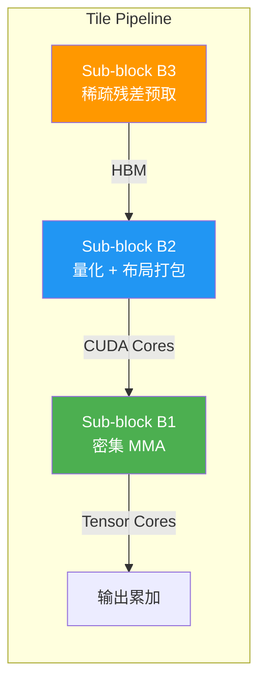

## 论文信息

- **标题**: MosaicQuant: Inlier–Outlier Disaggregation for Unified 4-Bit LLM Quantization
- **作者**: Yangjia Hu, Haodong Wang, Zicong Hong, Qianli Liu, Quanxin Shou, Jian Lin, Song Guo, Xiangjun Huang, Xiaowei Shen, Dian Wang, Jian Yang
- **机构**: HKUST, EPFL, MetaX Integrated Circuits Co., Ltd
- **arXiv**: [2606.15652](https://arxiv.org/abs/2606.15652)
- **PDF**: [https://arxiv.org/pdf/2606.15652](https://arxiv.org/pdf/2606.15652)
- **一句话总结**: 提出内/异常值分解（Inlier-Outlier Disaggregation）范式，用密集 4-bit 基 + 稀疏 4-bit 残差实现统一 4-bit 推理，配合 ZipperEngine 融合核达 1.24x 加速。

## 研究背景与动机

### 问题

4-bit 量化大幅降低 LLM 推理的显存和计算开销，但 4-bit 有限的表示范围难以同时捕捉密集的常规值（inliers）和稀疏的大值异常值（outliers），导致精度严重下降。

现有混合精度方法（如 Atom、SVDQuant、ResQ）保留异常值通道在高精度，但引入了高精度回退操作——需要额外的数据搬运和格式转换，破坏了低比特推理的硬件效率。

### 核心洞察

MosaicQuant 提出一个反直觉的思路：**不提升异常值的精度，而是用稀疏 4-bit 残差补偿量化误差**。这样整个推理管线保持统一 4-bit，同时精度接近 FP16。

## 核心方法

### 整体架构


MosaicQuant 将迁移后的权重 $\hat{W}$ 分解为两个 4-bit 组件：

$$\hat{X}\hat{W} \approx \underbrace{\mathcal{Q}(\hat{X})\mathcal{Q}(\hat{W})}_{\text{密集 4-bit 基}} + \underbrace{\mathcal{Q}(\hat{X})\mathcal{Q}(\mathbf{R})}_{\text{稀疏 4-bit 残差}}$$

其中 $\mathbf{R} = \hat{W} - \mathcal{Q}(\hat{W})$ 是量化残差。

**关键设计**：
- **密集 4-bit 基** $\mathcal{Q}(\hat{W})$：全矩阵 4-bit 量化，inliers 被精确表示，outliers 被量化产生误差
- **稀疏 4-bit 残差** $\mathcal{Q}(\mathbf{R})$：仅选择最关键的 block 进行 4-bit 残差补偿

### 三个关键观察

**观察 1：Block 级补偿优于 Channel 级**

量化误差在 block 级别呈现细粒度集中分布，而非均匀分布在 channel。补偿整个 channel 会包含大量低影响值，而 block 级补偿能更精确地定位高失真区域。

**观察 2：输出感知选择至关重要**

直接按权重绝对值或残差范数选择 block 效果不佳。输出失真（output distortion）作为选择标准显著优于其他方法，因为它考虑了激活值的影响。

**观察 3：10% 稀疏残差预算即可恢复大部分量化误差**

在 10% block 预算下，输出感知选择已能恢复 Layer 24 的 55% 和 Layer 34 的 63% 输出失真。呈现明显的边际递减规律。

### Hessian 引导的 Block 选择

直接计算输出失真选择 block 需要反复评估所有候选 block 的完整输出失真，计算代价过高。MosaicQuant 借鉴 GPTQ 的 Hessian 思路，提出 **$\Delta$-Hessian 分数**：

$$S_B = \left[\sum_{(i,j)\in B} h_j \mathbf{R}_{ij}^2 - \sum_{(i,j)\in B} h_j (\mathbf{R}_{ij} - \mathcal{Q}(\mathbf{R})_{ij})^2\right]_+$$

其中 $h_j = \frac{2}{N}\sum_{n=1}^N \hat{X}_{n,j}^2$ 是输入通道 $j$ 的激活敏感度（对角 Hessian 估计）。

**算法流程**（Algorithm 1）：

```
输入: 迁移权重 Ŵ, 校准激活 X̂, block 划分 B, block 预算 K
输出: 选中 block 集 S, block 掩码 M_S, 量化权重 W_MQ

1. R ← Ŵ - Q(Ŵ)                    // 密集 4-bit 量化后的残差
2. h_j ← (2/N) Σ X̂²_{n,j}          // 输入通道 j 的激活敏感度
3. 对每个 block B ∈ B:
4.     S_B ← [Σ h_j R²_{ij} - Σ h_j (R_{ij} - Q(R)_{ij})²]_+  // Δ-Hessian 分数
5. S ← TopK({S_B}, K)              // 选择得分最高的 K 个 block
6. (M_S)_B ← 1 若 B ∈ S, 否则 0    // 生成 block 掩码
```

**最优性定理**：在对角 Hessian 目标下，$\Delta$-Hessian top-K 选择是最优解。当 Hessian 非对角项为零时，它与精确输出失真选择完全等价。

### ZipperEngine: 密集/稀疏 4-bit 核融合


仅有统一表示不够——如果稀疏残差作为独立 kernel 执行，需要重新加载激活、合并部分输出，增加超过 30% 延迟。

**ZipperEngine 解决两个问题**：

1. **核融合（Kernel Fusion）**：稀疏分支复用密集 GEMM 的相同量化激活 tile 和输出 tile，消除冗余 HBM 访问和 kernel 启动。在 Qwen3-8B V projection 层上，稀疏计算占密集 4-bit 计算的 55%，ZipperEngine 通过融合将延迟降低 1.9x。

2. **重叠流水线（Overlapped Pipeline）**：将 tile 拆分为独立子 block，并发调度不同阶段：
   - Tensor Cores 执行 sub-block B1 的密集 MMA
   - CUDA Cores 准备 sub-block B2 的量化和布局打包
   - HBM 预取 sub-block B3 的稀疏残差 block



## 实验结果

### 精度对比

**WikiText2 困惑度（W4A8）**：

| 模型 | W16A16 | RTN | GPTQ | AWQ | ResQ | Atom | QuaRot | SpinQuant | **MosaicQuant** |
|------|--------|-----|------|-----|------|------|--------|-----------|----------------|
| LLaMA3.2-3B | 10.7 | 15.3 | 11.8 | 11.4 | 11.5 | 11.6 | 11.4 | 11.5 | **11.3** |
| LLaMA3-8B | 8.6 | 12.1 | 9.2 | 9.0 | 9.1 | 9.3 | 8.8 | 8.9 | **8.7** |
| Qwen3-4B | 10.0 | 14.8 | 11.2 | 10.8 | 11.0 | 11.1 | 10.5 | 10.6 | **10.2** |
| Qwen3-8B | 9.7 | 14.5 | 10.9 | 10.5 | 10.7 | 10.8 | 10.1 | 10.2 | **9.8** |
| Qwen3-14B | 8.6 | 13.2 | 9.4 | 9.1 | 9.3 | 9.5 | 8.8 | 8.9 | **8.7** |
| Qwen3-32B | 8.2 | 12.8 | 9.0 | 8.7 | 9.2 | 9.3 | 8.4 | 8.5 | **8.4** |

**W4A4 极端量化下**，RTN 和 SmoothQuant 在 Qwen3 上完全崩溃（困惑度 $10^3$），而 MosaicQuant 保持 8.8-11.8 的合理范围。

### 零样本任务精度

W4A8 下，MosaicQuant 在 LLaMA3.2-3B 上比 AWQ 高 2.2 点，在 Qwen3-14B 上比 AWQ 高 3.6 点。

W4A4 下，比 ResQ/Atom 高 1.3-3.8 点，比 SpinQuant 高 0.3-1.2 点。

### 端到端吞吐量


Qwen3-8B 上（输入 2048，输出 128）：

| 方法 | bz=4 | bz=8 | bz=16 |
|------|------|------|-------|
| TensorRT-LLM | 1.00x | 1.00x | 1.00x |
| AWQ | 1.12x | 1.14x | 1.04x |
| ResQ | 1.15x | 1.18x | 1.05x |
| QuaRot | 1.12x | 1.13x | 1.03x |
| **MosaicQuant** | **1.24x** | **1.21x** | **1.24x** |

MosaicQuant 在所有 batch size 下均达到最高吞吐量，比最强竞品 ResQ 高 1.11-1.20x。

### 消融实验

| 配置 | Qwen3-4B 0-shot | Qwen3-4B Wiki | LLaMA3-8B 0-shot | LLaMA3-8B Wiki |
|------|-----------------|---------------|-------------------|----------------|
| W16A16 | 69.4 | 10.0 | 73.5 | 8.6 |
| w/o 稀疏分支 | 52.4 | 108.6 | 55.7 | 143.7 |
| Channel 补偿 | 62.6 | 13.5 | 69.8 | 13.1 |
| **MosaicQuant** | **66.3** | **11.0** | **71.2** | **10.8** |

去掉稀疏分支导致严重崩溃（Wiki 困惑度从 10.0 飙升至 108.6）。Channel 级补偿有效但不够精细。Hessian 引导的 block 级选择进一步提升精度。

### 稀疏分支开销

| 模型 | 内存开销 | 延迟开销 |
|------|---------|---------|
| LLaMA3-3B | 8.8% | 5.9% |
| LLaMA3-8B | 8.7% | 5.3% |
| Qwen3-4B | 9.0% | 5.8% |
| Qwen3-8B | 8.5% | 5.6% |
| Qwen3-14B | 8.9% | 5.4% |
| Qwen3-32B | 9.2% | 6.2% |

10% block 预算下，内存开销仅 8.5-9.2%，延迟开销仅 5.3-6.2%。ZipperEngine 的重叠流水线使额外开销远低于直觉预期。

## 个人评价

### 创新点

1. **内/异常值分解范式**：不提升异常值精度，而是用稀疏 4-bit 残差补偿——整个管线保持统一 4-bit，这是概念上的创新。
2. **$\Delta$-Hessian 分数**：将对角 Hessian 用于残差 block 选择（而非权重量化），理论证明在对角 Hessian 目标下最优。
3. **ZipperEngine 核融合**：将稀疏残差计算融入密集 4-bit GEMM 核，消除独立 kernel 的内存和调度开销，系统层面的精心设计。

### 局限性

1. **PTQ 方法**：需要校准数据，不支持在线自适应。
2. **稀疏结构固定**：block 选择在离线阶段完成，无法适应不同输入分布。
3. **稀疏预算敏感**：10% block 预算是实验调优的结果，不同模型/层可能需要不同预算。
4. **硬件依赖**：ZipperEngine 针对 NVIDIA GPU Tensor Cores 设计，移植到其他硬件需要重新实现。

### 对后续研究的影响

- 统一低比特推理范式为硬件设计提供了清晰方向——不需要混合精度支持，只需高效稀疏-密集融合。
- $\Delta$-Hessian 分数可推广到其他残差补偿场景（如激活量化、KV cache 量化）。
- 稀疏 block 选择思路可结合在线自适应，实现动态残差分配。

## 相关论文

1. **GPTQ** (ICLR 2023) — 使用激活 Hessian 进行逐层逐列量化，MosaicQuant 的 $\Delta$-Hessian 受其启发。
2. **Atom** (MLSys 2024) — 混合精度量化，保留异常通道在 8-bit，MosaicQuant 的主要竞品。
3. **ResQ** (ICML 2025) — 低秩残差混合精度量化，MosaicQuant 在精度和速度上均超越。
4. **SmoothQuant** (ICML 2023) — 通过对角缩放将激活异常值迁移到权重，MosaicQuant 在其基础上进行量化。
5. **QuaRot** (NeurIPS 2025) — 正交旋转消除异常值后 4-bit 推理，MosaicQuant 在吞吐量上优于 QuaRot。

---

> 整理者：Nancy | 数据源：arXiv (2606.15652) + PaddleOCR-VL-1.6 解析 | 更新时间：2026-06-22
