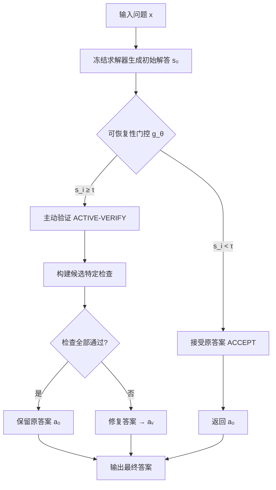

## 论文信息

- **标题：** Think Again or Think Longer? Selective Verification for Budget-Aware Reasoning
- **作者：** Sajib Acharjee, Dip D. Chowdhury, Dawei Zhou, Liqing Zhang
- **机构：** Virginia Tech, Fralin Biomedical Research Institute
- **arXiv：** [2606.19808](https://arxiv.org/abs/2606.19808)
- **PDF：** [https://arxiv.org/pdf/2606.19808](https://arxiv.org/pdf/2606.19808)
- **代码：** [github.com/Sajib-006/SEVRA](https://github.com/Sajib-006/SEVRA)
- **核心贡献一句话：** 提出 SEVRA——一个服务层控制器，在冻结求解器的初始答案与主动验证之间做选择性路由，显著降低有害翻转率，同时节省推理 token。

## 研究背景与动机

推理时计算（test-time reasoning）正成为部署时的控制旋钮：给更多 token 或额外模型调用，系统可以延续解答、采样备选、批评答案或主动验证。但这些操作不是均匀有价值的：

1. **修复失败尝试** — 把错误答案纠正
2. **浪费算力** — 对已经正确的答案做多余计算
3. **有害翻转（Harmful Flip）** — 把正确答案改成错误答案（Huang et al., 2024）

这引出一个部署问题：**观察到初始尝试后，系统应该接受它还是花第二次调用？** 答案不取决于题目难度，而取决于当前尝试是否可被特定干预修复——即**可恢复性（Recoverability）**。

## 核心方法

### 问题形式化

对输入问题 $x$，冻结求解器产生初始解答 $s_0$、答案 $a_0$ 和运行时元数据 $m_0$。控制器从三个动作中选择：

$$z \in \{\text{ACCEPT, CONTINUE, ACTIVE-VERIFY}\}$$

- **ACCEPT**：直接返回 $a_0$
- **CONTINUE**：暴露已有尝试，让求解器检查并修正
- **ACTIVE-VERIFY**：构建候选特定的检查，仅在检查失败时修改答案

定义两个关键指标：

- **Helpful Fix（有益修复）：** $\text{FIX}(z) = \mathbb{1}[c_0=0 \land c_z=1]$ — 从错到对
- **Harmful Flip（有害翻转）：** $\text{FLIP}(z) = \mathbb{1}[c_0=1 \land c_z=0]$ — 从对到错

### 主动验证（Active Verification）

主动验证要求冻结求解器构建并执行至少两个**候选特定检查**：重建控制方程、测试单位/边界、代入候选答案、通过独立路线求解。所有检查通过则保留原答案，否则修复。

### 可恢复性门控（Recoverability Gates）

论文比较了三类门控：

| 门控类型 | 描述 |
|---------|------|
| **Cheap Feature Gate** | 基于可观测特征的逻辑回归：完成状态、token 数、终值器使用、估计难度、验证需求、约束密度 |
| **Qwen3-0.6B Gate** | 4-bit QLoRA 序列分类器 |
| **Qwen3-1.7B Gate** | 同上，1.7B 参数 |

### 系统架构

论文原图展示了 SEVRA 的完整流程：

> Figure 1: Overview of SEVRA. Offline, a frozen solver generates base attempts, candidate recovery actions are executed, and repair, flip, and token cost outcomes are logged to train a recoverability-aware policy.

论文原图展示了服务层决策流程：

> Table 1: SEVRA as a serving-layer procedure. The controller changes only the post-generation decision; the solver and verification model remain frozen.

### 算法流程（Mermaid）

## 实验结果

### 主结果对比

论文原图展示了关键实验数据对比：

| 数据集 | 策略 | 准确率 | 额外调用 | 总 Token | 翻转率 |
|--------|------|--------|---------|---------|--------|
| **MATH500** | Base 4,096 | 59.0% | 0.0% | 4,313 | 0.0% |
| | Always Continue | 72.0% | 100.0% | 8,007 | 3.6% |
| | Selective Continue | 73.6% | 48.2% | 7,064 | 1.7% |
| | **Selective Active Verify** | **76.3%** | **48.2%** | **7,100** | **1.0%** |
| | Always Active Verify | 75.5% | 100.0% | 7,812 | 2.2% |
| | **Long Base 8,192** | **76.0%** | **0.0%** | **5,124** | **0.0%** |
| **GSM8K** | Base 4,096 | 93.40% | 0.0% | 1,180 | 0.00% |
| | Always Active Verify | 93.40% | 100.0% | 2,932 | 1.25% |
| | **Selective Active Verify** | **94.47%** | **3.0%** | **1,335** | **0.00%** |
| | **Long Base 8,192** | **94.54%** | **0.0%** | **1,154** | **0.00%** |
| **CommonsenseQA** | Base | 76.49% | — | 2,500 | 0.00% |
| | Always Active Verify | 72.32% | — | 5,061 | 5.94% |
| | Self-Consistency@5 | 78.38% | — | 13,843 | 1.56% |

### 门控复杂度对比

| 门控 | MATH500 准确率 | 验证率 | GSM8K 准确率 | 验证率 |
|------|---------------|--------|-------------|--------|
| Cheap Features | 75.9% | 45.0% | 94.47% | 2.8% |
| Qwen3-0.6B QLoRA | 75.7% | 46.4% | 94.47% | 3.0% |
| Qwen3-1.7B QLoRA | **76.3%** | 48.2% | 94.47% | 3.0% |

**关键发现：** Cheap Feature Gate 几乎追平 1.7B 学习门控，差距仅 0.4 个百分点。

### 有益修复 vs 有害翻转

| 干预 | 有益修复 (%) | 有害翻转 (%) |
|------|-------------|-------------|
| MATH Always Verify | 18.7 | -2.20 |
| MATH Selective Verify | 18.3 | **-1.00** |
| GSM8K Always Verify | 1.25 | -1.25 |
| GSM8K Selective Verify | 1.07 | **0.00** |
| CommonsenseQA Always Verify | 1.77 | **-5.84** |

### 不同初始预算的成本边界

| 初始预算 | 准确率 | 平均总 Token | 终值器率 | 截断率 |
|---------|--------|------------|---------|--------|
| 4,096 | 59.0% | 4,313 | 45.2% | 45.4% |
| 6,144 | 68.0% | 4,759 | 30.2% | 32.0% |
| 8,192 | 76.0% | 5,124 | 21.6% | 22.8% |

## 个人评价

### 创新点

1. **将推理后决策建模为可恢复性问题，而非通用验证器问题。** 核心洞察是"不是所有额外推理都有价值"——有些修复错误，有些浪费算力，有些制造有害翻转。
2. **引入了有害翻转（Harmful Flip）的显式监控。** 大多数工作只看准确率提升，忽略了额外推理可能把正确答案改错的风险。
3. **Cheap Feature Gate 几乎追平学习门控。** 服务可见特征（完成状态、token 数、终值器使用）就足以做高质量路由，无需部署额外语言模型。
4. **预算匹配对比设计严谨。** 不仅对比 always verify，还对比了 longer initial solve，揭示了"调初始预算优先于加恢复控制器"的部署规则。

### 局限性

1. **仅在一个求解器家族（Qwen3）上实验。** 不同模型家族的截断模式、推理质量可能差异很大。
2. **数学基准为主（MATH, GSM8K）。** CommonsenseQA 诊断显示验证在非数学任务上可能有害，但缺乏更多领域的验证。
3. **Gate 仅用 2,000 个 MATH 样本训练。** 泛化能力有待更多数据验证。
4. **未记录实际延迟。** Token 数是成本代理，但生产环境中 p50/p95 延迟才是关键指标。

### 对后续研究的影响

- **推理预算分配**的研究需要与初始预算调优联动评估，而非孤立看待恢复策略。
- **有害翻转**应成为推理时计算研究的标配指标。
- **轻量级门控**（基于服务可见特征）在生产部署中可能比学习门控更具吸引力。

## 相关论文

1. **Self-Consistency (Wang et al., 2022)** — 多采样投票提升推理，但成本高。SEVRA 显示 Self-Consistency@5 在 CommonsenseQA 上提升 1.88 点，但花费约 5 倍 token。
2. **Let's Verify Step by Step (Lightman et al., 2024)** — 训练验证器引导答案选择。SEVRA 不同在于使用同一冻结求解器做主动验证，而非独立验证器。
3. **Scaling Test-Time Compute (Snell et al., 2024)** — 证明最优分配测试时计算比缩放模型参数更有效。SEVRA 从部署角度细化了"如何分配"。
4. **LATTS (Uscidda et al., 2025)** — 局部自适应测试时缩放，在中间状态层面分配验证努力。比 SEVRA 更细粒度，但需要额外验证器和搜索状态。
5. **Large Language Models Cannot Self-Correct Reasoning Yet (Huang et al., 2024)** — 证明内在自校正可能失败或把正确答案改错。SEVRA 的有害翻转概念直接受此启发。

---

> 整理者：Nancy | 数据源：arXiv + PaddleOCR-VL-1.6 解析 | 更新时间：2026-06-22
