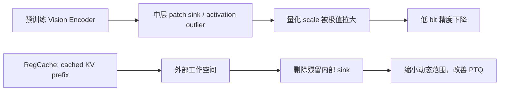

论文：**Activation Quantization of Vision Encoders Needs Prefixing Registers**，提出方法 **RegCache**。

上一篇《Vision Transformers Need Registers》说的是：ViT 会把背景 patch 临时当作工作寄存器，导致空间特征图里出现异常热点。这篇论文继续追踪这些寄存器型 token，发现它们还有一个很现实的后果：**它们会把 Vision Encoder 的激活量化范围撑得非常大，导致 INT8 甚至 INT4 推理精度显著下降。**

作者的解决方案是一个 training-free 的插件：提前从视觉编码器里找到稳定的 outlier token，把它们缓存成 register，在中间层作为 prefix 注入；同时删除推理过程中残留的异常 token。



## 论文信息

| 字段 | 内容 |
| --- | --- |
| 标题 | Activation Quantization of Vision Encoders Needs Prefixing Registers |
| 方法 | RegCache（Register Caching） |
| 任务 | Vision Encoder Post-Training Quantization |
| 模型 | CLIP、OpenCLIP、SigLIP、SigLIP2、DINOv2 |
| 特点 | 无需重新训练，可叠加已有 PTQ 方法 |
| 论文 | [arXiv:2510.04547](https://arxiv.org/abs/2510.04547) |

一句话总结：**视觉编码器里的 outlier token 就像量化器眼中的几个“超大垃圾值”；RegCache 给它们准备专用寄存器并清理残留 outlier，让普通 token 获得更合理的量化范围。**

## 先说清楚：量化为什么怕 outlier

激活量化通常要把浮点数映射到有限的整数范围。以对称量化为例，量化 scale 取决于激活的最大绝对值：

```text
scale = max(abs(activation)) / quantization_level
```

如果大多数激活都在 `[-2, 2]`，但只有几个 token 达到 `100`，量化器就必须覆盖 `[-100, 100]`：

```text
普通 activation:  -2 ~ 2
少数 outlier:   -100 ~ 100
量化范围:       -100 ~ 100
```

结果是绝大多数普通 activation 只能挤在很少的量化级别里，rounding error 变大。比特数越低，这个问题越严重：

```text
FP16 -> 基本保留原始分布
INT8 -> 可能已经受到 outlier 影响
INT4  -> 少数 outlier 可能主导整个量化范围
```


统一 per-tensor quantization 可近似写成 \(\hat a=s\cdot\mathrm{clip}(\mathrm{round}(a/s))\)，其中 \(s\) 与 \(\max|a|\) 成正比。极少数极大 token 令 \(s\) 变粗，普通 activation 的有效量化 bin 被压缩。RegCache 的目标不是让所有激活变小，而是把承担内部计算的大幅值状态迁到可控位置，使 patch token 不再主导范围。

因此，视觉模型量化不只是“把权重从 FP16 换成 INT8”。激活分布是否适合量化，往往决定了低比特模型最终能不能用。

## Vision Encoder 的 outlier 从哪里来

论文观察到，CLIP、SigLIP、DINOv2 等 Vision Encoder 会在中间层产生一些异常高范数 token。它们有几个特点：

- 数值幅度远高于普通 token；
- 通常出现在背景或低语义区域；
- 会吸引异常多的 attention；
- 在不同图片之间具有很高的相似性；
- 往往在中间层而不是第一层就出现。

最后一点很关键。LLM 里的 attention sink 经常来自 `BOS`、`SEP` 等一开始就存在的特殊 token；视觉编码器的输入则只是图像 patch，模型要先经过几层处理，才能判断哪些 patch 没有明确语义。因此 Vision Encoder 的 sink token 通常在中间层逐渐形成。

论文还做了前景/背景实验：把图像背景去掉后，outlier 会更早出现；只保留背景时，outlier 行为仍然相近。这支持了作者的判断：模型在寻找“语义上没有用、适合承担内部计算”的位置。


图的上排是“仅量化一个层”时的零样本精度，下排是同一位置 FC2 输入的最大 token norm。两者在一两个**中间 block**同步恶化：量化敏感层要靠测量选出，不能只凭层号猜；prefix 也应从敏感层之前的中段开始，而不是照搬 LLM 从第一层前缀化的做法。

## 一个重要观察：outlier 可以复用

如果每张图的 outlier 都完全不同，就无法提前准备 register。但论文发现，不同图片里的 outlier token 很相似：

```text
普通 token 的平均 cosine similarity: 约 0.26
outlier token 的平均 cosine similarity: 约 0.89
```

这意味着 outlier 中有相当一部分内容并不依赖当前图像，而是视觉编码器在多个输入上都会产生的共享中间状态。

作者因此提出一个核心假设：

> 一张图片中间层产生的 sink token，可以作为另一张图片的通用 register。

这就把“模型运行时随机占用背景 patch”的行为，转化成了“提前缓存一组可复用的寄存器”。

这不是仅凭直觉的假设：SigLIP-B/16 中，outlier token 跨图像的平均 cosine similarity 为 **0.89 +/- 0.07**，普通 token 只有 **0.26 +/- 0.10**。相似的是表示状态，而不是图像中的固定坐标，因此 cache 能跨图像使用，而非记住某个背景模板。

## RegCache 的三个步骤

RegCache 主要由三步组成：

```text
1. Curating：从校准数据中找出稳定的 outlier token
2. Caching：把它们保存成中间层的 prefix KV cache
3. Deleting：删除测试图中剩余的高范数 sink token
```


### 1. Curating：找出 register candidate

作者先用少量参考图片运行视觉编码器，统计各层 token 的范数和量化敏感性，定位容易出现 outlier 的 block。

然后从这些量化敏感层的输入中找出高范数 token，作为 register candidate。由于这些 token 在不同图片间高度相似，可以对它们做聚合，形成对输入内容不太敏感的通用 register。

这里的 register 不是重新训练出来的参数，而是从现有模型激活中抽取并缓存的 token 表示。

原文默认从 ImageNet-1k 训练集抽 50,000 张图，在目标层和其前至多三个 block 中收集候选，每层取 top-100。先测每层单独量化造成的精度跌幅得到量化敏感层 \(l_q\)，再从该处激活中选最大范数 token。没有标签时，也可以搜索最小化 FP32 与量化输出 feature 之间 reconstruction MSE 的配置，附录结果显示这种 label-free 选择仍有平均收益。

### 2. Middle-layer prefixing：在中间层注入

推理时，RegCache 把缓存的 register 作为 prefix token 加到中间层 attention 的 KV 中。它不像普通输入 patch 那样代表图像内容，而是一个可以吸收 attention、承接中间计算的外部工作区。

具体而言，先用未量化模型对候选 token 计算各层 K/V，再平均为 \(K_{reg},V_{reg}\)。量化推理中把 cache 复制 \(\tau\) 次并拼到 attention 的 Key/Value 序列，论文在 \(\tau=1\ldots15\) 内搜索。注入的是 KV 而不是完整的可继续更新 token，因此无需为额外 token 重新跑一遍完整 block。

相比 LLM 里从第一层开始 prefix，RegCache 只在 Vision Encoder 的中间到后续层使用 prefix：

```text
early layers:
  不注入，保留原始视觉 patch 建模

middle layers:
  插入 cached registers

later layers:
  继续使用这些 register，减少 patch outlier
```

这正是论文标题里的 **Prefixing Registers**。它不是把整个模型改成带 registers 的新模型，而是在量化部署阶段临时把工作寄存器插进去。

### 3. Token deletion：删除剩余 sink

prefix register 并不能保证原始 patch token 中不再出现异常值。因此 RegCache 会在最量化敏感的 block 中计算 token 的异常程度，删除 top-k 高范数 token。

可以把这一步理解成：

```text
cached registers: 给模型稳定的工作空间
token deletion:   清掉原始输入里残留的异常工作空间
```

这两个动作是配套的。如果只删除而不提供 register，模型可能会在别的位置重新制造 outlier；如果只 prefix 而不删除，残留的异常 patch 仍可能撑大量化范围。

对检测、分割等固定网格任务，不能因为删除 token 就破坏空间布局。论文在 ADE20K 的补充实验以邻域 patch embedding 的均值回填被删位置；SigLIP-B/16 的 W8A8 mIoU 从 naive 的 30.30 升至 **32.46**，接近 FP32 的 32.85。这是部署 dense task 的必要条件，不是可选优化。

## 它和上一篇 registers 论文有什么区别

两篇论文解决的是同一类现象的不同后果。

| 论文 | 主要问题 | 解决方式 |
| --- | --- | --- |
| Vision Transformers Need Registers | patch feature 和 attention map 被污染 | 训练时加入可学习 register tokens |
| RegCache | activation outlier 破坏低比特量化 | 推理时 prefix cached registers，并删除 outlier |

可以把流程串起来：

```text
没有专用工作空间
  -> 背景 patch 被借用
  -> 产生高范数 sink token
  -> 空间特征出现热点
  -> 激活量化范围被撑大
  -> INT4 / INT8 误差增加
```

上一篇从模型训练和特征表达角度修复；RegCache 则从量化部署角度修复，而且不要求重新训练原始 Vision Encoder。

| 维度 | 训练时 Register | RegCache |
| --- | --- | --- |
| 生效时机 | 预训练/继续训练 | PTQ calibration 与推理 |
| register 来源 | 可学习参数 | 离线挖掘并平均的 K/V cache |
| 处理方式 | 防止 patch 被借用 | 提供外部 sink，再清理残留 patch sink |
| 主要目标 | 干净、可解释的局部特征 | 缩小 activation dynamic range |

## 实验结论

作者将 RegCache 叠加到多种 Vision Transformer PTQ 方法上，并测试了 CLIP、OpenCLIP、SigLIP、SigLIP2 和 DINOv2。

整体结论比较一致：

- ImageNet zero-shot 分类精度提高；
- MS-COCO 图文检索效果提高；
- 4 bit 下收益最明显；
- 6 bit、8 bit 下也能减少量化损失；
- 对不同 Vision Encoder 和不同 PTQ 方法具有可迁移性；
- 在 Qwen3-VL 等 VLM 的低比特视觉输入链路中也有效。


图中红线显示的 FC2 层同时是异常范数尖峰和量化敏感点。下面的消融比笼统地说“有效”更说明组件为何缺一不可：

| W8A8 ImageNet Top-1 | naive | 仅 prefix cache | 仅删除 | 两者结合 |
| --- | ---: | ---: | ---: | ---: |
| SigLIP-B/16 | 69.71 | 74.37 | 42.41 | **74.38** |
| SigLIP2-B/16 | 26.04 | 23.82 | 69.06 | **72.35** |

不同 encoder 单独应用某一步的方向甚至相反，而组合都最好。因此不能将 RegCache 简化为 outlier clipping。CLIP-B/16 的 W8A8 中，naive 为 34.01，随机 prefix 为 54.18，直接 clipping 为 47.29，RegCache 为 **59.71**。候选筛选与平均、前缀位置以及删除步骤共同构成方法。

动态范围也确实收窄：敏感层输入的平均最大 token norm，CLIP 从 `41.38 -> 11.45`，OpenCLIP `92.78 -> 9.64`，SigLIP `35.82 -> 3.64`，SigLIP2 `148.20 -> 15.16`。收益在 4/6 bit 最显著；高 bit 或强 PTQ 基线的余量较小，DINOv2 的少数 W8A8 设置还有轻微退化。

论文的重点不是“RegCache 让浮点模型变强”，而是：当模型必须进入低比特部署时，它能减少 outlier 造成的额外损失。尤其是在 INT4 这类极端设置下，普通 PTQ 很容易失去大量语义能力，而 RegCache 能把一部分精度找回来。

## 工程上怎么理解

如果把量化部署类比成把一张表格压缩成有限精度：

```text
普通 token: 正常数据
outlier token: 少数极端值
quantizer: 为极端值扩大整张表的范围
```

RegCache 做的事情相当于：

```text
把极端值集中放进单独的缓存区
让主数据区域使用更紧凑的数值范围
必要时删除输入中的异常项
```

它的运行时开销主要是少量 token 的插入与删除，通常比重新训练一个量化感知模型便宜得多。对于手机端、边缘设备和 VLM 场景，Vision Encoder 往往要处理大量图片或视频帧，这种无需训练的修补具有实际价值。

TensorRT/A6000、batch 64 测试中，CLIP-B/16 INT8 从 60.64 ms 变为 61.27 ms（+1.04%），SigLIP-B/16 为 +1.54%。但 calibration 并非免费：用 naive RTN 在 RTX 4090 上完整搜索一次约需 1 小时。生产系统应把 `sensitive layer / prefix start / prefix count / delete count / cache` 当作**每个 encoder 与每个量化后端**的离线配置，而不是全模型共用一套数字。

## 实现检查清单

```text
# 离线 calibration
lq = argmax_layer_accuracy_drop(model, quantizer, reference_data)
candidates = collect_top_norm_tokens(model_fp, reference_data, layers_before(lq))
kv_cache = average_kv(model_fp, candidates)
prefix_count, delete_count = search(reference_data, quantized_model, kv_cache)

# 在线 inference
for block in transformer:
    if block == lq:
        remove_top_linf_patch_tokens(delete_count)  # 不删除 CLS / prefix
    if block >= prefix_start:
        append_cached_kv(kv_cache[block], prefix_count)
    run_quantized_block(block)
```

- 每张图独立选择待删 patch，不能用 batch 级 top-k。
- 明确删除发生在 pre/post-norm 的哪一个张量；校准和部署必须一致。
- K/V prefix 的 dtype、layout、scale 要与 attention kernel 一致。
- dense task 应回填 token 或维护位置映射；分类用的“直接缩短序列”不可盲目迁移。

## 局限和注意事项

RegCache 不是通用的“所有模型都自动变成 INT4”的方案。

第一，它需要通过校准数据定位量化敏感层和稳定的 register candidate。第二，prefix 的层位置、register 数量和删除 token 数量仍需要针对模型验证。第三，token deletion 可能改变视觉 token 数量，因此下游模块如果依赖固定 token 布局，需要确认接口处理方式。最后，论文主要验证的是视觉编码器和 VLM 视觉链路，不能直接推断同样策略对任意 Transformer 都有效。

还应注意，RegCache 为 activation quantization 设计，weight-only 的主要瓶颈不同；对医疗、遥感或极端分辨率等专业域，ImageNet cache 即使在论文中体现一定泛化，也不应替代本域 calibration。

## 总结

这篇论文的核心链条是：

```text
ViT 的隐式工作寄存器
  -> 中间层高范数 outlier
  -> activation quantization range 变宽
  -> 低比特量化误差变大
```

RegCache 的处理方式是：

```text
缓存稳定的 register token
  -> 在中间层 prefix
  -> 删除残留的 outlier token
  -> 让普通视觉 token 更容易量化
```

最值得记住的一句话是：**Vision Encoder 的 registers 不只是特征图问题，也是量化问题。** 当模型要从 FP16 走向 INT8、INT6 甚至 INT4 时，先处理这些寄存器型 outlier，往往比单纯更换量化公式更直接。
