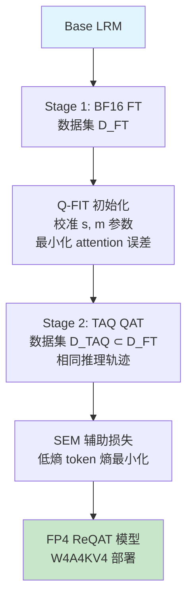

## 论文信息

- **标题**: ReQAT: Achieving Full-Precision Reasoning Accuracy with 4-bit Floating-Point Quantization-Aware Training
- **作者**: Janghwan Lee, Sihwa Lee, Jinseok Kim, Yongjik Kim, Jieun Lim, Jinwook Oh, Jungwook Choi
- **机构**: 汉阳大学 (Hanyang University)
- **arXiv**: [2606.15682](https://arxiv.org/abs/2606.15682)
- **PDF**: [https://arxiv.org/pdf/2606.15682](https://arxiv.org/pdf/2606.15682)

> **一句话总结**: 发现 FP4 量化失败集中在低熵 token（数字、运算符），提出 TAQ+SEM+Q-FIT 三件套，在 W4A4KV4 下恢复甚至超越 BF16 精度，推理吞吐量提升 3.9×。

## 研究背景

### 2.1 推理模型的部署困境

Large Reasoning Models (LRMs) 通过长 chain-of-thought (CoT) 解决复杂数学和逻辑问题，但部署面临三大成本瓶颈：

1. **内存带宽**: 自回归解码中反复加载权重
2. **计算量**: 大量 FLOPs
3. **KV Cache**: 长推理轨迹（>16K tokens）导致 KV cache 线性增长

NVIDIA Blackwell 架构原生支持 **NVFP4**（E2M1 格式，2-bit 指数 + 1-bit 尾数），B200 Tensor Core 提供 9 PFLOPS FP4 算力（FP16 的 ~4×），支持全量化 **W4A4KV4** 推理。

### 2.2 PTQ 和 QAT 为何失效？

现有 PTQ 在 W4A4KV4 下推理精度大幅下降（AIME 从 56.8% 跌至 50%）。QAT 虽然能改善，但仍远低于 BF16 全精度微调。

**核心发现**: 量化噪声对**低熵 token**（数字、运算符等确定性预测）的采样误差影响最大，而非高熵 token（连接词、过渡短语）。

Figure 1: (a) NVFP4 W4A4KV4 PTQ 精度下降; (b-c) QAT 精度恢复; (d) 精度-吞吐量权衡

## 核心方法

### 3.1 关键洞察：低熵 token 是量化失败的主因

论文通过三个实验验证了这一假设：

**实验 1: 语义分析** — 低熵 token 以数字和符号运算符为主，高熵 token 以话语标记和连接词为主。

Figure 2(a): 低熵 token 以数字/运算符为主，高熵 token 以连接词为主

**实验 2: 熵感知混合精度解码** — 将低熵 token 路由到 BF16 模型可恢复大部分精度，而仅路由高熵 token 效果有限。

**实验 3: Logit 噪声注入** — 在低熵 token 上注入噪声导致精度大幅下降（64→5），而高熵 token 上注入噪声影响很小（64→63）。

**结论**: FP4 量化下，低熵 token 的 top-1 argmax 通常不变，但**尾部概率质量（tail-mass）显著膨胀**，导致采样时更容易选到非 top-1 的替代 token。

### 3.2 ReQAT 三件套

Figure 3: ReQAT 整体流程 — BF16 FT → Q-FIT 校准 → TAQ+SEM QAT

#### (1) TAQ: Trace-Aligned Quantization-Aware Training

**动机**: 普通 QAT 在低熵 token 上的熵变化很小（模型已经"学会"了这些确定性预测），但**两阶段训练**（先 BF16 FT，再 QAT）如果**复用相同的推理轨迹**，可以让 QAT 阶段的学习信号重新集中在低熵 token 上。

**方法**:
- **Stage 1**: BF16 FT 在数据集 $\mathcal{D}_{FT}$ 上训练
- **Stage 2**: QAT 在 $\mathcal{D}_{TAQ} \subseteq \mathcal{D}_{FT}$ 上训练（相同轨迹的子集）

**关键发现**: 使用不同轨迹的 FT+QAT 效果与纯 QAT 相当（≤1% 提升），而**轨迹对齐**的 FT+QAT 提升约 5%。

**梯度分析**: TAQ 使低熵 token 的梯度贡献比 $C_{low}$ 持续增加，证明学习信号向量化敏感位置重新分配。

#### (2) SEM: Selective Entropy Minimization

在标准 SFT 损失上增加**选择性熵最小化**正则项：

$$\mathcal{L}_{SEM} = \mathcal{L}_{SFT} + \lambda \cdot \frac{1}{T} \sum_{t=1}^{T} w_t H_t$$

其中权重函数：

$$w_t = \max\left(0, 1 - \frac{H_t - H_{min}}{\tau - H_{min} + \epsilon}\right)$$

- $\tau$ 设为每个 mini-batch 熵值分布的 75 分位数
- 使用**软权重**而非硬掩码，避免阈值附近 token 被过度惩罚
- 仅在低熵位置激活，强化确定性预测的信心

#### (3) Q-FIT: Quantization-Friendly QAT Initialization

KV cache 量化引入额外挑战。Q-FIT 在 Stage-2 QAT 前联合校准两个变换：

$$\tilde{Q} = \mathcal{R}(Q^{pre} \odot s), \quad \tilde{K} = \mathcal{R}(K^{pre} \oslash s) - m$$

- **Pre-RoPE 缩放** $s$: 折叠到投影权重中，无推理开销
- **Post-RoPE 偏移** $m$: 校准后固定，推理时做减法
- 参数化: $(\alpha_s, \alpha_m) \in [0,1]$，通过最小化 BF16 与 KV4 attention 输出距离选择最优参数
- KV cache 使用 **E1M2** 格式（比 E2M1 训练损失更低）

### 3.3 算法流程

## 实验结果

### 4.1 主实验：AIME 精度

| Bit-Precision | Method | 140M | 210M | 280M | 350M |
|:---:|:---:|:---:|:---:|:---:|:---:|
| **BF16** | Baseline | — | 56.83 | — | — |
| **BF16** | FT | 63.70 | 64.17 | **65.46** | 64.79 |
| **MXFP4 W4A16** | Direct PTQ | 50.37 | — | — | — |
| **MXFP4 W4A16** | QAT | 59.88 | 61.35 | 61.09 | 62.29 |
| **MXFP4 W4A16** | **ReQAT** | 65.00 | 66.25 | 67.08 | **68.02** ⭐ |
| **NVFP4 W4A4KV4** | Direct PTQ | 50.13 | — | — | — |
| **NVFP4 W4A4KV4** | QAT | 57.09 | 57.60 | 58.86 | 58.23 |
| **NVFP4 W4A4KV4** | **ReQAT** | 59.79 | 64.28 | 64.37 | **65.63** ⭐ |

**关键结果**: NVFP4 W4A4KV4 下 ReQAT 达到 65.94% AIME 精度，**超越 BF16 基线 (56.83%) 和 BF16 FT (65.46%)**，且训练预算相同。

### 4.2 多基准测试（R1-Llama-8B, NVFP4 W4A4KV4）

| Method | GSM8K | MATH-500 | AIME-120 |
|:---:|:---:|:---:|:---:|
| BF16 Baseline | 88.49 | 90.00 | 36.67 |
| BF16 FT | 91.15 | 92.18 | 48.75 |
| Direct PTQ | 86.45 | 84.62 | 23.13 |
| FT + PTQ | 88.42 | 88.53 | 34.06 |
| ReQAT_T | 89.38 | 89.80 | 38.34 |
| ReQAT_TQ | 89.86 | 90.72 | 40.32 |
| **ReQAT_TQS** | **89.85** | **90.53** | **41.85** |

SEM 在简单基准（GSM8K、MATH-500）上增益有限，但在困难基准 AIME 上显著（40.32→41.85）。

### 4.3 吞吐量评估

| 平台 | BF16 基线 | NVFP4 | NVFP4-ReQAT | 总加速 |
|:---:|:---:|:---:|:---:|:---:|
| **DGX Spark** | 1.00× | 3.34× | 3.30× | **3.43×** |
| **DGX Spark** | 1.00× | 3.53× | 3.45× | **3.62×** |
| **DGX Spark** | 0.91× | 3.91× | 3.90× | **3.85×** |
| **B200** | 1.00× | 1.87× | 1.75× | — |
| **B200** | 1.00× | 2.57× | 2.42× | — |
| **B200** | — | 3.13× | 3.05× | **3.1×** |

Q-FIT 引入的开销极小（比原生 NVFP4 慢 4-5%），但仍保持 3×+ 加速。

### 4.4 消融实验

**TAQ 轨迹对齐的影响**（MXFP4 W4A16, R1-Qwen-14B）:

| Method | Trace Aligned | 140M | 210M | 280M | 350M |
|:---:|:---:|:---:|:---:|:---:|:---:|
| QAT | — | 59.88 | 61.35 | 61.09 | 62.29 |
| FT+QAT | — | 60.10 | 59.89 | 62.19 | 62.60 |
| FT+QAT | ✓ | **61.15** | **63.65** | **65.00** | **67.29** |

轨迹对齐带来 ~5% 的显著提升，证明复用相同推理轨迹是关键。

**Q-FIT 设计消融**（W4A4KV4, R1-Qwen-14B）:

| Method | E1M2 KV | Pre-RoPE Scale | Post-RoPE Shift | AIME Acc. |
|:---:|:---:|:---:|:---:|:---:|
| ReQAT_T | — | — | — | 63.13 |
| ReQAT_TQ | ✓ | ✓ | — | 63.44 |
| ReQAT_TQ | ✓ | — | ✓ | 62.71 |
| ReQAT_TQ | ✓ | ✓ | ✓ | **65.94** |

单独使用缩放或偏移效果有限，联合校准才达到最佳效果。

### 4.5 长响应鲁棒性

| Method | 0-8K | 8-16K | 16-24K | 24-32K |
|:---:|:---:|:---:|:---:|:---:|
| BF16 Baseline | 92.1% | 55.1% | 21.9% | 12.9% |
| BF16 FT | 99.4% | 91.5% | 57.4% | 17.5% |
| PTQ | 84.6% | 48.5% | 14.7% | 6.3% |
| **ReQAT** | **98.9%** | **91.7%** | **55.7%** | **19.3%** |

ReQAT 在超长响应（24-32K tokens）上表现最佳，证明量化误差不会在长推理轨迹中累积。

### 4.6 代码生成泛化

在 LiveCodeBench 上（仅用数学推理数据训练），ReQAT 同样超越 PTQ/QAT，证明方法不限于数学推理。

| Method | MXFP4 W4A16 | NVFP4 W4A4KV4 |
|:---:|:---:|:---:|
| BF16 Baseline | 51.68 | 51.68 |
| BF16 FT | 53.68 | 53.68 |
| PTQ | 48.88 | 47.99 |
| QAT | 52.01 | 50.68 |
| **ReQAT_TQS** | **54.52** | **53.59** |

## 个人评价

### 创新点

1. **低熵 token 失败假说**: 首次系统性地证明 FP4 量化失败集中在低熵 token（数字/运算符），而非直觉上的高熵 token。通过尾部概率质量膨胀和 logit 噪声注入实验严格验证。

2. **TAQ 轨迹对齐**: 巧妙利用两阶段训练 + 相同推理轨迹，让 QAT 阶段的学习信号重新分配到低熵 token。梯度分析证明低熵 token 的梯度贡献比 $C_{low}$ 持续增加。

3. **SEM 选择性熵最小化**: 不同于全局熵正则化，仅在低熵位置激活，使用软权重避免边界效应。

4. **Q-FIT 联合校准**: 自适应选择缩放/偏移策略，根据层特性和 token 分布动态调整。

### 局限性

1. **依赖 SFT 质量**: TAQ 建立在 SFT 之上，推理轨迹质量直接影响效果。
2. **两阶段训练开销**: 需要额外的 QAT 阶段（70M tokens），增加了训练成本。
3. **硬件依赖**: 主要验证在 NVIDIA Blackwell（B200/DGX Spark），其他架构的加速效果未验证。
4. **未探索 RL 结合**: 论文提到 TAQ 机制可能适用于知识蒸馏等范式，但未实际验证。

### 对后续研究的影响

- **熵感知量化**可能成为 LLM 量化的新范式，不仅限于推理模型
- **TAQ 的轨迹复用**思想可推广到其他 QAT 场景
- **Q-FIT 的联合校准**为 KV cache 量化提供了更通用的初始化框架

## 相关论文

| 论文 | 方向 | 简要介绍 |
|:---:|:---:|:---:|
| [QuaRot](https://arxiv.org/abs/2304.09145) | KV Cache 量化 | 通过正交旋转消除 KV cache 异常值，实现 4-bit 推理 |
| [FlatQuant](https://arxiv.org/abs/2502.11993) | 激活量化 | 通过训练时引入平坦性约束改善量化鲁棒性 |
| [AWQ](https://arxiv.org/abs/2306.00978) | 权重量化 | 激活感知的权重量化，跳过对激活敏感的通道 |
| [ParetoQ](https://arxiv.org/abs/2502.11993) | 极低比特量化 | 改进极低比特 LLM 量化的缩放定律 |
| [Beyond the 80/20 Rule](https://openreview.net/forum?id=yfcpdY4gMP) | 熵与推理 | 发现高熵少数 token 驱动有效的 RL 推理训练 |
| [AMXFP4](https://arxiv.org/abs/2502.11993) | FP4 量化 | 非对称微缩放 FP4 格式处理激活异常值 |

---

> 整理者：Nancy | 数据源：arXiv (2606.15682) + PaddleOCR 解析 | 更新时间：2026-06-22
