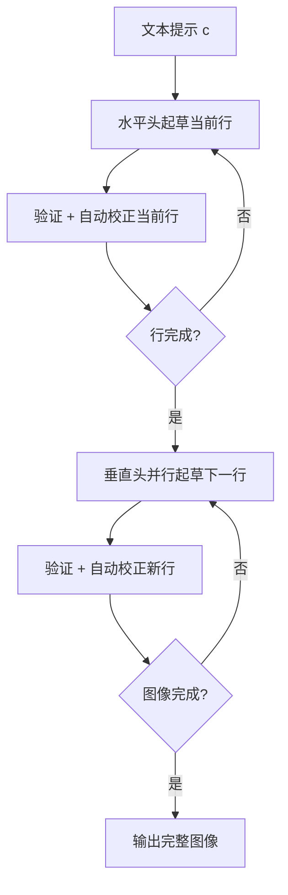

## 论文信息

- **标题**: SSD: Spatially Speculative Decoding Accelerates Autoregressive Image Generation
- **作者**: Shilong Xiang, Zirui Zhang, Lijun Yu, Chengzhi Mao
- **机构**: Rutgers University
- **arXiv**: [2606.20543](https://arxiv.org/abs/2606.20543)
- **PDF**: [https://arxiv.org/pdf/2606.20543](https://arxiv.org/pdf/2606.20543)
- **代码**: [https://shilongxiang.github.io/SSD/](https://shilongxiang.github.io/SSD/)

**一句话总结**: 将推测解码从 1D 序列扩展到 2D 空间结构，利用图像固有几何特性实现自回归图像生成最高 13.3x 加速，推理复杂度从 $O(n^2)$ 降至 $O(n)$。

---

## 研究背景

### 问题：AR 图像生成的内存墙瓶颈

自回归（Autoregressive, AR）图像生成将图像展平为 1D token 序列，通过 Transformer 逐 token 预测。生成一个 $n \times n$ 的 token 网格需要 $n^2$ 次串行前向传播——每次传播都要加载数十亿参数，产生严重的**内存墙（Memory Wall）**瓶颈。

以 Emu3-8B 为例，生成 $90 \times 90$ 网格（8,100 tokens）需要 8,100 次前向传播，耗时 339 秒。

### 现有加速方法的局限

| 方法 | 加速比 | 问题 |
|------|--------|------|
| 1D 推测解码（MTP） | 1.8x–3.7x | 沿展平序列预测，忽略了 2D 空间局部性 |
| Jacobi 并行解码（SJD） | ≤2.9x | 质量保持好但加速有限 |
| 空间并行生成 | 质量下降 | 强独立性假设破坏视觉连贯性 |

核心矛盾：图像是 2D 的，但所有加速方法都假设 1D 序列结构。

### SSD 的关键洞察

论文通过一个巧妙的实验验证了核心假设：**空间相关性本质上是 2D 的**。

> **Figure 1**: 将 Janus-Pro-7B 生成过程中每行的后半部分替换为随机 token（红色框），只要上方 token 正确生成（蓝色框），视觉连贯性依然保持。这证明垂直预测依赖的是空间相邻性，而非展平序列中的位置。

右图对比：水平方向 +2 偏移的预测精度 ≈ 垂直方向 +48 偏移的预测精度，进一步确认可预测性由 2D 空间局部性决定。

---

## 核心方法

### 3.1 方法总览

SSD 将 2D 空间预测分解为两个正交的 1D 预测流：

1. **水平头**（$k_h=5$）：沿行内预测后续 token
2. **垂直头**（$k_v=1$ 或 $2$）：跨行预测下方 token

> **Figure 2**: (a) 标准 AR 将图像展平为 1D 序列，$O(n^2)$ 步；(b) 推测解码加速但受限于线性几何，仍为 $O(n^2)$；(c) SSD 对齐图像内在几何，并行起草整行空间块，复杂度降至 $O(n)$。应用于 Emu3-8B 实现 13.7x 加速。

### 3.2 算法流程

**关键创新点 1：在连续隐空间起草**

离散 token 空间的 codebook 分布过于平坦（数万候选），精确匹配接受率 <5%。SSD 改为预测 Transformer 最后一层 **RMSNorm 之前** 的连续隐状态：

$$\hat{\mathbf{h}}_{y+\delta,x} = f_{\phi}\big([\mathbf{h}_{y,x}; \mathbf{e}_{y,x}]\big)$$

其中预测器 $f_{\phi}$ 的结构：

$$f_{\phi}(\mathbf{z}) = \mathbf{W}_0\mathbf{z} + \text{SwiGLU}(\text{RMSNorm}(\mathbf{W}_0\mathbf{z}))$$

- 输入：当前隐状态 $\mathbf{h}_{y,x}$ + token embedding $\mathbf{e}_{y,x}$（消除采样不确定性）
- 输出：偏移 $\delta$ 处的隐状态预测
- 训练损失：Smooth L1 loss 对冻结骨干网络的真实隐状态

> **Figure 6**: Token 空间头（$\mathbf{e} \to \mathbf{e}$）无法重建有意义的视觉内容，而隐状态头（$\mathbf{h}_{\text{pre}} \oplus \mathbf{e} \to \mathbf{h}_{\text{pre}}$）生成连贯图像。

**关键创新点 2：验证即自动校正**

标准推测解码遇到第一个不匹配就回滚整个 block，对 2D 空间块过于严格。SSD 改为**逐位置独立验证 + 残差采样校正**：

对每个起草位置独立应用接受规则：

$$\alpha(\hat{t}) = \min\left(\frac{p_{\theta}(\hat{t} \mid \mathbf{c})}{q_{\phi}(\hat{t} \mid \mathbf{c})}, 1\right)$$

被拒绝的 token 不丢弃，而是从残差分布重采样：

$$\tilde{p}(v \mid \mathbf{c}) = \frac{\max(0, p_{\theta}(v \mid \mathbf{c}) - q_{\phi}(v \mid \mathbf{c}))}{\sum_{v'} \max(0, p_{\theta}(v' \mid \mathbf{c}) - q_{\phi}(v' \mid \mathbf{c}))}$$

验证重复 $r$ 轮，每轮只需 1 次前向传播。最终 1 次前向传播提交验证块并更新 KV cache。

### 3.3 方法对比表

| 特性 | 标准 AR | 1D-MTP | SJD | **SSD (本文)** |
|------|---------|--------|-----|----------------|
| 预测方向 | 1D 序列 | 1D 序列 | 1D 迭代 | **2D 空间** |
| 起草空间 | — | 离散 token | 离散 token | **连续隐状态** |
| 验证策略 | — | 严格拒绝 | Jacobi 迭代 | **逐位置校正** |
| 理论复杂度 | $O(n^2)$ | $O(n^2)$ | $O(n^2)$ | **$O(n)$** |
| 骨干网络修改 | 无 | 无 | 无 | **无** |

---

## 实验结果

### 4.1 主结果

**DPG-Bench 结果**（语义对齐评估）：

| 模型 | 延迟 | 步数加速 | 延迟加速 | DPG-Bench Overall |
|------|------|---------|---------|-------------------|
| Lumina-mGPT AR | 91.64s | 1.00x | 1.00x | 76.30 |
| + 1D-MTP | 49.91s | 2.23x | 1.84x | 63.20 |
| + SJD | — | — | — | 75.60 |
| **+ SSD** | **7.52s** | **16.74x** | **12.19x** | **74.57** |

| 模型 | 延迟 | 步数加速 | 延迟加速 | DPG-Bench Overall |
|------|------|---------|---------|-------------------|
| Emu3 AR | 339s | 1.00x | 1.00x | 78.69 |
| + 1D-MTP | — | — | — | 53.11 |
| + SJD | — | — | 2.90x | 77.80 |
| **+ SSD** | **25.6s** | — | **13.28x** | **77.60** |

**GenEval 结果**（组合生成保真度）：

| 模型 | 延迟 | 步数加速 | 延迟加速 | GenEval Overall |
|------|------|---------|---------|----------------|
| Lumina-mGPT AR | 90.56s | 1.00x | 1.00x | 0.50 |
| **+ SSD** | **7.52s** | **16.74x** | **12.04x** | **0.46** |

### 4.2 消融实验

**预测目标空间消融**（Table 3, Janus-Pro-7B, r=0）：

| 输入 | 目标 | DPG-Bench Overall |
|------|------|-------------------|
| $\mathbf{e}$ | $\mathbf{e}$ | **5.52** ❌ |
| $\mathbf{h}_{\text{pre}}$ | $\mathbf{h}_{\text{pre}}$ | 69.07 |
| $\mathbf{h}_{\text{post}}$ | $\mathbf{h}_{\text{post}}$ | 45.26 |
| **$\mathbf{h}_{\text{pre}} \oplus \mathbf{e}$** | **$\mathbf{h}_{\text{pre}}$** | **71.65** ✅ |

**验证策略消融**（Table 4, Janus-Pro-7B）：

| 方法 | 步数 | 延迟 | 步数加速 | 延迟加速 | DPG-Bench |
|------|------|------|---------|---------|-----------|
| AR baseline | 576 | 7.87s | 1.00x | 1.00x | 84.23 |
| Spec. decoding | 504 | 9.04s | 1.14x | 0.87x | 83.80 |
| **Verify & auto correction** | **80** | **1.38s** | **7.20x** | **5.70x** | **83.40** |

标准推测解码反而比 AR 慢（0.87x），因为每次拒绝都需要 KV cache 回滚 + 额外前向传播。SSD 的自动校正策略将步数从 576 降至 80。

**验证轮数消融**（Table 5, Janus-Pro-7B）：

| $r$ | 步数 | 延迟 | 步数加速 | 延迟加速 | DPG-Bench |
|-----|------|------|---------|---------|-----------|
| AR | 576 | 7.87s | 1.00x | 1.00x | 84.23 |
| 0 | 34 | 0.559s | 16.9x | 14.1x | 71.65 |
| 1 | 57 | 0.971s | 10.1x | 8.1x | 81.27 |
| **2** | **80** | **1.383s** | **7.20x** | **5.70x** | **83.40** |

$r=0$ 时草稿已保持粗略空间结构，$r=2$ 时视觉质量与 AR baseline 不可区分。

### 4.3 可视化结果

**验证轮数对质量的影响**：

**AR baseline**

**r=0（无验证）**：保留粗略空间布局

**r=1**：恢复局部细节

**r=2**：与 AR baseline 视觉不可区分

> **Figure 7**: Janus-Pro-7B 在不同垂直验证轮数下的输出对比。$r=2$ 时视觉质量与 AR baseline 不可区分，同时保持 5.70x 延迟加速。

**多行验证调度**：

联合验证（Joint）vs 分阶段验证（Staged）：

**Joint (b=9, i=0)**

**Staged (b=5, i=4)**

> **Figure 8**: Lumina-mGPT-7B 在联合验证 vs 分阶段验证下的对比。分阶段验证先提交第一行，再在修正后的上下文上精炼第二行，产生更清晰的细节和更连贯的空间结构。

**扩展定性对比**：

> **Figure 9**: AR baseline、SJD、1D-MTP 与 SSD 在三模型上的并排对比。SSD 在实现显著加速的同时保持高视觉保真度。

---

## 个人评价

### 创新点

1. **从 1D 到 2D 的范式转换**：这是首个将推测解码从序列维度扩展到空间维度的工作。不是简单地"并行化更多 token"，而是重新思考了视觉生成的预测依赖性结构。

2. **连续隐空间起草**：避开离散 token 空间的平坦分布问题，在 Transformer 最后一层的预归一化隐状态上预测，这是一个非常实用的工程洞察。

3. **验证即自动校正**：将严格的全有或全无拒绝改为逐位置独立校正，完美适配 2D 空间块的验证场景。

4. **即插即用**：骨干网络完全冻结，只需训练轻量级预测头（开销 < 0.1 AR 步），可适配任何统一的自回归视觉模型。

### 局限性

1. **训练数据规模有限**：仅用 Midjourney prompt 数据集（5K–60K 样本），Table 7 显示性能仍在上升且未饱和，更大规模数据可能进一步提升。

2. **加速比依赖网格大小**：小网格（24×24）加速比有限（Janus-Pro 5.74x），大网格（90×90）加速比显著（Emu3 13.28x）。

3. **CFG 批处理差异**：部分加速来自更高效的生成循环而非 SSD 算法本身（Appendix A.5 承认）。

4. **仅评估文本到图像**：未探索图像到图像、视频生成等场景。

### 对后续研究的影响

- 为"视觉几何感知的推理加速"开辟了新方向
- 连续隐空间起草的思路可迁移到其他模态
- 验证即自动校正的范式可能适用于其他并行解码场景
- 结合更先进的视觉 tokenizer（更高分辨率、更密集离散表示），加速比有望进一步提升

---

## 相关论文

1. **Speculative Decoding** (Leviathan et al., ICML 2023) — 原始推测解码方法，使用草稿模型 + 拒绝采样加速 LLM 推理。

2. **Eagle** (Li et al., ICML 2024) — 在连续特征空间进行推测采样，与 SSD 的隐空间起草思路相似，但针对文本生成。

3. **SJD** (Teng et al., ICLR 2025) — 训练-free 的 Jacobi 推测解码用于自回归图像生成，加速比 1.5–2.9x。

4. **Lantern** (Jang et al., ICLR 2025) — 放宽推测解码约束以加速视觉自回归模型，加速 1.8–3.7x。

5. **PJD** (Liao et al., CVPR 2026) — 将 Jacobi 解码扩展到 2D 行级并行精炼，但未学习起草空间块。

---

> 整理者：Nancy | 数据源：arXiv (2606.20543) | PaddleOCR-VL-1.6 解析 | 更新时间：2026-06-22
