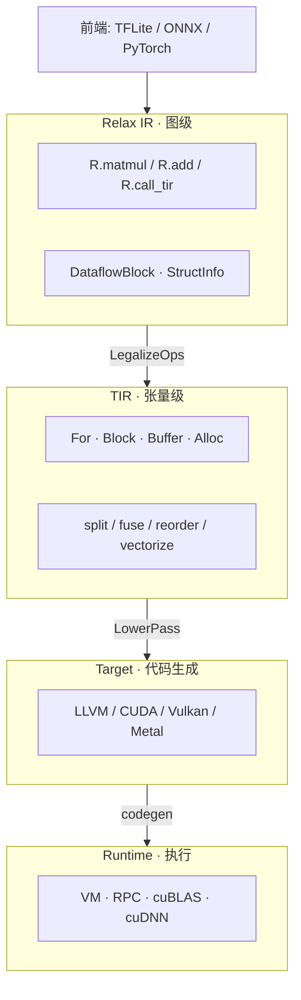

## TVM 是什么

TVM 是一个开源的深度学习编译器。输入模型（TFLite、ONNX、PyTorch），输出能在目标设备上执行的代码（`.so`、`.dylib`、CUDA kernel 等）。

它**不是**推理引擎（不负责跑模型），也**不是**训练框架（不负责算梯度）。它的位置在模型和硬件之间：

```
PyTorch / TensorFlow / ONNX
            │
            ▼
         TVM 编译器           ← 我们在的位置
            │
            ▼
     CPU / GPU / NPU / DSP
```

## 一张图看懂全貌



这张图从上到下是编译流水线，右边标注了每层的核心概念。

关键认知：**TVM 的编译就是 IR → IR → IR 的变换管道**。每一层的 IR 都可以 `.show()` 打印出来观察。

## 为什么需要这么多层

因为没有一个 IR 能同时做好所有事：

- Relax 表达"a matmul b 然后加 bias"——适合做**图融合**（把相邻算子合并成一个大 kernel），但不知道循环怎么排
- TIR 表达"i 循环在外、j 循环在里、k 循环做规约"——适合做 **tiling / vectorize**，但不知道寄存器怎么分配
- 目标代码表达 `vadd.f32` 之类——适合**寄存器分配、指令调度**，但完全丢失了张量语义

**每一层只关心自己能解决的问题，把剩下的交给下一层。**

## 端到端演示：matmul + add 的完整旅程

用一个真实例子走完全程。定义一个函数——对两个矩阵做乘法然后加 bias：

```python
from tvm.script import relax as R

@R.function
def main(
    a: R.Tensor((128, 256), "float32"),
    b: R.Tensor((256, 512), "float32"),
    bias: R.Tensor((512,), "float32"),
) -> R.Tensor((128, 512), "float32"):
    with R.dataflow():
        lv = R.matmul(a, b)
        out = R.add(lv, bias)
        R.output(out)
    return out
```

### 第 0 步：Relax IR 长什么样

`main.show()` 输出：

```
@R.function
def main(
    a: R.Tensor((128, 256), dtype="float32"),
    b: R.Tensor((256, 512), dtype="float32"),
    bias: R.Tensor((512,), dtype="float32"),
) -> R.Tensor((128, 512), dtype="float32"):
    with R.dataflow():
        lv: R.Tensor((128, 512), dtype="float32") =
            R.matmul(a, b, out_dtype="void")
        out: R.Tensor((128, 512), dtype="float32") =
            R.add(lv, bias)
        R.output(out)
    return out
```

**注意**：这里没有任何实现。没有矩阵乘法的算法、没有中间结果的存放位置、没有循环。IR 只说"我要 matmul，我要 add"。

为什么需要这一步：因为**图级优化**（比如发现 matmul 后面接 add，可以融合成一个 kernel）需要知道"谁依赖谁"，而不需要知道"循环怎么排"。Relax 恰好提供了这个抽象层级。

### 第 1 步：LegalizeOps —— 给算子找实现

```python
mod = ir.IRModule({"main": main})
legalized = relax.transform.LegalizeOps()(mod)
```

变化：`R.matmul(a, b)` → `R.call_tir(matmul, (a, b), ...)`，`R.add` 同理：

```
@R.function
def main(...):
    with R.dataflow():
        lv = R.call_tir(matmul, (a, b),
            out_sinfo=R.Tensor((128, 512), dtype="float32"))
        out = R.call_tir(add, (lv, bias),
            out_sinfo=R.Tensor((128, 512), dtype="float32"))
        R.output(out)
    return out
```

**为什么需要这一步**：Relax 的 `matmul` 只是一个符号——"做矩阵乘法"。但具体谁来实现？是 cuBLAS？是手写的 tiled kernel？是自动调优出来的 TIR？LegalizeOps 做一个全局查找，把每个算子绑定到一个具体的 TIR primfunc 实现上。`call_tir(f, args)` 的意思是"调用名叫 `f` 的 TIR 函数来实现这个算子"。

### 第 2 步：relax.build —— 一键到底

```python
ex = relax.build(legalized, target="c")
```

这一行内部完成了三次变换：

1. **VMShapeLower**：分析每个 tensor 的形状，插入运行时形状检查
2. **VMBuiltinLower**：把 `call_tir` 展开成 VM 指令序列
3. **Codegen**：把 VM 指令翻译成 C 代码（这里选的 target 是 C）

最终产物 `ex.as_text()`：

```
@main:
  check_tensor_info  in: %0, i2, c[0], c[1]     # 检查 a 的形状和 dtype
  check_tensor_info  in: %1, i2, c[0], c[2]     # 检查 b 的形状和 dtype
  check_tensor_info  in: %2, i1, c[0], c[3]     # 检查 bias 的形状和 dtype
  match_shape        in: %0, i2, 0,128, 0,256   # a 必须是 (128, 256)
  match_shape        in: %1, i2, 0,256, 0,512   # b 必须是 (256, 512)
  match_shape        in: %2, i1, 0,512           # bias 必须是 (512,)
  alloc_storage      in: %vm, c[4], ...          # 在堆上分配 lv 的存储空间
  alloc_tensor       in: %3, c[7]                # 创建指向该空间的 Tensor 对象
  call matmul        in: %0, %1, %4              # 调用 matmul(a, b) → lv
  alloc_storage      in: %vm, c[4], ...          # 分配 out 的存储空间
  alloc_tensor       in: %5, c[7]                # 创建 Tensor 对象
  call add           in: %4, %2, %6              # 调用 add(lv, bias) → out
  ret   %6                                       # 返回 out
```

**为什么需要这一步**：从 Relax 的图级表示降到了可执行的指令序列。形状检查确保输入合法，内存分配给每个中间结果分配空间，函数调用执行实际计算。这就是 VM 字节码——和 JVM 字节码、Python 字节码是一个概念。

### 第 3 步：执行

```python
vm = relax.VirtualMachine(ex, tvm.cpu())
result = vm["main"](a_tvm, b_tvm, bias_tvm)
```

VM 逐条解释上面的指令：检查输入 → 分配内存 → 调用 matmul → 调用 add → 返回。

## 流水线全景（三阶段 IR 变化）

把刚才的 demo 串起来，每个阶段的输入输出：


## 每层的分工

| 层 | 解决的问题 | 不关心的事 |
|----|-----------|-----------|
| **Relax** | 算子依赖关系、图融合、形状推导 | 循环顺序、内存布局 |
| **TIR** | 循环嵌套、Buffer 分配、tiling、vectorize | 寄存器分配、具体指令 |
| **Target** | 指令选择、寄存器分配、目标 ABI | 模型结构、高层优化 |
| **Runtime** | 加载执行、设备管理、RPC | 编译过程 |

## 总结

1. TVM 是一个 **IR 到 IR 的变换管道**，输入模型，输出可执行代码
2. 四层架构：**Relax（图级）→ TIR（张量级）→ Target（代码生成）→ Runtime（执行）**
3. 编译流水线：**Relax → LegalizeOps → Lower → Codegen → Executable**
4. 每一步的 IR 都可以 `show()` 观察——**这是最好的学习方式**
5. tvm-ffi 是贯穿全栈的**地基**，所有 IR 节点构建在它的对象系统之上
