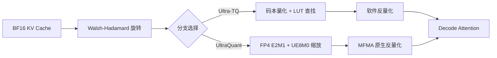

## 论文信息

- **标题**: UltraQuant: 4-bit KV Caching for Context-Heavy Agents
- **作者**: Inesh Chakrabarti, David Limpus, Aditi Ghai Rana, Bowen Bao, Spandan Tiwari, Thiago Crepaldi, Ashish Sirasao
- **机构**: AMD (Advanced Micro Devices), UCLA, Purdue University
- **arXiv**: [2606.20474](https://arxiv.org/abs/2606.20474) | [PDF](https://arxiv.org/pdf/2606.20474)
- **发表日期**: 2026-06-18
- **类别**: cs.LG, cs.AI, cs.PF

**一句话总结**: AMD 团队提出 UltraQuant——基于 FP4 硬件原生格式的 4-bit KV Cache 量化方案，在 Agent 多轮长对话场景下实现 3.47x TTFT 加速和 1.63x 吞吐提升，同时保持接近无损的推理精度。

---

## 研究背景

### 2.1 问题：Agent 场景下的 KV Cache 压力

LLM 已从短上下文聊天机器人演变为需要长期记忆的 Agent——浏览网页、检查代码仓库、调用工具、完成软件工程任务。这些工作流需要模型在多轮对话中保持系统指令、工具定义、检索文档、代码上下文和不断演化的计划。

随着模型上下文窗口向百万 token 级别扩展（Gemini 1.5, LongRoPE），KV Cache 随上下文线性增长，成为 HBM（高带宽内存）的首要消费者。

### 2.2 现有方法的两条路线

1. **架构层面**: 改变注意力机制减少 KV 状态（Multi-Head Latent Attention, Mamba, 线性 Transformer）
2. **系统层面**: 缓存复用、卸载、分页内存管理（vLLM PagedAttention）

**KV Cache 量化**走第一条路线：保持标准接口同时减少内存开销。

### 2.3 现有量化方法的不足

- **FP8 KV Cache** (vLLM): ~2x 压缩，近无损质量，硬件原生支持——但压缩率不够
- **TurboQuant** (Zandieh et al., ICLR 2026): 4-bit 旋转+码本量化，精度高——但码本查找带来不规则访问开销，部署效率低
- **KIVI/KVQuant**: 不对称 K/V 量化思路，但同样面临部署效率问题

**核心矛盾**: 算法最优的表示（码本量化）≠ 部署最优的格式（硬件原生）。

---

## 核心方法

### 3.1 总体架构

UltraQuant 提出两个端点：

| 方案 | 定位 | 核心思路 |
|------|------|----------|
| **Ultra-TQ** | 质量基准 | 优化版 TurboQuant 内核，保留码本表示 |
| **UltraQuant** | 部署方案 | FP4 微张量近似，CDNA4 矩阵核心原生执行反量化 |

### 3.2 Walsh-Hadamard 旋转

TurboQuant 的核心观察：原始 KV Cache 分布不适合小标量码本，但 **Walsh-Hadamard 旋转**将异常值能量分散到各通道，使每个坐标趋向近高斯分布，4-bit 标量量化器成为合理近似。

旋转后坐标近似服从 $\mathrm{Beta}((d-1)/2,(d-1)/2)$ 分布（随机旋转单位向量的坐标分布）。

### 3.3 UltraQuant: FP4 微张量近似

**关键创新**: 用硬件原生的 **FP4 E2M1** 格式替代任意码本中心点，使反量化折叠为矩阵核心单条指令。

#### Cache 布局

- 每组 32 个通道编码为 32 个 FP4 E2M1 码（每字节 2 码）+ 1 个 UE8M0 缩放因子
- 每组占用 $32 \times 4$ bits + 8 bits = 16B + 1 scale = 17B / 32 通道
- 即 **4.25 bits/element**，仅比理想 4-bit 多 6%

#### 反量化规则

$$\hat{x} = \text{code} \times 2^{\text{scale}}, \quad \text{scale} = \text{byte} - 127$$

缩放因子是 2 的幂指数——不是浮点乘法，而是**移位 FP4 码点的指数**，直接折叠进 scaled-MFMA 累加器。

AMD `MFMA_SCALE_F32_*_F8F6F4` 指令直接将 FP4 码和 UE8M0 字节作为原生操作数，**KV 值永远不会被 Materialize 为 BF16**。

*Figure 8: UltraQuant 优化阶梯，从基线到 16.77x 加速的逐步优化路径*

#### 常数优化缩放

每组 32 通道的缩放公式：$s = c \cdot m$，其中 $m = \max_i |x_i|$ 是组内绝对最大值，$c$ 是全局常数（跨所有组、头、模型共享）。

最优常数通过离线一维最小化求解：

$$c^* = \arg\min_c \mathbb{E}\left[\left(z - cm \cdot q(z/(cm))\right)^2\right]$$

在真实旋转 key 激活上评估，最优解为 **$c = 0.156$**。

*Figure 2: 4-bit 码本层放置对比。Lloyd-Max 为算法基准，FP4 E2M1 为硬件原生近似，对称 INT4 为均匀基线*

### 3.4 去除 QJL 归一化

UltraQuant 丢弃了码本路径使用的逐 token $\ell_2$ 归一化（K-norm）：

- 每组的 absmax 已吸收所有逐 token、逐头、逐模型的幅度变化
- 除以 $m$ 将每组映射到 $[-1,1]$，与模型/输入无关
- 旋转后形状仅依赖 head dimension $d$
- 逐 token 因子无法通过 softmax 传递，保留它只会增加存储和运行时开销

### 3.5 边界层保护

首尾各 2 层注意力层保持 BF16 KV Cache（$n=2$），这是所有量化方案的通用做法。

---

## 实验结果

### 4.1 精度结果

| 模型 | 基准 | BF16 | $TQ_{4/4}$ | Ultra-TQ | UltraQuant | UltraQuant-BF16 |
|------|------|------|-----------|----------|------------|-----------------|
| Qwen3.5-A3B | GPQA-Diamond | 79.80 | 78.28 | - | 79.80 | +0.00 |
| MiniMax-M2.5 | GPQA-Diamond | 84.34 | 83.33 | 83.84 | 82.32 | -2.02 |
| Qwen2.5-72B | GPQA-Diamond | 49.49 | 52.53 | 52.53 | 51.01 | +1.52 |

*Table 2: 生产精度矩阵。UltraQuant 在 GPQA 上接近无损，但在 AIME25 上有明显回归（-10~-13 pp）*

**关键发现**: 精度表现是基准依赖的，而非普遍近无损。论文坦诚报告了 AIME25 上的回归（Qwen3.5-A3B: -13.3pp, MiniMax-M2.5: -10.0pp），而非隐藏在平均值中。

### 4.2 性能结果

#### 吞吐对比

*Figure 4: UltraQuant 吞吐（相对 BF16）vs. BF16, FP8 KV, Ultra-TQ*

| 方法 | 输出吞吐（相对 BF16） |
|------|---------------------|
| vLLM OSS TQ | 0.34x |
| BF16 (AITER FA) | 1.00x |
| Ultra-TQ | 1.21x |
| FP8 KV | 1.37x |
| **UltraQuant** | **1.38x** |

UltraQuant 达到 BF16 基线的 **1.38x**，与硬件 FP8 KV（1.37x）差距仅 ~1%，但 KV footprint 减半。

#### 逐 Token 延迟

*Figure 5: 中位数逐 Token 延迟（相对 BF16）*

| 方法 | TPOT（相对 BF16） |
|------|------------------|
| vLLM OSS TQ | 5.96x |
| Ultra-TQ | 1.58x |
| **UltraQuant** | **1.40x** |
| FP8 KV | 1.37x |
| BF16 | 1.00x |

#### Agent 多轮对话场景

*Figure 1: 多轮 Agent 工作流逐轮延迟。UltraQuant 在所有轮次保持低延迟，FP8 在后期轮次因缓存淘汰而退化*

| 指标 | UltraQuant vs. FP8 KV |
|------|----------------------|
| P50 TTFT — 早期轮次 (r2-3) | 0.86x (FP8 更快) |
| P50 TTFT — 后期轮次 (r4-6) | **3.47x** |
| P50 TTFT — 全部轮次 | **2.3x** |
| 输出吞吐 | **1.63x** |

**关键洞察**: 优势出现在后期轮次——长上下文前缀超出 FP8 的有效驻留缓存容量时，UltraQuant 通过缓存驻留（而非重新 prefill）实现加速。

#### 上下文长度敏感性

*Figure 6: 逐 Token 延迟 vs. 输入上下文长度。UltraQuant 在 64K 时达到 ~0.5x BF16 延迟*

| 输入长度 | BF16 | FP8 | UltraQuant | Ultra-TQ |
|---------|------|-----|-----------|----------|
| 8K | 1.0x | 1.15x | 1.6x | 4.1x |
| 32K | 1.0x | 1.45x | 1.1x | 2.1x |
| 64K | 1.0x | 1.35x | **0.5x** | 0.5x |

### 4.3 消融实验

#### Per-Block Scale 消融

| 配置 | 适配统计 | 码本 | GPQA |
|------|---------|------|------|
| TQ-t4nc (生产) | per-token $\ell_2$ | Lloyd (校准) | 0.6503 |
| K+V Lloyd, per-token | per-token $\ell_2$ | Lloyd (校准) | 0.6237 |
| LMPb full | **per-block absmax** | Lloyd (校准) | **0.6559** |
| Variant E | **per-block absmax** | uniform (RTN) | 0.6528 |

**关键发现**: 从 per-token $\ell_2$ 切换到 per-block absmax 是承载精度的核心变化。在此之上，码本本身影响极小——Lloyd vs uniform 在噪声范围内。这证明了部署设计的合理性：保留 per-block scale，用固定 FP4 网格替代校准码本。

#### 全局常数消融

| 方案 | 精度 | vs. FP8 基线 |
|------|------|-------------|
| FP8 (8-bit 基线) | 63.0% | — |
| **fp4 c=0.156 (默认)** | **67.4%** | **+4.4 pp** |
| fp4 c=0.195 | 63.0% | 0.0 pp |
| fp4 c=1.0 (无收缩) | 58.7% | -4.3 pp |

*Figure 3: 旋转单位向量分布上的代码本失真。FP4 高于 Lloyd-Max 理论下界，但 constOpt per-block scale 关闭了大部分 MSE 差距*

#### 缓存压力制度对比

*Figure 9: 两种缓存压力制度下的逐轮延迟。GMU=0.60 时 UltraQuant 优势最大，GMU=0.65 时三者接近*

---

## 个人评价

### 5.1 创新点

1. **硬件原生 4-bit KV Cache**: 将 TurboQuant 的码本思路转化为 FP4 E2M1 硬件格式，反量化从软件 LUT 变为 MFMA 单条指令——这是算法到系统的完整闭环。

2. **全局常数 $c=0.156$**: 一个离线常数替代了所有逐 token、逐层的缩放因子计算。简洁且高效，精度反而超过 FP8 基线 4.4pp。

3. **Agent 场景评估框架**: 首次将 4-bit KV Cache 放在多轮 Agent 工作流中评估，联合测量任务质量、缓存驻留和吞吐。TTFT 在后期轮次 3.47x 加速是缓存驻留的直接体现。

4. **Ultra-TQ 优化阶梯**: 从 vLLM OSS TurboQuant 到 16.77x 加速的逐步优化路径为社区提供了可复现的性能参考。

### 5.2 局限性

1. **精度基准依赖性**: 在 MATH500 上稳定，GPQA/LCB-128K 上有竞争力，但 AIME25 上回归 -10~-13pp。数学推理任务对量化更敏感。

2. **短上下文无优势**: 上下文长度不够长时（<32K），UltraQuant 的吞吐优势不明显，甚至在 8K 时略慢于 BF16。优势仅在 HBM 压力超过 FP8 驻留容量时显现。

3. **常数校准的简化**: 全局常数 $c=0.156$ 对所有模型/头共享，论文承认逐层校准常数可能有更高精度。

4. **AMD 硬件绑定**: 方案深度依赖 CDNA4 scaled-MFMA 指令，移植到 NVIDIA GPU 需要重新设计内核。

### 5.3 对后续研究的影响

- **硬件感知量化**的新范式：当稍次优的码本直接映射到矩阵核心指令时，端到端最优可能偏好硬件原生格式而非分析最优表示。
- **Agent 推理优化**的评估标准：多轮对话、缓存驻留、并发吞吐应成为 KV 量化评估的标配指标。
- **FP4 训练前景**: 论文提到 FP4 预训练（UFP4 Recipe, 2606.20381），FP4 可能从推理扩展到训练。

---

## 相关论文

1. **TurboQuant** (Zandieh et al., ICLR 2026, [arXiv](https://arxiv.org/abs/2606.20474)) — UltraQuant 的算法基础。旋转+码本量化，提供 4-bit 质量锚点。

2. **KIVI** (Liu et al., ICML 2024, [arXiv:2402.02750](https://arxiv.org/abs/2402.02750)) — 无调优不对称 2-bit KV Cache 量化，K/V 不同精度处理的思想先驱。

3. **KVQuant** (Hooper et al., NeurIPS 2024, [arXiv:2401.18079](https://arxiv.org/abs/2401.18079)) — 面向 10M 上下文长度的 KV Cache 量化，系统层面的先驱工作。

4. **PagedAttention** (Kwon et al., SOSP 2023, [arXiv:2309.06180](https://arxiv.org/abs/2309.06180)) — vLLM 的分页注意力机制，使 KV Cache 驻留成为系统问题。

5. **UFP4 Recipe** (Zhao et al., 2026, [arXiv:2606.20381](https://arxiv.org/abs/2606.20381)) — FP4 预训练中的收缩偏差分析，与 UltraQuant 同属 FP4 生态。

> 整理者：Nancy | 数据源：arXiv | 更新时间：2026-06-22