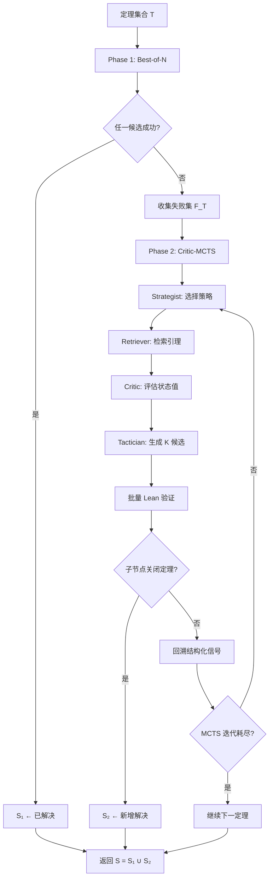

## 1. 论文信息

- **标题**: VERITAS: Verifier-Guided Proof Search for Zero-Shot Formal Theorem Proving
- **作者**: Manish Acharya¹, Zhenyu Liao², Yueke Zhang¹, Kevin Leach¹, Yu Huang¹, Yifan Zhang¹
- **机构**: ¹University at Buffalo, ²University of Waterloo
- **arXiv**: [2606.19399](https://arxiv.org/abs/2606.19399) | [PDF](https://arxiv.org/pdf/2606.19399)
- **代码**: [GitHub](https://github.com/manishacharya60/veritas)
- **一句话总结**: 将 Lean 验证器的结构化中间反馈（语法错误、类型不匹配、目标进度、证明完成）注入 LLM 生成决策，通过"Best-of-N → Critic-MCTS"两阶段协议实现零样本定理证明，无需微调。

## 2. 研究背景与动机

### 2.1 形式化定理证明的现状

形式化定理证明（Formal Theorem Proving）是在 Lean、Coq、Isabelle 等交互式证明助手（Interactive Theorem Prover, ITP）中构建机器可验证证明的过程。miniF2F 基准（Zheng et al., 2022）包含 244 道奥林匹克数学竞赛定理，成为评估 AI 系统多步形式推理能力的标杆。

现有方法沿两条路线推进：

1. **语言模型生成候选策略**（Polu & Sutskever, 2020; Yang et al., 2023; Azerbayev et al., 2024）
2. **树搜索探索部分证明空间**（Kocsis & Szepesvári, 2006; Lample et al., 2022; DeepMind, 2024）

现代系统通常组合两者：LLM 提议，搜索决策。

### 2.2 核心问题：验证器信号被浪费

论文指出一个关键观察：**LLM 与搜索之间的通信过于薄弱**。典型流程中：

- LLM 发射一批候选策略（tactics）
- 验证器检查每个候选
- 搜索算法从"通过/失败"二元结果更新价值估计

但验证器在检查过程中产生了丰富的中间信号：

| 信号 | 含义 | 示例 |
|------|------|------|
| **σ_A** | 语法有效性 | "expected '\|', got identifier 'zero'" |
| **σ_B** | 类型正确性 | "type mismatch on Int vs. Nat" |
| **σ_C** | 目标进度 | 子目标被简化但未关闭 |
| **σ_D** | 证明完成 | 无剩余目标或 sorry |

**现有方法将这些信号压缩为标量奖励或完全丢弃**。人类证明者恰恰依赖这些中间信号——将它们坍缩为单一比特，迫使搜索重新学习验证器已经明确告知的信息。

## 3. 核心方法

### 3.1 四代理架构

VERITAS 设计了四个专业化代理，共享统一证明状态 `ProofState s = (T, g, H, τ_{1:t}, σ_A, σ_B, σ_C, σ_D)`：

| 代理 | 模型 | 温度 | 职责 |
|------|------|------|------|
| **Strategist** | Claude Sonnet 4.6 | 0.3 | 选择高层策略（直接/归纳/反证/分情况/重写/应用引理）+ 深度估计 |
| **Tactician** | Claude Sonnet 4.6 | 0.8 | 生成 K=6 个候选策略，关键创新：**注入失败策略集 F 及其 Lean 错误信息作为负例** |
| **Critic** | Claude Haiku 4.5 | 0.3 | 评估部分证明状态价值 V(s) ∈ [0,1]，替代 MCTS 随机模拟 |
| **Retriever** | 关键词匹配 | — | 从 Mathlib 检索 top-5 相关引理，加权关键词重叠（类型名权重 3，操作符权重 2，连接词权重 1） |

### 3.2 论文原图：VERITAS 两阶段协议


*Figure 1. VERITAS two-phase protocol. Phase 1: Best-of-N dispatch; failures feed corpus F₁. Phase 2: Critic-guided MCTS on U₁ with Lean signals σ_A–σ_D; final S = S₁ ∪ S₂ satisfies S ⊇ S₁.*

### 3.3 Critic-Guided MCTS

标准 MCTS 的四个阶段被改造：

**选择（Selection）**：扩展 UCB 公式，融入 Critic 价值和策略对齐：

$$Q(s, a) + c\sqrt{\frac{\ln N(s)}{N(s,a)}} + w_v V_{\text{critic}}(s') + w_s \text{align}(a, \pi)$$

其中 `align(a, π) ∈ {0, 1}` 为 1 当且仅当动作 a 的 leading token 属于策略 π 专属的策略词汇表（如 `V_induction = {induction, cases, rcases}`），偏向策略对齐的子树。

**模拟（Simulation）**：用 Critic 价值替代随机 rollout：

$$V(s) = V_{\text{critic}}(s) + \alpha_1\sigma_A + \alpha_2\sigma_B + \alpha_3\sigma_C + \frac{\beta}{1+N(s)}$$

参数：`α₁ = α₂ = 0.1`, `α₃ = 0.2`（目标进度是最强的中间信号），`β = 0.1`（随访问次数衰减的探索奖励）。

**回溯（Backpropagation）**：携带结构化 A-B-C-D 信号向上，而非坍缩为二元胜负——保留部分进度状态（σ_C）的信用，这对多步定理至关重要。

### 3.4 两阶段设计与单调性保证

```
Phase 1: Best-of-N 扫描
  └── N 个策略候选 → 批量 Lean 验证 → 成功则返回
  └── 失败则收集失败集 F_T

Phase 2: Critic-guided MCTS（仅对 Phase 1 失败的定理）
  └── F_T 注入 Tactician 系统提示
  └── 50 轮 MCTS × 6 候选/节点
```

**命题 2.1（单调性）**：对于任何固定 VERITAS 运行，最终解决集包含自身 Phase 1 解决集：`S(T) ⊇ S₁(T)`。

这意味着 Phase 2 的额外解决可归因于反馈驱动探索，而非随机性。

### 3.5 批量 Lean 验证技巧

将 K 个候选编译为单个 `.lean` 文件（`private theorem_p0 ... := by <tactic_0>`），单次 `lake env lean -json` 调用验证全部候选。验证成本从 `O(K)` 降至 `O(1)` Lean 调用，K=6 时约 10 倍加速，K=16 时接近 20 倍。

### 3.6 Mermaid 流程图：算法流程



## 4. 实验结果

### 4.1 主要结果

| 方法 | miniF2F (%) | VERITAS-CombiBench (%) | Lean/定理 | API 成本 |
|------|------------|----------------------|-----------|----------|
| Portfolio（启发式） | 26.2 | 3.6 | 1 | <\$1 |
| Best-of-1 Sonnet | 29.1 | — | 1 | \$7 |
| Best-of-5 Sonnet | 36.9 | 1.8 | 5 | \$35 |
| **VERITAS 两阶段** | **40.6** | **7.3** | 27 | ~\$150 |

VERITAS 在 miniF2F 上达到 **40.6%**（99/244），超越 Best-of-5 的 36.9%（+3.7pp）和 Portfolio 的 26.2%（+14.4pp）。

### 4.2 分类别性能对比

| 类别 | Best-of-5 | VERITAS | Δ |
|------|-----------|---------|---|
| 代数（Alg., n=88） | 54% | 58% | **+4pp** |
| 数论（NumT., n=67） | 45% | 49% | **+4pp** |
| AMC（n=45） | 18% | 20% | +2pp |
| AIME（n=15） | 14% | 14% | 0pp |
| IMO（n=19） | 12% | 5% | **-5pp** |
| 其他（n=10） | 10% | 30% | **+20pp** |

MCTS 在代数和"其他"类别增益最大——这些类别的证明需要依赖前序步骤效应的策略序列。IMO 下降反映竞赛级创造力超出了固定 MCTS 预算（50×6）的能力。

### 4.3 消融实验

| 方法 | miniF2F 201 难题 (%) | 说明 |
|------|---------------------|------|
| VERITAS-Heuristic | 12.4% | MCTS + 规则代理，无 LLM；218× 更多 Lean 调用仍不如 Portfolio |
| VERITAS-MCTSonly | 19.4% | 仅 Phase 2，无 Phase 1；浪费 MCTS 预算在简单定理上 |
| Best-of-5 | 25.8% | 独立采样基线 |
| **VERITAS 两阶段** | **28.9%** | 完整系统 |

关键发现：**LLM 和搜索的贡献是协同的**。单独 MCTS 不如 Portfolio，单独 LLM 不如两阶段组合。

### 4.4 解决归因分析

在 201 道难题上：

| 结果集 | 数量 | 占比 |
|--------|------|------|
| 两者均解决 | 47 | 23.4% |
| Best-of-5 独有 | 5 | 2.5% |
| **VERITAS 独有** | **11** | **5.5%** |
| 均未解决 | 138 | 68.7% |

11 道 VERITAS 独有解决的定理需要 **2-4 步依赖策略**，每步依赖前序步骤对目标的影响。平均约 47 次 Lean 调用才发现完整序列。

### 4.5 VERITAS-CombiBench：LLM 采样反而有害

在组合数学基准上，Best-of-5（1.8%）**低于** Portfolio（3.6%）——更多 LLM 样本使情况恶化。原因：组合数学需要精确的 Mathlib 名称（`Nat.choose_symm`, `Finset.card_powerset`），LLM 幻觉出词法错误的名称（σ_A=0），而 Portfolio 的 `norm_num/omega` 覆盖了有效子集。

VERITAS 通过迭代纠正名称达到 7.3%（4/55），全部是 Brualdi 教材问题。

### 4.6 失败模式分析

按最深验证器信号分层 244 道定理：

| 最深信号 | 数量 | 占比 | 含义 |
|----------|------|------|------|
| **σ_D**（完成） | 99 | 40.6% | 成功证明 |
| **σ_C**（近失） | 24 | 10% | 部分进度但未关闭——最有希望的提升空间 |
| **σ_B**（类型正确但错误） | 41 | 17% | 语法正确但语义错误 |
| **σ_A**（语法失败） | 78 | 32% | 幻觉策略名称，需更好的检索 |

### 4.7 计算效率对比

| 方法 | Lean 调用/定理 | API 成本 | 解决率 | 边际解决/千次 Lean |
|------|---------------|----------|--------|-------------------|
| Portfolio | 1 | <\$1 | 26.2% | (基准) |
| Best-of-5 | 5 | \$35 | 36.9% | 26.6 |
| VERITAS | 27 | ~\$150 | 40.6% | 5.5 |

VERITAS 在推理 Pareto 前沿上：Best-of-5 在 5 倍 Lean 预算内无法达到 40.6%，VERITAS-MCTSonly 即使在 10 倍 LLM-free 预算下也无法接近。

## 5. 个人评价

### 5.1 创新点

1. **验证器反馈路由**：将 Lean 的四路结构化信号（σ_A–σ_D）注入每个生成决策，而非坍缩为二元奖励。这是推理时（inference-time）的"过程监督"，无需微调。

2. **单调性保证**：两阶段设计确保 Phase 2 的贡献可归因，解决了"更多搜索 vs. 更好搜索"的归因问题。

3. **批量验证技巧**：将 K 个候选编译为单个 Lean 文件，验证成本从 O(K) 降至 O(1)，工程简洁但效果显著。

4. **失败集注入**：将失败的策略及其 Lean 错误作为负例注入 Tactician 提示，比仅用结果做奖励/剪枝信息量大一个数量级。

### 5.2 局限性

1. **IMO 类别下降**：竞赛级创造力问题需要超出固定 MCTS 预算的搜索深度。

2. **σ_A 语法失败占 32%**：根本原因是 Mathlib 引理检索不够精准，LLM 幻觉出无效名称。改进检索器是明确的下步。

3. **计算成本高**：每定理 ~$0.50 API 成本 + 5-10 分钟推理时间，不适合交互式使用。

4. **单代理运行**：实验均为单次运行，未报告多次采样的方差。

### 5.3 对后续研究的影响

论文提出一个通用设计原则：**当确定性验证器发射结构化中间信号时，将其折叠回生成决策比增加采样预算更有效**。这一原则可推广至：

- SMT 不可满足核心（unsat cores）
- Coq/Agda 目标状态
- 符号执行反例
- 模型检查轨迹

## 6. 相关论文

| 论文 | 方法 | miniF2F | 备注 |
|------|------|---------|------|
| **GPT-f** (Polu & Sutskever, 2020) | LLM 策略生成 | ~20% | 开创性工作 |
| **ReProver** (Yang et al., 2023) | 检索增强 LLM | 26.5% | 检索 + 生成 |
| **COPRA** (Thakur et al., 2024) | 上下文学习代理 | 30.7% | 最近的推理时方法 |
| **InternLM-StepProver** (Wu et al., 2024) | 微调 + 专家迭代 | 65.9% | 需大量 Lean 轨迹 |
| **DeepSeek-Prover-V2** (Ren et al., 2025) | RL + 子目标分解 | 88.9% | 最强但需微调 |
| **VERITAS** (本文) | 零样本 + 验证器反馈 | 40.6% | 无需微调，推理时 |

VERITAS 在零样本推理时方法中处于领先地位，与 COPRA 最接近但架构不同（角色分解 + Critic-MCTS + 单调两阶段路由）。

---

> 整理者：Nancy | 数据源：arXiv (2606.19399) + PaddleOCR 解析 | 更新时间：2026-06-22
